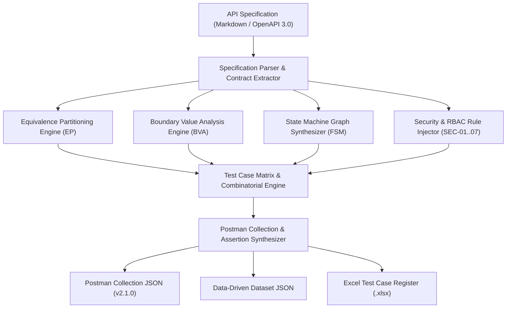

# Skill: AI-Driven API Test Generator (Bloom-AI G9.5 Create)

This skill enables AI agents and automated testing pipelines to generate comprehensive, production-grade API test suites directly from backend API specifications.

## 🌟 Key Capabilities
1. **Specification Parsing:** Ingests Markdown API docs or OpenAPI 3.0 YAML/JSON specifications.
2. **Domain & Boundary Partitioning:** Automatically identifies path, query, header, and body parameters, extracting valid and invalid equivalence classes and on/off boundary points.
3. **State Transition Modeling:** Constructs Finite State Machine (FSM) models for lifecycle endpoints (e.g. Order Status, User Verification) and synthesizes both valid path sequences and invalid state transition violation tests.
4. **Security & Vulnerability Injection:** Systematic generation of test cases for OWASP API Security Top 10, including Broken Object Level Authorization (BOLA/IDOR), Broken Authentication, Parameter Tampering, SQL Injection, and Role Escalation (SEC-01 – SEC-07).
5. **Postman Artifact Synthesis:** Emits RFC-compliant Postman Collection v2.1.0 JSON, Environment JSON, and parameterized data-driven iteration files with embedded Anti-Cheat audit headers (`X-Student-Id`).

---

## 🏗️ Architecture & Workflow



---

## 🚀 Usage Guide

### 1. Batch Mode (Generate All 3 Homework API Suites)
```powershell
python .agents/skills/api-test-generator/generator.py --all --output_dir "output_suite"
```

### 2. Single Endpoint Mode
```powershell
# Pool A: Login
python .agents/skills/api-test-generator/generator.py --endpoint "/api/login" --method POST --output_dir "out_login"

# Pool B: Checkout
python .agents/skills/api-test-generator/generator.py --endpoint "/api/checkout" --method POST --output_dir "out_checkout"

# Pool C: Admin Order State Machine
python .agents/skills/api-test-generator/generator.py --endpoint "/api/admin/orders/:id/status" --method PUT --output_dir "out_admin"
```

### 3. Generated Outputs
- `*.postman_collection.json`: Complete executable Postman collection with dynamic pre-request scripts and Chai assertions. Protected suites include admin and user login bootstrap requests that obtain fresh tokens; run the complete collection rather than only the target request.
- `*_data.json`: Structured iteration records for Postman Collection Runner and Newman CLI.
- `pseudocode.md`: Formal algorithmic specification of the generation engine.
