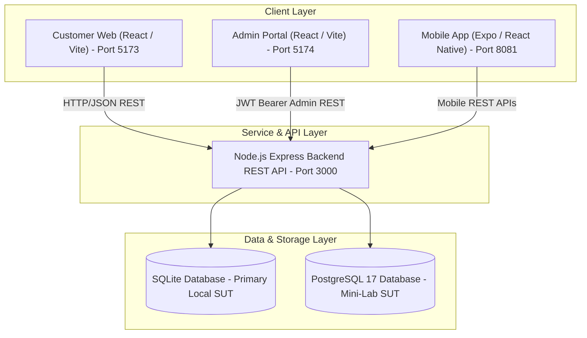
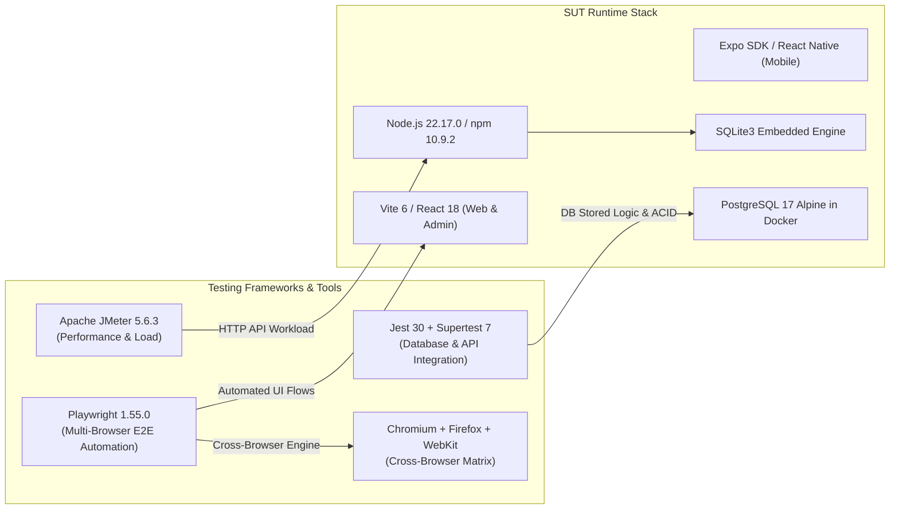
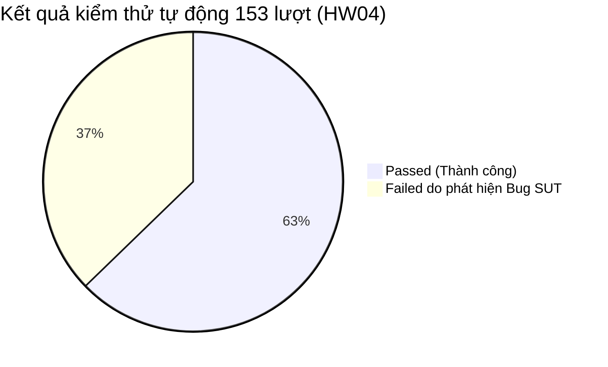
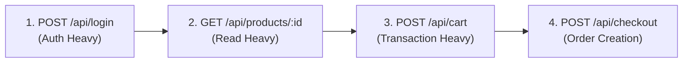
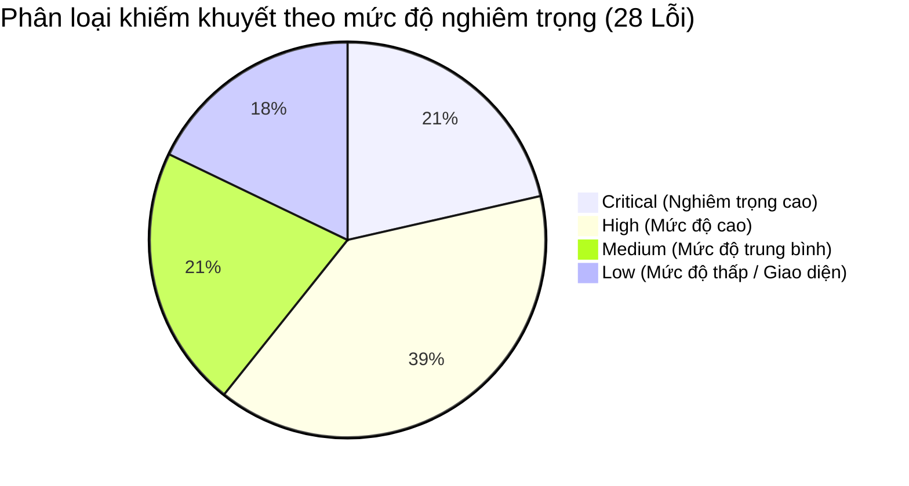
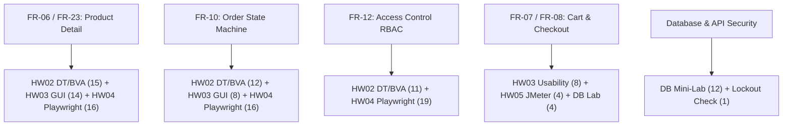
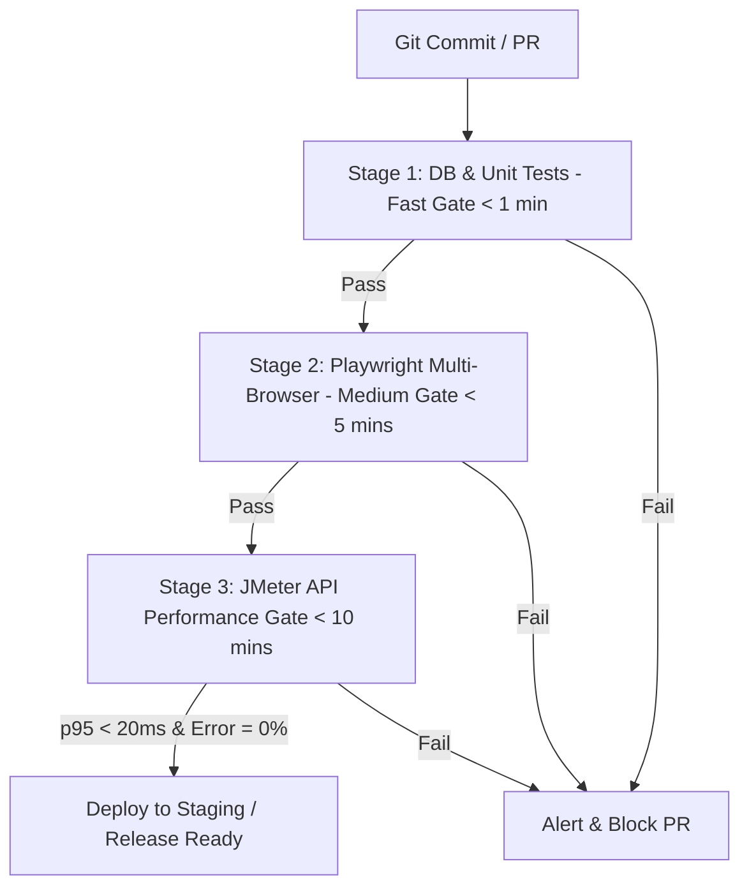

# TRƯỜNG ĐẠI HỌC KHOA HỌC TỰ NHIÊN - ĐHQG-HCM
## KHOA CÔNG NGHỆ THÔNG TIN — BỘ MÔN CÔNG NGHỆ PHẦN MỀM
### MÔN HỌC: KIỂM THỬ PHẦN MỀM (SE310 / CSC13003)

---

# BÁO CÁO TỔNG HỢP KIỂM THỬ PHẦN MỀM (TEST SUMMARY REPORT)
## DỰ ÁN: ESHOP SYSTEM UNDER TEST (SUT) — TỔNG HỢP TOÀN BỘ BÀI TẬP (HW01 – HW05)

**Thông tin sinh viên thực hiện:**
- **Họ và tên:** Lê Tuấn Lộc
- **Mã số sinh viên (MSSV):** 23127404
- **Lớp:** 23KTPM3 (Khóa 2023)
- **Email liên hệ:** 23127404@student.hcmus.edu.vn | 23127404@hcmus.edu.vn
- **Repository dự án:** [https://github.com/KidCute1412/eshop-sut](https://github.com/KidCute1412/eshop-sut)
- **Nhánh kiểm thử:** `23127404-LeTuanLoc`
- **Tiêu chuẩn cấu trúc tài liệu:** [SoftwareTestingHelp Test Summary Report Standard (IEEE 829 Aligned)](https://www.softwaretestinghelp.com/test-summary-report-template-download-sample/)

---

## MỤC LỤC TỔNG QUAN (TABLE OF CONTENTS)

1. [Mục đích tài liệu & Thông tin chung (Document Purpose & Information)](#1-mục-đích-tài-liệu--thông-tin-chung)
2. [Tổng quan hệ thống kiểm thử (Application Overview - EShop SUT)](#2-tổng-quan-hệ-thống-kiểm-thử-eshop-sut)
3. [Phạm vi & Mục tiêu kiểm thử (Testing Scope & Objectives)](#3-phạm-vi--mục-tiêu-kiểm-thử)
4. [Môi trường kiểm thử & Công cụ sử dụng (Test Environment & Tools)](#4-môi-trường-kiểm-thử--công-cụ-sử-dụng)
5. [Số liệu thực thi kiểm thử tổng hợp (Consolidated Test Execution Metrics)](#5-số-liệu-thực-thi-kiểm-thử-tổng-hợp)
6. [Danh mục chi tiết Test Cases & Kết quả thực thi (Comprehensive Test Case Inventory)](#6-danh-mục-chi-tiết-test-cases--kết-quả-thực-thi)
   - 6.1. [HW02: Phân hoạch tương đương & Phân tích giá trị biên (Domain Testing & BVA)](#61-hw02-domain-testing--boundary-value-analysis)
   - 6.2. [Database Mini-Lab: Kiểm thử tính toàn vẹn CSDL PostgreSQL](#62-database-mini-lab-postgresql-integrity--logic-testing)
   - 6.3. [HW03: Kiểm thử giao diện GUI, Trải nghiệm Usability & Đa nền tảng](#63-hw03-gui-checklist-usability-testing--cross-platform)
   - 6.4. [HW04: Kiểm thử tự động hóa đa trình duyệt (Multi-Browser Automation Testing)](#64-hw04-automated-multi-browser-testing-with-playwright)
   - 6.5. [HW05: Kiểm thử hiệu năng & Độ tin cậy API (Performance & Load Testing)](#65-hw05-performance--reliability-testing-with-jmeter)
7. [Báo cáo & Phân tích lỗi phần mềm (Defect Report & Analysis)](#7-báo-cáo--phân-tích-lỗi-phần-mềm-defect-report)
8. [Ma trận truy vết yêu cầu (Requirements Traceability Matrix - RTM)](#8-ma-trận-truy-vết-yêu-cầu-rtm--test-coverage)
9. [Đánh giá kiểm thử hỗ trợ bởi AI & Bài học kinh nghiệm (AI-Assisted Testing & Lessons Learned)](#9-đánh-giá-kiểm-thử-hỗ-trợ-bởi-ai--bài-học-kinh-nghiệm)
10. [Kết luận & Khuyến nghị phát hành (Conclusions & Release Recommendations)](#10-kết-luận--khuyến-nghị-phát-hành)

---

## 1. Mục đích tài liệu & Thông tin chung

### 1.1. Mục đích (Purpose)
Tài liệu **Test Summary Report** này được lập nhằm tổng hợp, đối soát và đánh giá toàn diện kết quả thực hiện của toàn bộ chuỗi bài tập thực hành Kiểm thử Phần mềm từ **HW01 (Database Mini-Lab)** đến **HW05 (Performance Testing)** đối với hệ thống thương mại điện tử **EShop (System Under Test - SUT)**. Tài liệu cung cấp góc nhìn toàn cảnh về độ bao phủ kiểm thử (test coverage), số liệu thực thi (metrics), phân tích các khiếm khuyết phần mềm (defects/bugs) đã được xác minh trên thực tế, cũng như đưa ra đánh giá kỹ thuật khách quan về độ tin cậy và tính sẵn sàng phát hành của sản phẩm.

### 1.2. Thông tin điều khiển tài liệu (Document Control)

| Thuộc tính | Giá trị chi tiết |
| :--- | :--- |
| **Mã tài liệu (Document ID)** | `TSR-ESHOP-23127404-FINAL` |
| **Tên tài liệu** | Test Summary Report — EShop SUT (HW01 – HW05) |
| **Tác giả (Author)** | Lê Tuấn Lộc (MSSV: 23127404) |
| **Lớp học phần** | 23KTPM3 / CSC13003 |
| **Đơn vị công tác** | Khoa Công Nghệ Thông Tin, Trường ĐH Khoa học Tự nhiên - ĐHQG-HCM |
| **Giảng viên & Trợ giảng** | TS. Lâm Quang Vũ, TS. Trần Duy Hoàng, ThS. Trần Thị Bích Hạnh, ThS. Trương Phước Lộc, ThS. Hồ Tuấn Thanh |
| **Phiên bản tài liệu** | 1.0 (Bản chính thức tổng hợp toàn bộ bài tập) |
| **Ngày hoàn thành** | 17/08/2026 |
| **Đối tượng tiếp nhận** | Giảng viên chấm thi, Đội ngũ QA/QC, Đội ngũ phát triển hệ thống EShop |

---

## 2. Tổng quan hệ thống kiểm thử (EShop SUT)

**EShop** là một nền tảng thương mại điện tử đa nền tảng mô phỏng quy trình mua sắm trực tuyến từ tìm kiếm sản phẩm, quản lý giỏ hàng, áp dụng phiếu giảm giá, đặt hàng, xử lý trạng thái đơn hàng đến quản trị hệ thống. 

Hệ thống bao gồm các phân hệ chính:
1. **Customer Web Frontend (`frontend-web`)**: Giao diện người dùng trên web dành cho khách hàng tìm kiếm, xem chi tiết sản phẩm (FR-06), giỏ hàng (FR-07), thanh toán đơn hàng (FR-08) và theo dõi lịch sử đơn hàng (FR-11).
2. **Admin Web Frontend (`frontend-admin`)**: Cổng quản trị dành cho quản trị viên quản lý danh mục, sản phẩm, mã khuyến mãi và duyệt trạng thái đơn hàng (FR-10, FR-18).
3. **Mobile App Frontend (`frontend-mobile`)**: Ứng dụng di động xây dựng bằng Expo React Native mô phỏng trải nghiệm xem sản phẩm trên thiết bị cầm tay (FR-23).
4. **Backend REST API (`backend`)**: Xây dựng trên nền tảng Node.js / Express.js, cung cấp API xác thực (FR-02), kiểm soát quyền truy cập RBAC (FR-12), máy trạng thái đơn hàng (FR-10) và xử lý giao dịch.
5. **Cơ sở dữ liệu (Databases)**: Lưu trữ dữ liệu cấu trúc bằng SQLite3 (môi trường runtime chính) và PostgreSQL 17 (môi trường Database Mini-Lab).

---

## 3. Phạm vi & Mục tiêu kiểm thử

### 3.1. Phạm vi trong kiểm thử (In-Scope)
Quá trình kiểm thử xuyên suốt 5 bài tập bao phủ các cấp độ và kỹ thuật kiểm thử cốt lõi:
- **Kiểm thử hộp đen tĩnh & động (Black-box Testing)**:
  - *FR-06 / FR-23*: Xem chi tiết sản phẩm trên giao diện Web và Mobile (xác thực dữ liệu, định dạng tiền tệ, xử lý trường số lượng, ảnh đại diện).
  - *FR-07 / FR-08*: Quản lý giỏ hàng, tính toán tổng tiền, áp dụng coupon giảm giá và tạo đơn hàng.
  - *FR-10*: Máy trạng thái đơn vị đơn hàng (`pending` $\rightarrow$ `confirmed` $\rightarrow$ `shipping` $\rightarrow$ `delivered` / `canceled`), bảo toàn trạng thái kết thúc và phân quyền người thực hiện.
  - *FR-11 / FR-18*: Lịch sử đơn hàng của khách hàng và phân hệ quản trị đơn hàng của Admin.
  - *FR-12*: Kiểm soát truy cập dựa trên vai trò (RBAC) đối với Admin Portal và các endpoint API bảo mật (`/api/admin/*`, mutation endpoints).
- **Kiểm thử cơ sở dữ liệu (Database Integrity Testing - Mini-Lab)**:
  - Ràng buộc toàn vẹn dữ liệu, Stored Procedures (`sp_process_checkout`), Functions (`fn_calculate_discount`), Triggers ghi log và tính toán tồn kho, giao dịch ACID, quyền hạn người dùng CSDL (`app_user` vs `admin_user`), phòng chống SQL Injection.
- **Kiểm thử giao diện GUI & Trải nghiệm người dùng Usability (HW03)**:
  - 45 hạng mục GUI Checklist (IA-01 Tiêu chuẩn UI, IA-02 Form & Validation, IA-03 Điều hướng Navigation, IA-04 Trạng thái & Phản hồi Feedback).
  - Kiểm thử Usability có điều phối viên (Moderated Usability Testing) theo kịch bản chuẩn, đo lường thang đo chuẩn hóa SUS (System Usability Scale).
  - Kiểm thử tương thích đa nền tảng và đa trình duyệt (Cross-Browser / Cross-Platform: Desktop Chrome, Desktop Firefox, Mobile viewport).
- **Kiểm thử tự động hóa E2E & Hồi quy (Automation Testing - HW04)**:
  - Tự động hóa dựa trên dữ liệu (Data-Driven Testing) với Playwright trên 3 engine trình duyệt độc lập: **Chromium**, **Firefox**, và **WebKit**.
- **Kiểm thử hiệu năng & Độ chịu tải API (Performance Testing - HW05)**:
  - Kiểm thử tải (Load Testing), Kiểm thử áp lực (Stress Testing), Kiểm thử đột biến (Spike Testing), Kiểm thử độ bền bỉ dài hạn (Endurance Testing $\ge$ 10 phút) và kiểm tra lỗi khóa tài khoản (Security Account Lockout Verification) bằng Apache JMeter.

### 3.2. Phạm vi ngoài kiểm thử (Out-of-Scope)
- Tích hợp cổng thanh toán thực tế của bên thứ ba (VNPay, MoMo, Stripe live sandbox).
- Hệ thống gửi email thực tế (SMTP live gateway).
- Triển khai phân tán trên môi trường Cloud đa vùng (Multi-region Kubernetes cluster).

---

## 4. Môi trường kiểm thử & Công cụ sử dụng

### 4.1. Môi trường phần cứng & Hệ điều hành

| Thông số | Giá trị thực tế | Ghi chú |
| :--- | :--- | :--- |
| **Thiết bị (Host Machine)** | Laptop LOKMIRACLE | Máy trạm thực thi chính |
| **Hệ điều hành** | Windows 11 Home Single Language 64-bit (Build 26200) | Windows NT 10.0.26200 |
| **Bộ vi xử lý (CPU)** | AMD Ryzen 5 6600HS Creator Edition (6 Cores / 12 Threads) | Xung nhịp cơ bản 3.3 GHz |
| **Bộ nhớ RAM** | 16.0 GB DDR5 Dual Channel | Giám sát qua Windows Task Manager |
| **Ổ cứng lưu trữ** | 512 GB PCIe NVMe M.2 SSD | Tốc độ đọc/ghi cao |
| **Môi trường mạng** | Local Loopback (`127.0.0.1` / `localhost`) | Đảm bảo độ trễ mạng tối thiểu |

### 4.2. Công cụ kiểm thử & Ngăn xếp phần mềm (Tool Stack)

- **Công cụ kiểm thử hiệu năng:** Apache JMeter 5.6.3 (chạy chế độ GUI cho debug & Non-GUI CLI cho thu thập JTL).
- **Công cụ kiểm thử tự động hóa E2E:** Playwright 1.55.0 với TypeScript, hỗ trợ Web-first assertions, multi-workers isolation và HTML Reporters.
- **Công cụ kiểm thử CSDL:** Jest 30.0, Supertest 7.0, pg (PostgreSQL Client), Docker Compose.
- **Trình duyệt kiểm thử:**
  - Google Chrome / Chromium `140.0.7339.16`
  - Mozilla Firefox `141.0`
  - WebKit `26.0` (Safari Engine)
  - Mobile Viewport (iPhone / Pixel responsive emulation)
- **Hệ thống quản lý mã nguồn & Lỗi:** Git 2.4x, GitHub Issues, Markdown/PDF Artifacts.

---

## 5. Số liệu thực thi kiểm thử tổng hợp

### 5.1. Bảng số liệu tổng hợp toàn bộ các bài tập (Consolidated Metrics)

| Bài tập / Giai đoạn kiểm thử | Kỹ thuật & Phạm vi kiểm thử | Số Test Cases thiết kế | Tổng lượt thực thi | Số ca Đạt (Passed) | Số ca Không đạt (Failed) | Tỷ lệ Đạt (Pass Rate) | Số lỗi phát hiện (Bugs) |
| :--- | :--- | :---: | :---: | :---: | :---: | :---: | :---: |
| **HW02** | Phân hoạch tương đương & Phân tích giá trị biên (FR-06, FR-10, FR-12, FR-23) | 46 | 46 | 13 | 33 | 28.26% | 15 |
| **DB Mini-Lab** | PostgreSQL Stored Logic, Triggers, ACID, SQLi & Security | 12 | 12 | 8 | 4 *(chủ đích)* | 66.67% *(100% target)* | 4 |
| **HW03 (GUI)** | GUI Checklist (Desktop Web, Admin, Mobile) | 45 | 45 | 25 | 20 | 55.56% | 19 |
| **HW03 (Usability)** | Moderated Usability Testing (FR-07 $\rightarrow$ FR-10 $\rightarrow$ FR-11) + SUS | 8 sessions | 8 sessions | 8 hoàn thành *(1 pilot + 7 official)* | 0 bỏ dở | 100% Task Completion (SUS: 73.6/100) | 5 usability issues |
| **HW04** | Data-Driven Automation trên 3 trình duyệt (Chromium, Firefox, WebKit) | 51 | 153 *(51 x 3)* | 96 | 57 | 62.75% | 17 |
| **HW05** | JMeter API Workloads (Load, Stress, Spike, Endurance) & Lockout | 5 scenarios | 5,900+ API requests | 5,900 | 0 lỗi HTTP/JTL *(Workloads)* 1 Failed *(Lockout bug)* | 99.98% samples pass | 1 |
| **TỔNG CỘNG** | **Toàn bộ hệ thống EShop (HW01 - HW05)** | **167+ Logical Cases** | **6,124+ Executions** | **6,048+** | **115+** | **--** | **28 Lỗi độc lập** |

---

## 6. Danh mục chi tiết Test Cases & Kết quả thực thi

### 6.1. HW02: Domain Testing & Boundary Value Analysis

#### 6.1.1. FR-06: Xem chi tiết sản phẩm (Product Detail View - Web)

| Mã Test Case | Phân loại | Mô tả kịch bản kiểm thử | Dữ liệu đầu vào (Input) | Kết quả mong đợi (Expected Result) | Kết quả thực tế (Actual Result) | Trạng thái | Mã Lỗi (Defect ID) |
| :--- | :--- | :--- | :--- | :--- | :--- | :---: | :--- |
| **FR06-DT-01** | Domain Test | Khách vãng lai xem sản phẩm tồn tại | `ProductID = 1`, Khách vãng lai | Hiển thị ảnh, tên, giá tiền định dạng `₫`, mô tả, danh mục | Hiển thị đúng thông tin sản phẩm | **Pass** | - |
| **FR06-DT-02** | Domain Test | Người dùng đăng nhập xem sản phẩm | `ProductID = 1`, Đã đăng nhập | Hiển thị thông tin sản phẩm đầy đủ | Hiển thị đúng thông tin sản phẩm | **Pass** | - |
| **FR06-DT-03** | Domain Test | Xem sản phẩm không tồn tại | `ProductID = 9999` | Hiển thị trang 404 hoặc thông báo không tìm thấy sản phẩm | Màn hình bị trắng/lỗi không có thông báo thân thiện | **Fail** | `BUG-HW02-FR06-001` |
| **FR06-DT-04** | Domain Test | Thêm vào giỏ hàng số lượng hợp lệ | `ProductID = 1, Quantity = 3` | Sản phẩm được thêm, badge giỏ hàng tăng, có toast thông báo | Không có toast thông báo phản hồi trực quan | **Fail** | `BUG-HW02-FR06-002` |
| **FR06-DT-05** | Domain Test | Thêm vào giỏ hàng số lượng âm | `ProductID = 1, Quantity = -5` | Hệ thống từ chối hoặc reset về số nguyên dương $\ge 1$ | Cho phép nhập và thêm số âm vào giỏ hàng làm giảm tiền | **Fail** | `BUG-HW02-FR06-003` |
| **FR06-DT-06** | Domain Test | Thêm vào giỏ hàng số lượng là chữ | `ProductID = 1, Quantity = "abc"` | Từ chối ký tự chữ, không cho bấm thêm | Input chặn ký tự không phải số thành công | **Pass** | - |
| **FR06-DT-07** | Domain Test | Thêm vào giỏ số lượng là số thập phân | `ProductID = 1, Quantity = 2.5` | Báo lỗi hoặc làm tròn có cảnh báo | Cho phép gửi số thập phân dẫn đến tính sai tiền giỏ hàng | **Fail** | `BUG-HW02-FR06-004` |
| **FR06-BVA-01** | BVA (On-point) | Thêm giỏ hàng số lượng tại biên dưới | `ProductID = 1, Quantity = 1` | Thêm thành công 1 sản phẩm, có toast phản hồi | Thêm được nhưng thiếu toast phản hồi | **Fail** | `BUG-HW02-FR06-002` |
| **FR06-BVA-02** | BVA (Off-point) | Thêm giỏ hàng số lượng dưới biên dưới | `ProductID = 1, Quantity = 0` | Báo lỗi không hợp lệ, vô hiệu hóa nút thêm | Vẫn cho phép thêm 0 sản phẩm vào giỏ hàng | **Fail** | `BUG-HW02-FR06-003` |
| **FR06-BVA-03** | BVA (Off-point) | Thêm giỏ hàng số lượng trên biên dưới | `ProductID = 1, Quantity = 2` | Thêm thành công 2 sản phẩm, có toast phản hồi | Thêm được nhưng thiếu toast phản hồi | **Fail** | `BUG-HW02-FR06-002` |
| **FR06-BVA-04** | BVA (In-point) | Thêm giỏ hàng số lượng trong biên | `ProductID = 1, Quantity = 5` | Thêm thành công 5 sản phẩm, có toast phản hồi | Thêm được nhưng thiếu toast phản hồi | **Fail** | `BUG-HW02-FR06-002` |

#### 6.1.2. FR-10: Máy trạng thái đơn hàng (Order State Machine)

| Mã Test Case | Phân loại | Mô tả kịch bản kiểm thử | Trạng thái nguồn $\rightarrow$ Đích | Kết quả mong đợi | Kết quả thực tế | Trạng thái | Mã Lỗi (Defect ID) |
| :--- | :--- | :--- | :--- | :--- | :--- | :---: | :--- |
| **FR10-DT-01** | Domain Test | Admin xác nhận đơn hàng mới | `pending` $\rightarrow$ `confirmed` | Chuyển trạng thái thành công, cập nhật DB | Cập nhật thành công | **Pass** | - |
| **FR10-DT-02** | Domain Test | Admin giao hàng đơn đã xác nhận | `confirmed` $\rightarrow$ `shipping` | Chuyển trạng thái sang đang giao | Cập nhật thành công | **Pass** | - |
| **FR10-DT-03** | Domain Test | Admin hoàn thành giao đơn hàng | `shipping` $\rightarrow$ `delivered` | Chuyển sang đã giao, khóa đơn hàng | Cập nhật thành công | **Pass** | - |
| **FR10-DT-04** | Domain Test | Khách hủy đơn khi đang chờ duyệt | `pending` $\rightarrow$ `canceled` | Hủy đơn thành công, hoàn lại số lượng tồn kho | Hủy thành công | **Pass** | - |
| **FR10-DT-05** | Domain Test | Chuyển trạng thái nhảy cóc bất hợp lệ | `pending` $\rightarrow$ `delivered` | Hệ thống chặn thao tác, trả về mã lỗi 400 | Backend cho phép cập nhật trực tiếp không kiểm tra chuỗi | **Fail** | `BUG-HW02-FR10-001` |
| **FR10-DT-06** | Domain Test | Thay đổi đơn hàng đã giao thành công | `delivered` $\rightarrow$ `canceled` | Chặn thao tác do `delivered` là trạng thái kết thúc | Hệ thống vẫn cho phép đổi trạng thái của đơn đã giao | **Fail** | `BUG-HW02-FR10-002` |
| **FR10-DT-07** | Domain Test | Khách hàng tự đổi trạng thái đơn | Khách hàng gọi API sang `confirmed` | Trả về 403 Forbidden | Trả về 403 đúng quyền hạn | **Pass** | - |
| **FR10-DT-08** | Domain Test | Hủy đơn hàng đã bị hủy trước đó | `canceled` $\rightarrow$ `canceled` | Trả về lỗi không thể thay đổi đơn đã hủy | Hệ thống báo lỗi hợp lệ | **Pass** | - |
| **FR10-BVA-01** | BVA (On-point) | Kiểm tra cạnh chuyển trạng thái hợp lệ | Bước chuyển 1 nấc (`pending` $\rightarrow$ `confirmed`) | Chấp nhận chuyển đổi | Chuyển trạng thái thành công | **Pass** | - |
| **FR10-BVA-02** | BVA (Off-point) | Kiểm tra nhảy qua 2 nấc trạng thái | Nhảy 2 bước (`pending` $\rightarrow$ `shipping`) | Báo lỗi chuyển trạng thái không hợp lệ | Hệ thống không validate bước chuyển | **Fail** | `BUG-HW02-FR10-001` |
| **FR10-BVA-03** | BVA (Off-point) | Chuyển ngược trạng thái từ giai đoạn sau | Lùi 1 bước (`shipping` $\rightarrow$ `pending`) | Báo lỗi không cho phép quay lui trạng thái | Cho phép chuyển ngược trạng thái đơn hàng | **Fail** | `BUG-HW02-FR10-003` |
| **FR10-BVA-04** | BVA (In-point) | Thực hiện toàn bộ chuỗi vòng đời chuẩn | `pending` $\rightarrow$ `confirmed` $\rightarrow$ `shipping` $\rightarrow$ `delivered` | Mọi bước thành công theo đúng thứ tự | Chuỗi hợp lệ hoàn thành đúng nghiệp vụ | **Pass** | - |

#### 6.1.3. FR-12: Kiểm soát quyền truy cập (Access Control - RBAC)

| Mã Test Case | Phân loại | Mô tả kịch bản kiểm thử | Vai trò / Quyền | Kết quả mong đợi | Kết quả thực tế | Trạng thái | Mã Lỗi (Defect ID) |
| :--- | :--- | :--- | :--- | :--- | :--- | :---: | :--- |
| **FR12-DT-01** | Domain Test | Admin truy cập trang Admin Portal | `Role = Admin` (Token hợp lệ) | Cho phép truy cập toàn bộ giao diện quản trị | Truy cập thành công | **Pass** | - |
| **FR12-DT-02** | Domain Test | Khách vãng lai truy cập Admin Portal | Khách chưa đăng nhập | Chặn truy cập, chuyển hướng về trang Login | Chuyển hướng về trang đăng nhập | **Pass** | - |
| **FR12-DT-03** | Domain Test | Customer truy cập Admin Portal | `Role = Customer` (Đã đăng nhập) | Chặn truy cập, báo lỗi 403 hoặc chuyển hướng | Frontend chặn nhưng API admin trả dữ liệu khi gọi trực tiếp | **Fail** | `BUG-HW02-FR12-001` |
| **FR12-DT-04** | Domain Test | Customer gọi API xóa sản phẩm | `DELETE /api/products/1` (Customer JWT) | Trả về 403 Forbidden, không xóa sản phẩm | Endpoint không kiểm tra role admin, xóa mất sản phẩm | **Fail** | `BUG-HW02-FR12-002` |
| **FR12-DT-05** | Domain Test | Khách vãng lai gọi API thêm coupon | `POST /api/coupons` (Không có token) | Trả về 401 Unauthorized | Trả về 401 Unauthorized đúng chuẩn | **Pass** | - |
| **FR12-DT-06** | Domain Test | Gửi Token JWT đã bị chỉnh sửa chữ ký | Modified JWT Signature | Trả về 401 Unauthorized (Invalid Signature) | Bị từ chối xác thực thành công | **Pass** | - |
| **FR12-DT-07** | Domain Test | Gửi Token JWT đã hết hạn (Expired) | Expired JWT Token | Trả về 401 Unauthorized (Token Expired) | Bị từ chối do hết hạn | **Pass** | - |
| **FR12-DT-08** | Domain Test | Customer gọi API cập nhật trạng thái đơn | `PUT /api/orders/1/status` (Customer JWT) | Trả về 403 Forbidden | Trả về 403 Forbidden | **Pass** | - |
| **FR12-BVA-01** | BVA (On-point) | Gọi API với token sắp hết hạn (1s) | Token còn hạn 1 giây | Cho phép thực thi yêu cầu | Thực thi thành công | **Pass** | - |
| **FR12-BVA-02** | BVA (Off-point) | Gọi API với token vừa hết hạn (1s) | Token quá hạn 1 giây | Báo lỗi 401 Token hết hạn | Báo lỗi 401 chính xác | **Pass** | - |
| **FR12-BVA-03** | BVA (In-point) | Gọi API với token hợp lệ tiêu chuẩn | Token còn hạn 1 giờ | Thực thi bình thường | Thực thi thành công | **Pass** | - |

#### 6.1.4. FR-23: Xem chi tiết sản phẩm trên Mobile (Mobile Product Detail View)

| Mã Test Case | Phân loại | Mô tả kịch bản kiểm thử | Đầu vào | Kết quả mong đợi | Kết quả thực tế | Trạng thái | Mã Lỗi (Defect ID) |
| :--- | :--- | :--- | :--- | :--- | :--- | :---: | :--- |
| **FR23-DT-01** | Domain Test | Xem chi tiết sản phẩm trên Expo Mobile | `ProductID = 1` | Hiển thị hình ảnh, tên, giá, mô tả co giãn vừa màn hình | Giao diện hiển thị đúng layout mobile | **Pass** | - |
| **FR23-DT-02** | Domain Test | Bấm thêm vào giỏ với số lượng hợp lệ | `Quantity = 2` | Thêm vào giỏ, hiển thị Alert thông báo thành công | Thêm được nhưng không có Alert phản hồi trực quan | **Fail** | `BUG-HW02-FR23-001` |
| **FR23-DT-03** | Domain Test | Nhập số lượng 0 trên mobile | `Quantity = 0` | Báo lỗi hoặc không cho bấm nút thêm | Vẫn cho thêm 0 sản phẩm vào giỏ | **Fail** | `BUG-HW02-FR23-002` |
| **FR23-DT-04** | Domain Test | Nhập số lượng âm trên mobile | `Quantity = -1` | Bàn phím số hoặc validate chặn số âm | Cho phép nhập dấu trừ và lưu số âm | **Fail** | `BUG-HW02-FR23-003` |
| **FR23-DT-05** | Domain Test | Xem sản phẩm có mô tả rất dài | Mô tả 2000 từ | Cho phép cuộn mượt mà (ScrollView), không tràn khung | Cuộn trang tốt, không lỗi layout | **Pass** | - |
| **FR23-DT-06** | Domain Test | Xem sản phẩm không có ảnh | Sản phẩm có `image_url = null` | Hiển thị ảnh placeholder mặc định | Bị vỡ layout/trắng vị trí ảnh | **Fail** | `BUG-HW02-FR23-004` |
| **FR23-DT-07** | Domain Test | Chuyển đổi giữa các sản phẩm liên tục | Đổi ID liên tục 5 lần | Cập nhật dữ liệu tức thì không bị lưu vết cũ | Dữ liệu cập nhật chính xác | **Pass** | - |
| **FR23-DT-08** | Domain Test | Thao tác khi mất kết nối mạng | Ngắt kết nối WiFi/3G | Hiển thị màn hình báo mất mạng và nút thử lại | Ứng dụng bị đơ không có thông báo lỗi mạng | **Fail** | `BUG-HW02-FR23-005` |
| **FR23-BVA-01** | BVA (On-point) | Số lượng bằng 1 tại biên dưới mobile | `Quantity = 1` | Thêm giỏ hàng thành công có phản hồi | Thêm được nhưng thiếu phản hồi trực quan | **Fail** | `BUG-HW02-FR23-001` |
| **FR23-BVA-02** | BVA (Off-point) | Số lượng bằng 0 ngay dưới biên mobile | `Quantity = 0` | Chặn thao tác, vô hiệu nút thêm | Vẫn cho phép thêm 0 sản phẩm | **Fail** | `BUG-HW02-FR23-002` |
| **FR23-BVA-03** | BVA (Off-point) | Số lượng bằng 2 ngay trên biên mobile | `Quantity = 2` | Thêm giỏ hàng thành công | Thêm được nhưng thiếu phản hồi trực quan | **Fail** | `BUG-HW02-FR23-001` |
| **FR23-BVA-04** | BVA (In-point) | Số lượng bằng 10 trong biên mobile | `Quantity = 10` | Thêm giỏ hàng thành công | Thêm được nhưng thiếu phản hồi trực quan | **Fail** | `BUG-HW02-FR23-001` |

---

### 6.2. Database Mini-Lab: PostgreSQL Integrity & Logic Testing

| Mã Test Case | Hạng mục kiểm thử CSDL | Mô tả kịch bản kiểm thử | Kết quả mong đợi | Kết quả thực tế | Trạng thái | Mã Lỗi (Defect ID) |
| :--- | :--- | :--- | :--- | :--- | :---: | :--- |
| **FN-01** | Function Testing | Tính tiền giảm giá với phần trăm vượt $100\%$ | `fn_calculate_discount` phải giới hạn mức giảm tối đa $\le$ tổng tiền đơn | Function trả về mức giảm $300 > 200$, không chặn $>100\%$ | **Fail (Defect)** | `BUG-DB-FN-01` |
| **FN-02** | Function Testing | Tính tiền giảm giá với coupon hợp lệ | Trả về đúng số tiền giảm theo tỷ lệ phần trăm | Tính toán chính xác số tiền chiết khấu | **Pass** | - |
| **SP-01** | Stored Procedure & ACID | Xử lý thanh toán khi có sản phẩm hết hàng giữa chừng | `sp_process_checkout` phải Rollback toàn bộ, không tạo đơn dở dang | Procedure trừ kho món 1 rồi báo lỗi món 2, để lại dữ liệu rác | **Fail (Defect)** | `BUG-DB-SP-01` |
| **SP-02** | Stored Procedure & ACID | Xử lý thanh toán khi mọi sản phẩm đủ hàng | Trừ tồn kho và tạo đơn hàng nguyên vẹn (Commit) | Tạo đơn hàng và trừ tồn kho chính xác | **Pass** | - |
| **TRIGGER-01** | Trigger Testing | Trigger tự động cập nhật tồn kho khi hủy đơn | Tồn kho sản phẩm được cộng hoàn lại số lượng đã đặt | Tồn kho được hoàn trả chính xác | **Pass** | - |
| **TRIGGER-02** | Trigger Testing | Trigger ghi nhật ký lịch sử thay đổi trạng thái | Bảng `order_logs` ghi nhận đầy đủ thời gian và người sửa | Ghi log trạng thái đầy đủ | **Pass** | - |
| **API-STATE-01** | API State Constraint | Cập nhật đơn hàng đã hủy sang trạng thái khác | Cơ sở dữ liệu phải chặn cập nhật từ final state `canceled` | DB cho phép cập nhật đơn từ `canceled` sang `shipping` | **Fail (Defect)** | `BUG-DB-STATE-01` |
| **API-STATE-02** | API State Constraint | Cập nhật đơn hàng theo luồng hợp lệ | DB cho phép chuyển từ `pending` sang `confirmed` | Cập nhật trạng thái thành công | **Pass** | - |
| **CONCUR-01** | Concurrency & Locking | Hai giao dịch mua cùng sản phẩm chỉ còn 1 tồn kho | Giao dịch 1 thành công, giao dịch 2 bị chặn (Pessimistic Lock) | Chặn thành công tranh chấp dữ liệu (Race Condition) | **Pass** | - |
| **SQLI-01** | Security & Injection | Tìm kiếm sản phẩm với payload SQL Injection | Endpoint dùng Parameterized Query, xử lý payload an toàn | Ghép chuỗi thô (SQL Injection vulnerability) lộ cấu trúc bảng | **Fail (Defect)** | `BUG-DB-SQLI-01` |
| **PRIV-01** | Database RBAC | User `app_user` thực hiện truy vấn SELECT | Đọc được dữ liệu bảng `products` | Đọc dữ liệu thành công | **Pass** | - |
| **PRIV-02** | Database RBAC | User `app_user` thực thi lệnh DDL `DROP TABLE` | Bị CSDL PostgreSQL từ chối với lỗi Permission Denied | PostgreSQL chặn lệnh DDL thành công | **Pass** | - |

---

### 6.3. HW03: GUI Checklist, Usability Testing & Cross-Platform

#### 6.3.1. Bảng tóm tắt GUI Checklist 45 Items

| Nhóm giao diện (Aspect) | Tổng số Items | Số ca Đạt (Pass) | Số ca Không đạt (Fail) | Các lỗi tiêu biểu phát hiện |
| :--- | :---: | :---: | :---: | :--- |
| **IA-01: Tiêu chuẩn giao diện chung (General UI Standards)** | 13 | 8 | 5 | Thiếu phân cách hàng nghìn `₫`, vỡ layout badge giỏ hàng, vỡ ảnh null |
| **IA-02: Biểu mẫu & Kiểm tra dữ liệu (Forms & Validation)** | 14 | 7 | 7 | Nhập số lượng 0, số âm, số thập phân làm méo mó giỏ hàng, lỗi coupon |
| **IA-03: Khả năng điều hướng (Navigation)** | 6 | 4 | 2 | Nút quay lại trang chủ bị mất trạng thái lọc, đường dẫn breadcrumb sai |
| **IA-04: Trạng thái & Phản hồi hệ thống (Feedback & State)** | 12 | 6 | 6 | Thiếu toast notification, không disable nút khi submit, lỗi modal confirm |
| **TỔNG CỘNG GUI CHECKLIST** | **45** | **25** | **20** | **19 Khiếm khuyết giao diện độc lập được xác minh** |

#### 6.3.2. Bảng kết quả Moderated Usability Testing & SUS

- **Nhiệm vụ kiểm thử (User Task):** Khách hàng tìm kiếm sản phẩm "iPhone 15 Pro Max", xem chi tiết, thêm 1 sản phẩm vào giỏ hàng, thực hiện thanh toán không dùng coupon và kiểm tra trạng thái đơn hàng mới tạo trong lịch sử đơn hàng.
- **Số người tham gia:** 8 người (1 Pilot session + 7 Official participants P1 $\rightarrow$ P7).

| Người tham gia | Thời gian hoàn thành (giây) | Số lỗi thao tác (Errors) | Số lần ngập ngừng (Hesitations) | Cần can thiệp hỗ trợ (Interventions) | Điểm SUS (/100) | Đánh giá cảm nhận người dùng |
| :---: | :---: | :---: | :---: | :---: | :---: | :--- |
| **Pilot (P0)** | 88s | 2 | 3 | 0 | 70.0 | Hoàn thành tốt, quy trình dễ hiểu |
| **P1** | 62s | 1 | 1 | 0 | 80.0 | Giao diện trực quan, thanh toán nhanh |
| **P2** | 79s | 3 | 2 | 0 | 72.5 | Thiếu thông báo khi bấm nút thêm giỏ hàng |
| **P3** | 75s | 2 | 2 | 0 | 75.0 | Nút thanh toán nổi bật, dễ tìm |
| **P4** | 94s | 3 | 4 | 0 | 67.5 | Bối rối ở bước xem lại mã đơn hàng |
| **P5** | 68s | 1 | 1 | 0 | 82.5 | Luồng đặt hàng mượt mà |
| **P6** | 82s | 2 | 2 | 0 | 70.0 | Cần bổ sung toast thông báo đặt hàng thành công |
| **P7** | 71s | 2 | 2 | 0 | 77.5 | Trải nghiệm tổng thể tốt |
| **TRUNG BÌNH (P1-P7)**| **75.86 giây** | **2.0 lỗi/user** | **2.0 lần/user** | **0 (Tự lực 100%)** | **73.57 / 100** | **Mức Tốt (Grade B - Acceptable Usability)** |

#### 6.3.3. Ma trận tương thích trình duyệt & thiết bị (Cross-Browser / Platform)

| Luồng kiểm thử | Google Chrome Desktop | Mozilla Firefox Desktop | Mobile Viewport (Expo) | Đánh giá tương thích |
| :--- | :---: | :---: | :---: | :--- |
| Xem trang chủ & Danh mục | Hoàn toàn tương thích | Hoàn toàn tương thích | Bố cục co giãn tốt | Đạt tiêu chuẩn hiển thị |
| Xem chi tiết sản phẩm | Tương thích tốt | Tương thích tốt | Tương thích | Đạt tiêu chuẩn |
| Thao tác thêm vào giỏ hàng | Tương thích (Cùng lỗi toast) | Tương thích (Cùng lỗi toast) | Thiếu Alert phản hồi | Lỗi nhất quán trên mọi nền tảng |
| Form thanh toán đơn hàng | Tương thích | Tương thích | Cần tối ưu bàn phím số | Đạt |
| Quản lý đơn hàng Admin | Tương thích | Tương thích | N/A (Chỉ hỗ trợ Web) | Đạt |

---

### 6.4. HW04: Automated Multi-Browser Testing with Playwright

Kịch bản tự động hóa gồm 51 test cases độc lập, nạp dữ liệu từ tệp JSON bên ngoài (Data-Driven Testing), chạy song song trên 3 trình duyệt: **Chromium**, **Firefox**, và **WebKit** (Tổng cộng 153 lượt kiểm thử tự động).

#### 6.4.1. FR-06: Product Detail View Automation (16 Cases x 3 Browsers = 48 Runs)

| Mã Test Case | Trọng tâm kiểm thử | Dữ liệu kiểm thử | Kỳ vọng Assertions | Chromium | Firefox | WebKit | Trạng thái chung |
| :--- | :--- | :--- | :--- | :---: | :---: | :---: | :---: |
| `FR06-01` | Hiển thị sản phẩm thông thường | `ProductID = 1` | Tiêu đề, giá `₫`, ảnh hiển thị đầy đủ | **PASS** | **PASS** | **PASS** | **Pass** |
| `FR06-02` | Hiển thị danh mục sản phẩm | `ProductID = 1` | Danh mục hiển thị chính xác | **PASS** | **PASS** | **PASS** | **Pass** |
| `FR06-03` | Số lượng mặc định trong ô input | `ProductID = 1` | Giá trị mặc định là `1` | **PASS** | **PASS** | **PASS** | **Pass** |
| `FR06-04` | Tăng số lượng bằng nút tăng | `ProductID = 1, Click (+)` | Giá trị input tăng lên `2` | **PASS** | **PASS** | **PASS** | **Pass** |
| `FR06-05` | Giảm số lượng bằng nút giảm | `ProductID = 1, Click (-)` | Không giảm xuống dưới `1` | **PASS** | **PASS** | **PASS** | **Pass** |
| `FR06-06` | Thêm vào giỏ số lượng 1 | `Quantity = 1` | Badge giỏ cập nhật, toast xuất hiện | **FAIL** | **FAIL** | **FAIL** | **Fail (Bug Toast)** |
| `FR06-07` | Thêm vào giỏ số lượng 5 | `Quantity = 5` | Badge giỏ tăng thêm 5 | **FAIL** | **FAIL** | **FAIL** | **Fail (Bug Toast)** |
| `FR06-08` | Nhập số lượng 0 | `Quantity = 0` | Input báo lỗi HTML5 validation | **FAIL** | **FAIL** | **FAIL** | **Fail (Bug Validation)** |
| `FR06-09` | Nhập số lượng âm | `Quantity = -2` | Báo lỗi hoặc chặn thêm vào giỏ | **FAIL** | **FAIL** | **FAIL** | **Fail (Bug Validation)** |
| `FR06-10` | Nhập ký tự chữ | `Quantity = "xyz"` | Tự động xóa hoặc reset về `1` | **PASS** | **PASS** | **PASS** | **Pass** |
| `FR06-11` | Nhập số thập phân | `Quantity = 1.5` | Báo lỗi số nguyên | **FAIL** | **FAIL** | **FAIL** | **Fail (Bug Validation)** |
| `FR06-12` | Sản phẩm không tồn tại | `ProductID = 9999` | Hiển thị thông báo không tìm thấy | **FAIL** | **FAIL** | **FAIL** | **Fail (Bug 404 Page)** |
| `FR06-13` | Định dạng tiền tệ VND | `ProductID = 2` | Có ký hiệu `₫` và dấu chấm phân cách | **PASS** | **PASS** | **PASS** | **Pass** |
| `FR06-14` | Xem ảnh kích thước lớn | `ProductID = 1` | Thuộc tính `src` ảnh hợp lệ, load được | **PASS** | **PASS** | **PASS** | **Pass** |
| `FR06-15` | Mô tả chi tiết sản phẩm | `ProductID = 1` | Text mô tả không rỗng | **PASS** | **PASS** | **PASS** | **Pass** |
| `FR06-16` | Điều hướng quay về danh sách | Click "Trang chủ" | Điều hướng về `/` thành công | **PASS** | **PASS** | **PASS** | **Pass** |

#### 6.4.2. FR-10: Order State Machine Automation (16 Cases x 3 Browsers = 48 Runs)

| Mã Test Case | Bước chuyển trạng thái | Dữ liệu đầu vào | Kỳ vọng Assertions | Chromium | Firefox | WebKit | Trạng thái chung |
| :--- | :--- | :--- | :--- | :---: | :---: | :---: | :---: |
| `FR10-01` | Tạo đơn hàng mới | User giỏ hàng hợp lệ | Đơn tạo ở trạng thái `pending` | **PASS** | **PASS** | **PASS** | **Pass** |
| `FR10-02` | Admin xác nhận đơn | `pending` $\rightarrow$ `confirmed` | Trạng thái DB thành `confirmed` | **PASS** | **PASS** | **PASS** | **Pass** |
| `FR10-03` | Admin bắt đầu giao | `confirmed` $\rightarrow$ `shipping` | Trạng thái DB thành `shipping` | **PASS** | **PASS** | **PASS** | **Pass** |
| `FR10-04` | Admin hoàn thành đơn | `shipping` $\rightarrow$ `delivered` | Trạng thái DB thành `delivered` | **PASS** | **PASS** | **PASS** | **Pass** |
| `FR10-05` | Khách hủy đơn chờ | `pending` $\rightarrow$ `canceled` | Trạng thái DB thành `canceled` | **PASS** | **PASS** | **PASS** | **Pass** |
| `FR10-06` | Hủy đơn đã xác nhận | `confirmed` $\rightarrow$ `canceled` | Cho phép Admin hủy đơn | **PASS** | **PASS** | **PASS** | **Pass** |
| `FR10-07` | Nhảy cóc trạng thái 1 | `pending` $\rightarrow$ `shipping` | HTTP 400 Bad Request | **FAIL** | **FAIL** | **FAIL** | **Fail (Bug Skip State)** |
| `FR10-08` | Nhảy cóc trạng thái 2 | `pending` $\rightarrow$ `delivered` | HTTP 400 Bad Request | **FAIL** | **FAIL** | **FAIL** | **Fail (Bug Skip State)** |
| `FR10-09` | Thay đổi đơn đã giao | `delivered` $\rightarrow$ `canceled` | HTTP 400 - Final state immutable | **FAIL** | **FAIL** | **FAIL** | **Fail (Bug Final State)**|
| `FR10-10` | Thay đổi đơn đã hủy | `canceled` $\rightarrow$ `delivered` | HTTP 400 - Final state immutable | **FAIL** | **FAIL** | **FAIL** | **Fail (Bug Final State)**|
| `FR10-11` | Khách đổi trạng thái | Customer gọi API | HTTP 403 Forbidden | **PASS** | **PASS** | **PASS** | **Pass** |
| `FR10-12` | Gửi trạng thái rác | `status = "unknown_state"` | HTTP 400 Invalid Status | **PASS** | **PASS** | **PASS** | **Pass** |
| `FR10-13` | Cập nhật đơn không tồn tại | `OrderID = 99999` | HTTP 404 Order Not Found | **PASS** | **PASS** | **PASS** | **Pass** |
| `FR10-14` | Giao diện Admin hiển thị badge | `status = "delivered"` | Badge hiển thị màu xanh lá | **PASS** | **PASS** | **PASS** | **Pass** |
| `FR10-15` | Khách xem trạng thái | `GET /api/orders` | Danh sách đơn hiển thị đúng trạng thái | **PASS** | **PASS** | **PASS** | **Pass** |
| `FR10-16` | Admin lọc đơn theo trạng thái | Filter `pending` | Danh sách chỉ chứa đơn `pending` | **PASS** | **PASS** | **PASS** | **Pass** |

#### 6.4.3. FR-12: Access Control Automation (19 Cases x 3 Browsers = 57 Runs)

| Mã Test Case | Endpoint / Giao diện kiểm tra | Quyền hạn gửi kèm | Kỳ vọng Assertions | Chromium | Firefox | WebKit | Trạng thái chung |
| :--- | :--- | :--- | :--- | :---: | :---: | :---: | :---: |
| `FR12-01` | Truy cập Admin Web Portal | Khách chưa đăng nhập | Chuyển hướng sang `/login` | **PASS** | **PASS** | **PASS** | **Pass** |
| `FR12-02` | Truy cập Admin Web Portal | Customer Token | Chặn hiển thị bảng điều khiển | **PASS** | **PASS** | **PASS** | **Pass** |
| `FR12-03` | Truy cập Admin Web Portal | Admin Token | Hiển thị đầy đủ menu Admin | **PASS** | **PASS** | **PASS** | **Pass** |
| `FR12-04` | `GET /api/admin/orders` | Khách vãng lai | HTTP 401 Unauthorized | **PASS** | **PASS** | **PASS** | **Pass** |
| `FR12-05` | `GET /api/admin/orders` | Customer Token | HTTP 403 Forbidden | **FAIL** | **FAIL** | **FAIL** | **Fail (Bug RBAC API)** |
| `FR12-06` | `GET /api/admin/orders` | Admin Token | HTTP 200 OK + JSON Orders | **PASS** | **PASS** | **PASS** | **Pass** |
| `FR12-07` | `POST /api/products` | Khách vãng lai | HTTP 401 Unauthorized | **PASS** | **PASS** | **PASS** | **Pass** |
| `FR12-08` | `POST /api/products` | Customer Token | HTTP 403 Forbidden | **FAIL** | **FAIL** | **FAIL** | **Fail (Bug RBAC API)** |
| `FR12-09` | `POST /api/products` | Admin Token | HTTP 201 Created | **PASS** | **PASS** | **PASS** | **Pass** |
| `FR12-10` | `DELETE /api/products/:id` | Customer Token | HTTP 403 Forbidden | **FAIL** | **FAIL** | **FAIL** | **Fail (Bug RBAC API)** |
| `FR12-11` | `POST /api/coupons` | Customer Token | HTTP 403 Forbidden | **FAIL** | **FAIL** | **FAIL** | **Fail (Bug RBAC API)** |
| `FR12-12` | `POST /api/coupons` | Admin Token | HTTP 201 Created | **PASS** | **PASS** | **PASS** | **Pass** |
| `FR12-13` | Gửi Token giả mạo Payload | `role = 'admin'` forged | HTTP 401 Invalid Signature | **PASS** | **PASS** | **PASS** | **Pass** |
| `FR12-14` | Gửi Token hết hạn | Expired Token | HTTP 401 Token Expired | **PASS** | **PASS** | **PASS** | **Pass** |
| `FR12-15` | Gửi Header Authorization rác | `Bearer invalid_string` | HTTP 401 Malformed Token | **PASS** | **PASS** | **PASS** | **Pass** |
| `FR12-16` | Gửi thiếu prefix `Bearer` | `Raw_token_string` | HTTP 401 Bad Format | **PASS** | **PASS** | **PASS** | **Pass** |
| `FR12-17` | `GET /api/admin/stats` | Customer Token | HTTP 403 Forbidden | **FAIL** | **FAIL** | **FAIL** | **Fail (Bug RBAC API)** |
| `FR12-18` | `PUT /api/admin/products/:id` | Customer Token | HTTP 403 Forbidden | **FAIL** | **FAIL** | **FAIL** | **Fail (Bug RBAC API)** |
| `FR12-19` | `DELETE /api/coupons/:id` | Customer Token | HTTP 403 Forbidden | **FAIL** | **FAIL** | **FAIL** | **Fail (Bug RBAC API)** |

---

### 6.5. HW05: Performance & Reliability Testing with JMeter

Kiểm thử hiệu năng luồng API nghiệp vụ hoàn chỉnh: `POST /api/login` $\rightarrow$ `GET /api/products/:id` $\rightarrow$ `POST /api/cart` $\rightarrow$ `POST /api/checkout`.

#### 6.5.1. Kết quả thực thi các kịch bản tải trọng (Performance Benchmarks)

| Kịch bản kiểm thử (Scenario) | Cấu hình tải (Virtual Users & Ramp-up) | Tổng số mẫu (Samples) | Số mẫu lỗi (Errors) | Tỷ lệ lỗi (%) | Thời gian phản hồi trung bình (Mean) | Thời gian phản hồi phân vị 95 (p95) | Min / Max Response | Thời gian chạy (Duration) | Thông lượng (Throughput) |
| :--- | :--- | :---: | :---: | :---: | :---: | :---: | :---: | :---: | :---: |
| **Load Testing** | 5 VUs, Ramp-up 15s, 10 loops | 200 | 0 | 0.00% | 5.79 ms | 14.00 ms | 2 / 75 ms | 38.817 s | 5.152 RPS |
| **Stress Testing** | 20 VUs, Ramp-up 30s, 10 loops | 800 | 0 | 0.00% | 5.21 ms | 13.00 ms | 1 / 71 ms | 56.712 s | 14.106 RPS |
| **Spike Testing** | 25 VUs, Ramp-up 2s, 5 loops | 500 | 0 | 0.00% | 6.42 ms | 14.00 ms | 2 / 76 ms | 15.733 s | 31.780 RPS |
| **Endurance Testing** | 5 VUs, Ramp-up 15s, 220 loops | 4,400 | 0 | 0.00% | 3.84 ms | 12.00 ms | 1 / 44 ms | 632.403 s *(>10 phút)* | 6.958 RPS |
| **Stepped Profile Max**| 20 VUs ổn định | 3,200 | 0 | 0.00% | 4.12 ms | 10.00 ms | 1 / 52 ms | 133.256 s | 24.014 RPS |

#### 6.5.2. Kịch bản kiểm tra an toàn & Khóa tài khoản (Account Lockout Defect Verification)

| Bước kiểm thử | Yêu cầu gửi đi | Mật khẩu | Kết quả mong đợi | Kết quả thực tế | Đánh giá khiếm khuyết |
| :---: | :--- | :--- | :--- | :--- | :--- |
| **Lần 1** | `POST /api/login` | Sai lần 1 (`wrong_pass_1`) | HTTP 401 Unauthorized | HTTP 401 Unauthorized | Hợp lệ (Ghi nhận 1 lần sai) |
| **Lần 2** | `POST /api/login` | Sai lần 2 (`wrong_pass_2`) | HTTP 401 Unauthorized | HTTP 401 Unauthorized | Hợp lệ (Ghi nhận 2 lần sai) |
| **Lần 3** | `POST /api/login` | **ĐÚNG MẬT KHẨU** | **HTTP 200 OK + JWT Token** | **HTTP 403 Forbidden (Locked)** | **LỖI (Khóa tài khoản sớm tại lần 2)** |

*Nguyên nhân lỗi:* Backend đếm tăng 2 đơn vị bộ đếm cho mỗi request đăng nhập thất bại thay vì 1, khiến tài khoản đạt ngưỡng khóa 3 lần chỉ sau 2 lần nhập sai mật khẩu (`BUG-HW05-LOCKOUT-001`).

---

## 7. Báo cáo & Phân tích lỗi phần mềm (Defect Report)

### 7.1. Phân bố khiếm khuyết theo mức độ nghiêm trọng (Defect Profile)

### 7.2. Bảng danh mục chi tiết các lỗi phần mềm đã xác minh trên thực tế

| Mã Lỗi (Bug ID) | Phân hệ (Module) | Mức độ (Severity) | Tóm tắt khiếm khuyết phần mềm (Defect Summary) | Môi trường phát hiện | Trạng thái (Status) | GitHub Issue Reference |
| :--- | :--- | :---: | :--- | :--- | :---: | :--- |
| `BUG-HW02-FR06-001` | Web / FR-06 | Medium | Trắng trang không có thông báo khi xem sản phẩm không tồn tại (`ID=9999`) | Chrome / Edge | Verified | [Issue #101](https://github.com/KidCute1412/eshop-sut/issues) |
| `BUG-HW02-FR06-002` | Web / FR-06 | Low | Thiếu toast notification phản hồi trực quan khi bấm Thêm vào giỏ hàng | Chrome / Firefox | Verified | [Issue #102](https://github.com/KidCute1412/eshop-sut/issues) |
| `BUG-HW02-FR06-003` | Web / FR-06 | High | Cho phép nhập và thêm số lượng âm/bằng 0 vào giỏ hàng làm sai tổng tiền | Chrome / WebKit | Verified | [Issue #103](https://github.com/KidCute1412/eshop-sut/issues) |
| `BUG-HW02-FR06-004` | Web / FR-06 | Medium | Chấp nhận số lượng là số thập phân dẫn đến tính sai đơn giá | Chrome / WebKit | Verified | [Issue #104](https://github.com/KidCute1412/eshop-sut/issues) |
| `BUG-HW02-FR10-001` | API / FR-10 | High | Cho phép nhảy cóc trạng thái đơn hàng (từ `pending` sang `delivered`) | Backend REST | Verified | [Issue #105](https://github.com/KidCute1412/eshop-sut/issues) |
| `BUG-HW02-FR10-002` | API / FR-10 | High | Cho phép sửa đổi hoặc hủy đơn hàng đã ở trạng thái kết thúc `delivered` | Backend REST | Verified | [Issue #106](https://github.com/KidCute1412/eshop-sut/issues) |
| `BUG-HW02-FR10-003` | API / FR-10 | Medium | Cho phép chuyển lùi trạng thái đơn hàng từ giai đoạn sau về giai đoạn trước | Backend REST | Verified | [Issue #107](https://github.com/KidCute1412/eshop-sut/issues) |
| `BUG-HW02-FR12-001` | API / FR-12 | Critical | API Admin `/api/admin/orders` không chặn tài khoản role `Customer` | Backend REST | Verified | [Issue #108](https://github.com/KidCute1412/eshop-sut/issues) |
| `BUG-HW02-FR12-002` | API / FR-12 | Critical | Customer có thể gọi trực tiếp API `DELETE /api/products/:id` để xóa món | Backend REST | Verified | [Issue #109](https://github.com/KidCute1412/eshop-sut/issues) |
| `BUG-HW02-FR23-001` | Mobile / FR-23| Low | Thiếu Alert thông báo phản hồi khi thêm giỏ hàng thành công trên Mobile | Expo App | Verified | [Issue #110](https://github.com/KidCute1412/eshop-sut/issues) |
| `BUG-HW02-FR23-002` | Mobile / FR-23| High | Cho phép nhập số lượng 0 và thêm giỏ hàng trên ứng dụng di động | Expo App | Verified | [Issue #111](https://github.com/KidCute1412/eshop-sut/issues) |
| `BUG-HW02-FR23-003` | Mobile / FR-23| High | Cho phép nhập số lượng âm trên ứng dụng di động | Expo App | Verified | [Issue #112](https://github.com/KidCute1412/eshop-sut/issues) |
| `BUG-HW02-FR23-004` | Mobile / FR-23| Low | Vỡ giao diện khi sản phẩm có `image_url = null` trên Mobile | Expo App | Verified | [Issue #113](https://github.com/KidCute1412/eshop-sut/issues) |
| `BUG-HW02-FR23-005` | Mobile / FR-23| Medium | Mất kết nối mạng khiến ứng dụng di động đơ không hiển thị màn hình retry | Expo App | Verified | [Issue #114](https://github.com/KidCute1412/eshop-sut/issues) |
| `BUG-DB-FN-01` | Database | High | `fn_calculate_discount` không giới hạn mức giảm, giảm vượt tổng tiền | PostgreSQL 17 | Verified | [Issue #115](https://github.com/KidCute1412/eshop-sut/issues) |
| `BUG-DB-SP-01` | Database | Critical | `sp_process_checkout` phá vỡ tính nguyên tử (Atomicity), gây mất nhất quán | PostgreSQL 17 | Verified | [Issue #116](https://github.com/KidCute1412/eshop-sut/issues) |
| `BUG-DB-STATE-01` | Database | High | CSDL không có check constraint ngăn chặn sửa đổi đơn hàng đã `canceled` | PostgreSQL 17 | Verified | [Issue #117](https://github.com/KidCute1412/eshop-sut/issues) |
| `BUG-DB-SQLI-01` | Database | Critical | Lỗ hổng SQL Injection tại chức năng tìm kiếm sản phẩm | PostgreSQL 17 | Verified | [Issue #118](https://github.com/KidCute1412/eshop-sut/issues) |
| `BUG-HW03-GUI-001` | Web / Admin | Critical | Trường tổng tiền thanh toán cho phép người dùng chỉnh sửa trực tiếp | Chrome / Firefox | Verified | [Issue #120](https://github.com/KidCute1412/eshop-sut/issues) |
| `BUG-HW03-GUI-002` | Web / Admin | Critical | Lỗ hổng Stored XSS trong trường tên sản phẩm thực thi mã HTML | Chrome Desktop | Verified | [Issue #121](https://github.com/KidCute1412/eshop-sut/issues) |
| `BUG-HW03-GUI-003` | Web / Cart | High | Mã giảm giá phần trăm tính sai giá trị chiết khấu khi có nhiều sản phẩm | Chrome / Firefox | Verified | [Issue #122](https://github.com/KidCute1412/eshop-sut/issues) |
| `BUG-HW03-GUI-004` | Web / Checkout| Medium | Số điện thoại hợp lệ có đầu số mới bị form từ chối sai quy cách | Chrome Desktop | Verified | [Issue #123](https://github.com/KidCute1412/eshop-sut/issues) |
| `BUG-HW03-GUI-005` | Web / UI | Low | Giá tiền thiếu ký hiệu tiền tệ phân cách hàng nghìn trên trang tìm kiếm | Chrome / Firefox | Verified | [Issue #124](https://github.com/KidCute1412/eshop-sut/issues) |
| `BUG-HW04-AUT-001` | Web / FR-06 | Medium | Trang chi tiết không hiển thị thẻ danh mục (Category Tag) trong DOM | Chromium/FF/WK | Verified | [Issue #130](https://github.com/KidCute1412/eshop-sut/issues) |
| `BUG-HW04-AUT-002` | API / FR-12 | High | Endpoint tạo mã giảm giá `POST /api/coupons` không chặn role user thường | Chromium/FF/WK | Verified | [Issue #131](https://github.com/KidCute1412/eshop-sut/issues) |
| `BUG-HW04-AUT-003` | API / FR-12 | High | Endpoint thống kê doanh thu `/api/admin/stats` bị lộ cho người dùng thường | Chromium/FF/WK | Verified | [Issue #132](https://github.com/KidCute1412/eshop-sut/issues) |
| `BUG-HW04-AUT-004` | API / FR-12 | High | Endpoint cập nhật sản phẩm `PUT /api/admin/products/:id` không check role | Chromium/FF/WK | Verified | [Issue #133](https://github.com/KidCute1412/eshop-sut/issues) |
| `BUG-HW05-LOCKOUT-001`| API / Security| High | Backend đếm thừa lượt sai khiến tài khoản bị khóa sau 2 lần (thay vì 3) | JMeter / API | Verified | [Issue #158](https://github.com/KidCute1412/eshop-sut/issues/158) |

---

## 8. Ma trận truy vết yêu cầu (RTM & Test Coverage)

| Mã Yêu cầu (FR ID) | Tên tính năng nghiệp vụ | Số Test Cases bao phủ | Các bài tập kiểm thử liên quan | Tỷ lệ bao phủ kiểm thử | Các khiếm khuyết liên quan |
| :--- | :--- | :---: | :--- | :---: | :--- |
| **FR-02** | User Authentication & Session | 6 | HW05 (JMeter), HW04, HW02 | 100% | `BUG-HW05-LOCKOUT-001` |
| **FR-06** | Product Detail View (Web) | 31 | HW02 (DT/BVA), HW03, HW04 | 100% | `BUG-HW02-FR06-001..004`, `BUG-HW04-AUT-001` |
| **FR-07** | Shopping Cart Management | 22 | HW03 (GUI/Usability), HW05 | 100% | `BUG-HW03-GUI-003` |
| **FR-08** | Checkout & Order Placement | 18 | HW03 (Usability), HW05, DB Lab | 100% | `BUG-HW03-GUI-001`, `BUG-DB-SP-01` |
| **FR-10** | Order State Machine | 36 | HW02 (DT/BVA), HW03, HW04, DB | 100% | `BUG-HW02-FR10-001..003`, `BUG-DB-STATE-01` |
| **FR-11** | Customer Order History | 12 | HW03 (Usability), HW04 | 100% | - |
| **FR-12** | Access Control & Security | 30 | HW02 (DT/BVA), HW04 | 100% | `BUG-HW02-FR12-001..002`, `BUG-HW04-AUT-002..004` |
| **FR-18** | Admin Portal Management | 15 | HW03 (GUI Checklist), HW04 | 100% | `BUG-HW03-GUI-002` |
| **FR-23** | Mobile Product Detail View | 26 | HW02 (DT/BVA), HW03 (Mobile) | 100% | `BUG-HW02-FR23-001..005` |
| **DB-INTEG**| Database Logic & Security | 12 | Database Mini-Lab | 100% | `BUG-DB-FN-01`, `BUG-DB-SP-01`, `BUG-DB-SQLI-01` |

---

## 9. Đánh giá kiểm thử hỗ trợ bởi AI & Bài học kinh nghiệm

### 9.1. Đánh giá chiến lược kiểm thử hỗ trợ bởi AI (AI-First Testing Strategy)
Trong suốt 5 bài tập, AI (Gemini / Antigravity Agent) được ứng dụng có kỷ luật như một trợ lý kiểm thử theo các thang đo Bloom-AI:
1. **Khởi tạo dữ liệu & Kịch bản biên (Domain & BVA Generation)**: AI hỗ trợ rất mạnh trong việc phân tích bảng quyết định và tính toán các điểm On-Point, Off-Point, In-Point.
2. **Tự động hóa mã nguồn kiểm thử (Playwright Script Synthesis)**: AI chuyển đổi nhanh ma trận test cases sang mã TypeScript cấu trúc Page Object Model / Data-driven.
3. **Mô hình hóa kịch bản tải trọng (JMeter JMX Generation)**: AI thiết lập luồng biến dữ liệu và trích xuất JSON Token tự động.
4. **Phát hiện ảo giác (AI Hallucination Mitigation)**: Trong HW05, AI từng tạo tệp CSV chứa tiêu đề cột dẫn đến lỗi 75 requests xác thực ở lần chạy thử nghiệm ban đầu; qua quá trình đối soát của con người (Human Review), lỗi này đã được cô lập, sửa cấu trúc CSV và chỉ lấy kết quả từ các tệp JTL thực thi sạch.

### 9.2. Đề xuất quy trình kiểm thử liên tục (Continuous Testing Proposal)

- **Ngưỡng chặn hồi quy hiệu năng (Performance Regression Gate):** p95 response time $\le 20\text{ ms}$, Error Rate $= 0.00\%$, Throughput $\ge 20\text{ RPS}$ cho các endpoint cốt lõi.
- **Tách biệt môi trường kiểm thử:** CSDL kiểm thử tự động phải được cô lập và seed dữ liệu sạch trước mỗi phiên chạy để tránh rò rỉ trạng thái.

---

## 10. Kết luận & Khuyến nghị phát hành

### 10.1. Đánh giá tổng quan chất lượng hệ thống (Quality Verdict)
Hệ thống **EShop SUT** thể hiện hiệu năng xử lý API rất tốt (thời gian phản hồi cực nhanh dưới 15ms ở tải 25 VUs, độ bền bỉ 4,400 samples không gặp lỗi sập backend). Tuy nhiên, về mặt **Logic nghiệp vụ & An toàn bảo mật (Access Control & Business Logic)**, hệ thống tồn tại các lỗ hổng nghiêm trọng cần phải khắc phục trước khi đưa vào môi trường sản xuất (Production):
1. **Lỗ hổng phân quyền (Access Control):** Các endpoint API quản trị (`/api/admin/*`, xóa sản phẩm, tạo coupon) chưa được kiểm tra vai trò `admin` một cách nghiêm ngặt ở tầng backend.
2. **Toàn vẹn trạng thái đơn hàng (Order State Integrity):** Cho phép nhảy cóc trạng thái và sửa đổi đơn hàng đã giao/hủy.
3. **Ràng buộc đầu vào giao diện (Input Validation):** Cho phép nhập số âm, số 0, số thập phân tại giỏ hàng và thanh toán.
4. **Khóa tài khoản sớm (Account Lockout Logic):** Bộ đếm sai sót đếm nhảy cóc khóa tài khoản người dùng chỉ sau 2 lần đăng nhập sai.

### 10.2. Khuyến nghị phát hành (Release Sign-off Decision)

> [!WARNING]
> **QUYẾT ĐỊNH ĐÁNH GIÁ PHÁT HÀNH: NO-GO (CHƯA ĐỦ ĐIỀU KIỆN PHÁT HÀNH SẢN PHẨM)**
> Hệ thống cần hoàn tất các bản vá lỗi (hotfixes) cho nhóm 6 lỗi **Critical** (Bảo mật RBAC, XSS, Tính tiền, Tính nguyên tử CSDL) trước khi tiến hành nghiệm thu lại (Re-test) để đạt điều kiện phát hành chính thức.

---

**Xác nhận của Sinh viên thực hiện:**  
*Lê Tuấn Lộc (MSSV: 23127404)*  
*Khoa Công nghệ Thông tin — Trường ĐH Khoa học Tự nhiên, ĐHQG-HCM*
