# Bug Report 

## 1. Tổng quan

Bug report này được tổng hợp từ các test case có trạng thái `Failed` và blocking issue trong test report.

Các tính năng có lỗi hoặc blocker:

| Feature | Nội dung | Số issue |
| --- | --- | ---: |
| `FR-03` | Quên mật khẩu & đặt lại mật khẩu | 4 |
| `FR-09` | Áp dụng mã giảm giá | 3 |
| `FR-13` | Dashboard Admin | 4 |
| `FR-03M` | Quên mật khẩu & đặt lại mật khẩu trên mobile | 1 blocker |

---

## 2. Danh sách bug

| Bug ID | Feature | Tiêu đề | Severity | Test case liên quan | Trạng thái |
| --- | --- | --- | --- | --- | --- |
| `BUG-FR03-001` | `FR-03` | Hệ thống chấp nhận mật khẩu yếu khi đặt lại mật khẩu | High | `FR03-DT-06`, `FR03-BVA-07` | Open |
| `BUG-FR03-002` | `FR-03` | Hệ thống từ chối mật khẩu mạnh hợp lệ khi đặt lại mật khẩu | Medium | `FR03-DT-04` | Open |
| `BUG-FR03-003` | `FR-03` | OTP hiển thị 4 chữ số thay vì 6 chữ số theo yêu cầu | Medium | `FR03-BVA-09` | Open |
| `BUG-FR03-004` | `FR-03` | Màn hình quên mật khẩu không hiển thị Step Indicator | Low | `FR03-DT-08` | Open |
| `BUG-FR09-001` | `FR-09` | Coupon phần trăm tính sai discount và final amount | High | `FR09-DT-01`, `FR09-BVA-03` | Open |
| `BUG-FR09-002` | `FR-09` | Hệ thống cho áp dụng coupon khi người dùng chưa đăng nhập | High | `FR09-DT-05` | Open |
| `BUG-FR09-003` | `FR-09` | Coupon bị từ chối khi tổng tiền bằng đúng min order | High | `FR09-DT-09`, `FR09-BVA-02`, `FR09-BVA-05` | Open |
| `BUG-FR13-001` | `FR-13` | Dashboard hiển thị doanh thu gấp đôi giá trị mong đợi | High | `FR13-DT-02`, `FR13-DT-07`, `FR13-BVA-03` | Open |
| `BUG-FR13-002` | `FR-13` | User không phải Admin vẫn truy cập được tài nguyên admin | High | `FR13-DT-08` | Open |
| `BUG-FR13-003` | `FR-13` | Đơn hàng đã hủy vẫn có thể đánh dấu đã giao | Medium | `FR13-DT-03` | Open |
| `BUG-FR13-004` | `FR-13` | Dashboard hiển thị doanh thu âm khi đơn delivered có giá trị âm | Medium | `FR13-DT-09`, `FR13-BVA-04` | Open |
| `BLOCKER-FR03M-001` | `FR-03M` | Không thể kiểm thử mobile do mọi request bị network timeout | High | `FR03M-DT-*`, `FR03M-BVA-*` | Open |

---

# 3. Chi tiết bug

## `BUG-FR03-001` - Hệ thống chấp nhận mật khẩu yếu khi đặt lại mật khẩu

**Feature:** `FR-03` - Quên mật khẩu & đặt lại mật khẩu  
**Severity:** High  
**Trạng thái:** Open  
**Test case liên quan:** `FR03-DT-06`, `FR03-BVA-07`

### Summary

Hệ thống vẫn cho phép đặt lại mật khẩu thành công dù mật khẩu mới không đạt yêu cầu độ mạnh.

### Details

- Kết quả mong đợi: Hệ thống phải từ chối mật khẩu yếu hoặc mật khẩu dưới 8 ký tự.
- Kết quả thực tế: API trả `Password reset successfully` khi dùng mật khẩu yếu như `weak` hoặc mật khẩu 7 ký tự như `Abc1!xy`.
- Ảnh hưởng: Người dùng có thể đặt mật khẩu yếu, làm giảm mức độ an toàn của tài khoản.

### Steps to Reproduce

1. Gửi yêu cầu quên mật khẩu với email hợp lệ.
2. Lấy OTP hợp lệ.
3. Gửi yêu cầu đặt lại mật khẩu với OTP hợp lệ.
4. Nhập mật khẩu yếu, ví dụ `weak` hoặc `Abc1!xy`.
5. Quan sát hệ thống vẫn báo đặt lại mật khẩu thành công.

### Evidence 

- `evidence/FR-03/FR03-DT-06.png`
- `evidence/FR-03/FR03-BVA-07.png`

### Ảnh GitHub Issue

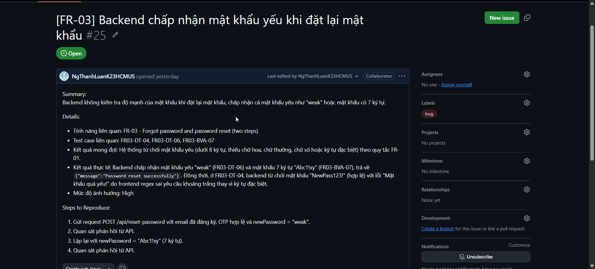

---

## `BUG-FR03-002` - Hệ thống từ chối mật khẩu mạnh hợp lệ khi đặt lại mật khẩu

**Feature:** `FR-03` - Quên mật khẩu & đặt lại mật khẩu  
**Severity:** Medium  
**Trạng thái:** Open  
**Test case liên quan:** `FR03-DT-04`

### Summary

Hệ thống báo mật khẩu quá yếu dù người dùng nhập mật khẩu mới thỏa yêu cầu độ mạnh.

### Details

- Dữ liệu đầu vào: `newPassword = NewPass123!`.
- Kết quả mong đợi: Hệ thống đặt lại mật khẩu thành công và chuyển về trang đăng nhập.
- Kết quả thực tế: Hệ thống báo `Mật khẩu quá yếu!`.
- Ảnh hưởng: Người dùng không thể đặt lại mật khẩu bằng một mật khẩu hợp lệ.

### Steps to Reproduce

1. Gửi yêu cầu quên mật khẩu với email hợp lệ.
2. Nhập OTP hợp lệ.
3. Nhập mật khẩu mới `NewPass123!`.
4. Gửi yêu cầu đặt lại mật khẩu.
5. Quan sát hệ thống báo mật khẩu quá yếu.

### Evidence 

- `evidence/FR-03/FR03-DT-04.png`

### Ảnh GitHub Issue

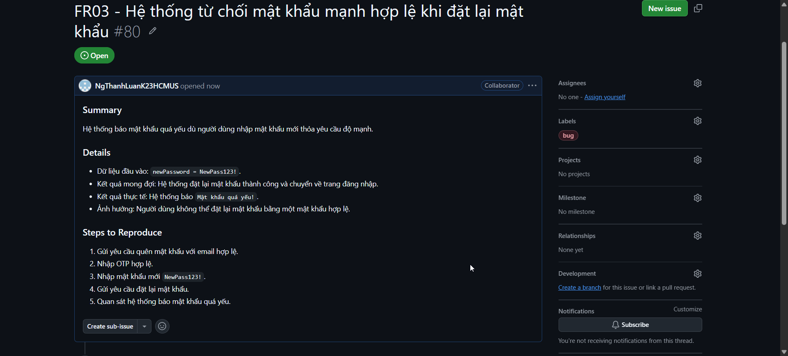

---

## `BUG-FR03-003` - OTP hiển thị 4 chữ số thay vì 6 chữ số theo yêu cầu

**Feature:** `FR-03` - Quên mật khẩu & đặt lại mật khẩu  
**Severity:** Medium  
**Trạng thái:** Open  
**Test case liên quan:** `FR03-BVA-09`

### Summary

OTP được hệ thống hiển thị chỉ có 4 chữ số, trong khi yêu cầu tính năng quy định OTP phải có 6 chữ số.

### Details

- Kết quả mong đợi: Hệ thống sinh và hiển thị OTP 6 chữ số.
- Kết quả thực tế: Hệ thống hiển thị OTP 4 chữ số.
- Ảnh hưởng: Hành vi thực tế không khớp yêu cầu, làm sai miền kiểm thử OTP và có thể giảm độ khó đoán của OTP.

### Steps to Reproduce

1. Mở chức năng quên mật khẩu.
2. Nhập email hợp lệ.
3. Gửi yêu cầu lấy OTP.
4. Quan sát OTP được hệ thống hiển thị.
5. So sánh số chữ số OTP thực tế với yêu cầu 6 chữ số.

### Evidence 

- `evidence/FR-03/FR03-BVA-09.png`

### Ảnh GitHub Issue

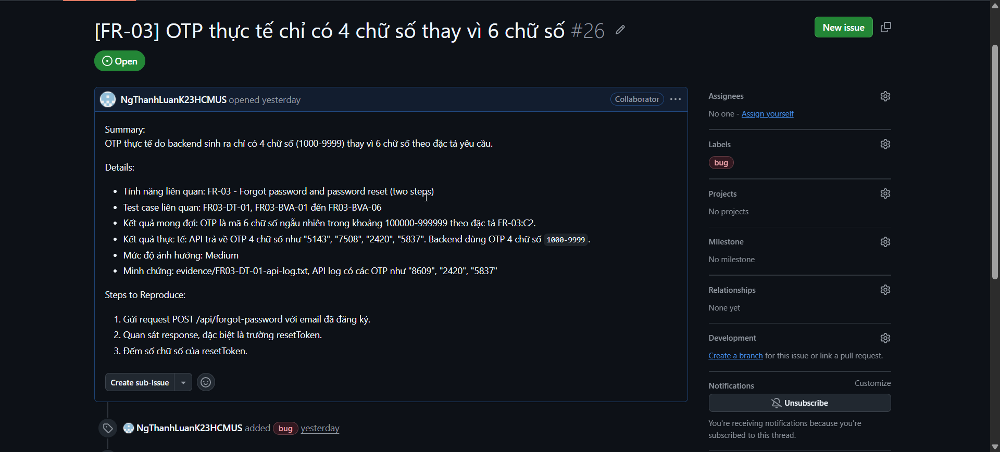

---

## `BUG-FR03-004` - Màn hình quên mật khẩu không hiển thị Step Indicator

**Feature:** `FR-03` - Quên mật khẩu & đặt lại mật khẩu  
**Severity:** Low  
**Trạng thái:** Open  
**Test case liên quan:** `FR03-DT-08`

### Summary

Giao diện quên mật khẩu không hiển thị chỉ báo bước như yêu cầu.

### Details

- Kết quả mong đợi: Giao diện hiển thị Step Indicator, ví dụ `Bước 1 / 2`.
- Kết quả thực tế: Không thấy chỉ báo bước trên giao diện.
- Ảnh hưởng: Giao diện không đúng yêu cầu và người dùng khó nhận biết đang ở bước nào trong luồng đặt lại mật khẩu.

### Steps to Reproduce

1. Mở chức năng quên mật khẩu.
2. Quan sát màn hình quên mật khẩu.
3. Kiểm tra khu vực hiển thị bước hiện tại.
4. Xác nhận không có Step Indicator.

### Evidence 

- `evidence/FR-03/FR03-DT-08.png`

### Ảnh GitHub Issue

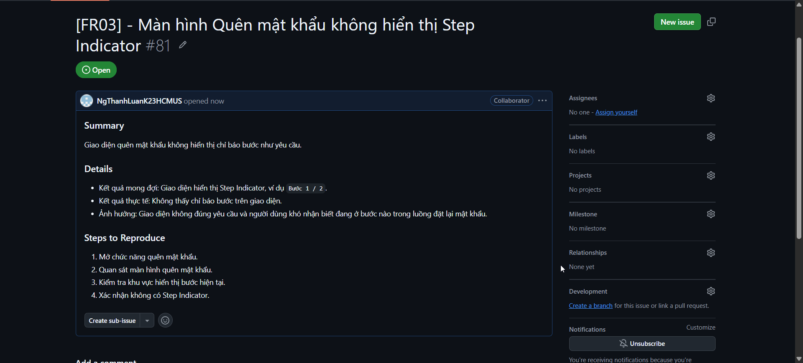

---

## `BUG-FR09-001` - Coupon phần trăm tính sai discount và final amount

**Feature:** `FR-09` - Áp dụng mã giảm giá  
**Severity:** High  
**Trạng thái:** Open  
**Test case liên quan:** `FR09-DT-01`, `FR09-BVA-03`

### Summary

Coupon phần trăm tạo ra discount/final amount sai, khiến số tiền cuối cùng tăng bất thường thay vì giảm.

### Details

- Kết quả mong đợi: Với coupon phần trăm hợp lệ, hệ thống tính discount theo tỷ lệ phần trăm và final amount phải bằng `total - discount`.
- Kết quả thực tế:
  - Với `SAVE10`, `total = 3000000`, final amount hiển thị `30000000`.
  - Với `total = 300001`, hệ thống trả `discount_amount = -2700009`, `final_amount = 3000010`.
- Ảnh hưởng: Sai nghiệp vụ thanh toán, có thể làm giá trị đơn hàng bị tăng bất thường.

### Steps to Reproduce

1. Đăng nhập bằng user hợp lệ.
2. Gửi yêu cầu áp dụng coupon `SAVE10`.
3. Đặt tổng tiền đơn hàng là một giá trị hợp lệ, ví dụ `3000000` hoặc `300001`.
4. Quan sát `discount_amount` và `final_amount`.
5. So sánh kết quả thực tế với công thức `final amount = total - discount`.

### Evidence 

- `evidence/FR-09/FR09-DT-01.png`
- `evidence/FR-09/FR09-BVA-03.png`

### Ảnh GitHub Issue

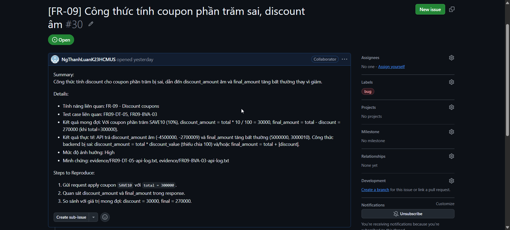

---

## `BUG-FR09-002` - Hệ thống cho áp dụng coupon khi người dùng chưa đăng nhập

**Feature:** `FR-09` - Áp dụng mã giảm giá  
**Severity:** High  
**Trạng thái:** Open  
**Test case liên quan:** `FR09-DT-05`

### Summary

API vẫn áp dụng coupon thành công khi request không có user/token hợp lệ.

### Details

- Dữ liệu đầu vào: `code = SAVE10`, `total = 500000`, `user_id = null`.
- Kết quả mong đợi: Hệ thống phải từ chối vì người dùng chưa đăng nhập.
- Kết quả thực tế: API vẫn trả `success = true` và áp dụng coupon.
- Ảnh hưởng: Người dùng chưa xác thực có thể sử dụng chức năng yêu cầu đăng nhập.

### Steps to Reproduce

1. Không đăng nhập hoặc không gửi token hợp lệ.
2. Gửi request apply coupon với mã `SAVE10`.
3. Đặt tổng tiền hợp lệ, ví dụ `500000`.
4. Quan sát response API.
5. Xác nhận hệ thống vẫn áp dụng coupon dù chưa đăng nhập.

### Evidence 

- `evidence/FR-09/FR09-DT-05.png`

### Ảnh GitHub Issue

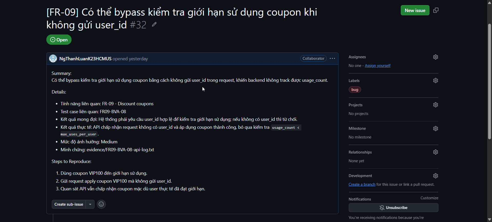

---

## `BUG-FR09-003` - Coupon bị từ chối khi tổng tiền bằng đúng min order

**Feature:** `FR-09` - Áp dụng mã giảm giá  
**Severity:** High  
**Trạng thái:** Open  
**Test case liên quan:** `FR09-DT-09`, `FR09-BVA-02`, `FR09-BVA-05`

### Summary

Hệ thống từ chối coupon khi tổng tiền đơn hàng bằng đúng `min_order_amount`, dù yêu cầu là chấp nhận khi `total >= min_order_amount`.

### Details

- Kết quả mong đợi: Coupon được chấp nhận khi `total` bằng đúng min order.
- Kết quả thực tế:
  - `SAVE10` với `total = 300000` bị từ chối.
  - `BIGBUY` với `total = 500000` bị từ chối.
- Ảnh hưởng: Người dùng không áp dụng được coupon ở giá trị biên hợp lệ.

### Steps to Reproduce

1. Đăng nhập bằng user hợp lệ.
2. Gửi yêu cầu apply coupon `SAVE10` với `total = 300000`.
3. Quan sát response.
4. Gửi yêu cầu apply coupon `BIGBUY` với `total = 500000`.
5. Quan sát hệ thống từ chối dù tổng tiền bằng đúng min order.

### Evidence 

- `evidence/FR-09/FR09-DT-09.png`
- `evidence/FR-09/FR09-BVA-02.png`
- `evidence/FR-09/FR09-BVA-05.png`

### Ảnh GitHub Issue

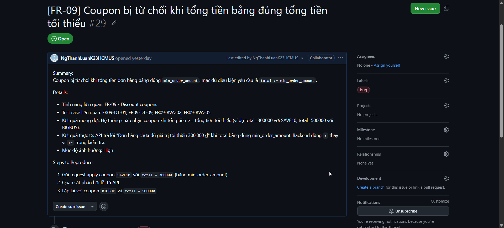

---

## `BUG-FR13-001` - Dashboard hiển thị doanh thu gấp đôi giá trị mong đợi

**Feature:** `FR-13` - Dashboard Admin  
**Severity:** High  
**Trạng thái:** Open  
**Test case liên quan:** `FR13-DT-02`, `FR13-DT-07`, `FR13-BVA-03`

### Summary

Dashboard hiển thị doanh thu gấp đôi tổng giá trị đơn hàng đã giao.

### Details

- Kết quả mong đợi: Doanh thu bằng tổng doanh thu của các đơn hàng có trạng thái đã giao.
- Kết quả thực tế:
  - Một đơn delivered `100000` hiển thị doanh thu `200000`.
  - Ba đơn delivered tổng `600000` hiển thị doanh thu `1200000`.
  - Biên doanh thu `1` hiển thị `2`.
- Ảnh hưởng: Dashboard Admin báo cáo sai doanh thu, ảnh hưởng trực tiếp tới dữ liệu kinh doanh.

### Steps to Reproduce

1. Đăng nhập bằng tài khoản Admin.
2. Chuẩn bị đơn hàng có trạng thái đã giao với giá trị xác định.
3. Mở Dashboard.
4. Quan sát tổng doanh thu.
5. So sánh doanh thu hiển thị với tổng giá trị mong đợi.

### Evidence 

- `evidence/FR-13/FR13-DT-02.png`
- `evidence/FR-13/FR13-DT-07.png`
- `evidence/FR-13/FR13-BVA-03.png`

### Ảnh GitHub Issue

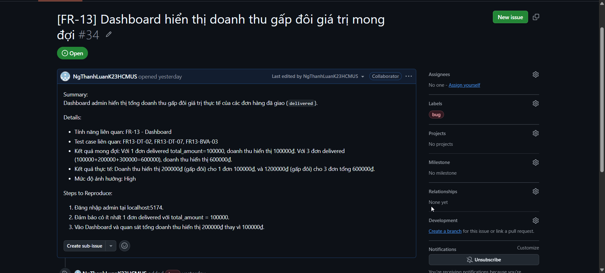

---

## `BUG-FR13-002` - User không phải Admin vẫn truy cập được tài nguyên admin

**Feature:** `FR-13` - Dashboard Admin  
**Severity:** High  
**Trạng thái:** Open  
**Test case liên quan:** `FR13-DT-08`

### Summary

User thường hoặc token không có quyền Admin vẫn truy cập được tài nguyên admin.

### Details

- Kết quả mong đợi: Hệ thống phải từ chối bằng `401` hoặc `403`.
- Kết quả thực tế: Request của user không phải Admin vẫn được chấp nhận.
- Ảnh hưởng: Lỗi phân quyền nghiêm trọng, có thể làm lộ dữ liệu admin.

### Steps to Reproduce

1. Chuẩn bị token của user thường hoặc user không có role Admin.
2. Gửi request đến API hoặc tài nguyên admin.
3. Quan sát response.
4. Xác nhận request vẫn được chấp nhận thay vì bị từ chối.

### Evidence 

- `evidence/FR-13/FR13-DT-08.png`

### Ảnh GitHub Issue

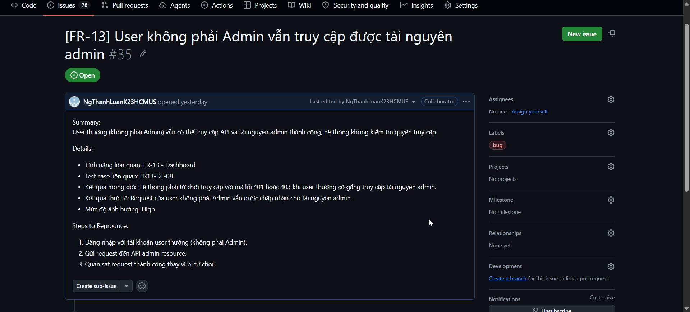

---

## `BUG-FR13-003` - Đơn hàng đã hủy vẫn có thể đánh dấu đã giao

**Feature:** `FR-13` - Dashboard Admin  
**Severity:** Medium  
**Trạng thái:** Open  
**Test case liên quan:** `FR13-DT-03`

### Summary

Đơn hàng có trạng thái đã hủy vẫn có thể bị đánh dấu là đã giao.

### Details

- Kết quả mong đợi: Đơn hàng đã hủy không thể chuyển sang trạng thái đã giao.
- Kết quả thực tế: Đơn canceled không được cộng vào doanh thu, nhưng vẫn có thể đánh dấu đã giao.
- Ảnh hưởng: Trạng thái đơn hàng có thể bị chuyển sai, gây sai lệch dữ liệu vận hành.

### Steps to Reproduce

1. Đăng nhập bằng tài khoản Admin.
2. Chuẩn bị hoặc tạo một đơn hàng có trạng thái đã hủy.
3. Thử đánh dấu đơn hàng đó là đã giao.
4. Quan sát hệ thống vẫn cho phép thao tác.

### Evidence 

- `evidence/FR-13/FR13-DT-03.png`

### Ảnh GitHub Issue

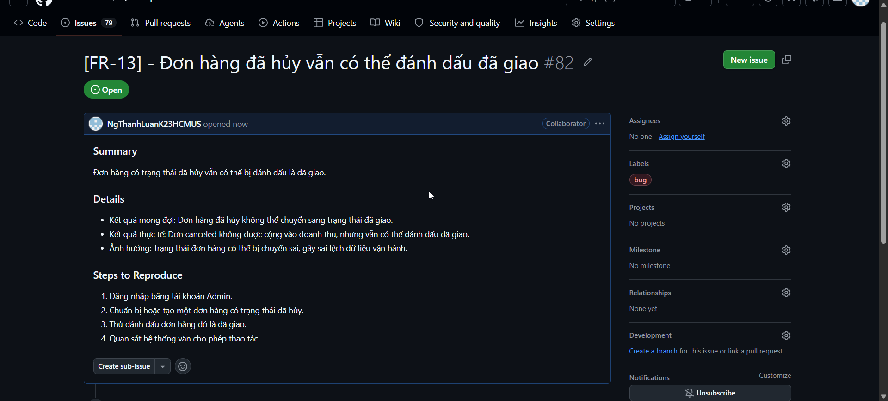

---

## `BUG-FR13-004` - Dashboard hiển thị doanh thu âm khi đơn delivered có giá trị âm

**Feature:** `FR-13` - Dashboard Admin  
**Severity:** Medium  
**Trạng thái:** Open  
**Test case liên quan:** `FR13-DT-09`, `FR13-BVA-04`

### Summary

Dashboard vẫn xử lý và hiển thị doanh thu âm khi tồn tại đơn delivered có giá trị âm.

### Details

- Dữ liệu đầu vào: Đơn hàng delivered có giá trị `-1`.
- Kết quả mong đợi: Hệ thống phải báo lỗi hoặc không cho doanh thu âm tồn tại.
- Kết quả thực tế: Dashboard hiển thị doanh thu `-2`.
- Ảnh hưởng: Dữ liệu doanh thu trên Dashboard có thể bị sai và không hợp lệ.

### Steps to Reproduce

1. Đăng nhập bằng tài khoản Admin.
2. Chuẩn bị đơn hàng delivered có giá trị âm.
3. Mở Dashboard.
4. Quan sát doanh thu hiển thị.
5. Xác nhận Dashboard hiển thị doanh thu âm.

### Evidence 

- `evidence/FR-13/FR13-DT-09.png`
- `evidence/FR-13/FR13-BVA-04.png`

### Ảnh GitHub Issue

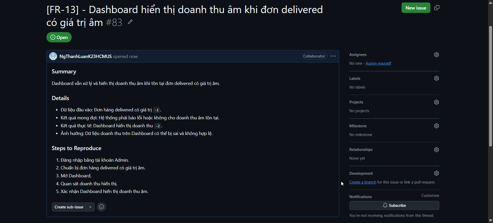

---

## `BLOCKER-FR03M-001` - Không thể kiểm thử mobile do mọi request bị network timeout

**Feature:** `FR-03M` - Quên mật khẩu & đặt lại mật khẩu trên mobile  
**Severity:** High  
**Trạng thái:** Open  
**Test case liên quan:** `FR03M-DT-*`, `FR03M-BVA-*`

### Summary

Không thể kiểm thử tính năng FR-03M trên mobile vì mọi request đều bị network timeout.

### Details

- Kết quả mong đợi: Mobile có thể gửi request forgot password/reset password và nhận response từ hệ thống.
- Kết quả thực tế: Mọi request từ mobile bị network timeout.
- Ảnh hưởng: Toàn bộ Domain Testing và BVA của FR-03M bị block, chưa thể kết luận lỗi chức năng mobile.

### Steps to Reproduce

1. Mở môi trường mobile hoặc mobile emulator.
2. Truy cập tính năng Forgot Password.
3. Thực hiện request forgot password hoặc reset password.
4. Quan sát request bị network timeout.
5. Lặp lại với các request khác của FR-03M và xác nhận tất cả đều timeout.

### Ảnh GitHub Issue

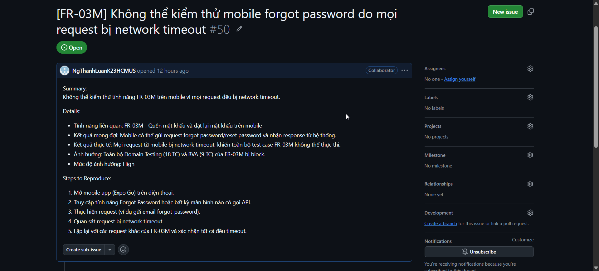

---

