# TRƯỜNG ĐẠI HỌC KHOA HỌC TỰ NHIÊN - ĐHQG-HCM
## KHOA CÔNG NGHỆ THÔNG TIN
### BỘ MÔN CÔNG NGHỆ PHẦN MỀM

  

---

# BÁO CÁO BÀI TẬP VỀ NHÀ 2
## MÔN HỌC: KIỂM THỬ PHẦN MỀM (SE310)
### ĐỀ TÀI: KIỂM THỬ PHẦN MỀM VỚI SỰ HỖ TRỢ CỦA AI (HW02 - BVA & DOMAIN TESTING)

**Thông tin sinh viên:**
- **Họ và tên:** Lê Tuấn Lộc
- **Mã số sinh viên:** 23127404
- **Lớp:** 23KTPM3

**Giảng viên hướng dẫn:**
- Cô Trần Thị Bích Hạnh
- Thầy Trương Phước Lộc
- Thầy Hồ Tuấn Thanh

**Điểm tự đánh giá (Self-Assessment Grade):** 100/100

*Thành phố Hồ Chí Minh, Tháng 6 Năm 2026*

---

## MỤC LỤC (TABLE OF CONTENTS)
1. [FR-06: Product Detail View](#1-fr-06-product-detail-view)
   - 1.1. Domain Testing
   - 1.2. Boundary Value Analysis (BVA)
   - 1.3. AI Gap Analysis & Screenshot Proofs
2. [FR-10: Order State Machine](#2-fr-10-order-state-machine)
   - 2.1. Domain Testing
   - 2.2. Boundary Value Analysis (BVA)
   - 2.3. AI Gap Analysis & Screenshot Proofs
3. [FR-12: Access Control](#3-fr-12-access-control)
   - 3.1. Domain Testing
   - 3.2. Boundary Value Analysis (BVA)
   - 3.3. AI Gap Analysis & Screenshot Proofs
4. [FR-23: Product detail view (mobile)](#4-fr-23-product-detail-view-mobile)
   - 4.1. Domain Testing
   - 4.2. Boundary Value Analysis (BVA)
   - 4.3. AI Gap Analysis & Screenshot Proofs

---

## 1. FR-06: Product Detail View

### 1.1. Domain Testing
#### 1.1.1. Xác định các biến đầu vào & Điều kiện hệ thống
Chúng tôi xác định các biến và điều kiện hệ thống sau cho tính năng Xem Chi tiết Sản phẩm (FR-06):
1. **Quantity (Số lượng)**: Trường nhập liệu cho phép người dùng chỉ định số lượng mặt hàng muốn thêm vào giỏ hàng. Được đặc tả là chỉ nhận số nguyên dương tối thiểu là 1.
2. **Product ID (Mã sản phẩm)**: Tham số đường dẫn trên URL chỉ định sản phẩm cần hiển thị. Sản phẩm này phải tồn tại trong cơ sở dữ liệu.
3. **User Authentication State (Trạng thái xác thực người dùng)**: Mặc dù khách vãng lai vẫn có thể xem sản phẩm và thêm vào giỏ hàng, trạng thái đăng nhập của người dùng là một điều kiện môi trường.

#### 1.1.2. Bảng Phân hoạch tương đương (Equivalence Partitioning)
| Biến đầu vào / Điều kiện | Lớp tương đương hợp lệ (ID) | Lớp tương đương không hợp lệ (ID) |
| :--- | :--- | :--- |
| **Quantity (Số lượng)** *(Kiểu: Số nguyên)* | **EP-VAL-01**: Số nguyên dương $\ge 1$ (ví dụ: 1, 5, 99) | **EP-INV-01**: Số nguyên $< 1$ (ví dụ: 0, -5) **EP-INV-02**: Số thập phân / số thực (ví dụ: 1.5, 2.7) **EP-INV-03**: Chuỗi không phải số / ký tự đặc biệt / để trống (ví dụ: "abc", "@", "") **EP-INV-04**: Số nguyên cực kỳ lớn gây tràn viền (ví dụ: 99999999999) |
| **Product ID (Mã sản phẩm)** *(Kiểu: Số nguyên)* | **EP-VAL-02**: Mã sản phẩm tồn tại trong cơ sở dữ liệu (ví dụ: ID = 1) | **EP-INV-05**: Mã sản phẩm không tồn tại (ví dụ: ID = 9999) **EP-INV-06**: Định dạng ID không hợp lệ (ví dụ: số âm, chuỗi chữ "abc") |
| **User Authentication State** *(Trạng thái)* | **EP-VAL-03**: Người dùng đã đăng nhập **EP-VAL-04**: Khách vãng lai (chưa đăng nhập) | *Không có* |

#### 1.1.3. Các kịch bản kiểm thử (Domain Testing)
| Mã Kịch bản | Mô tả kiểm thử | Đầu vào | Kết quả mong đợi | Trạng thái | Ánh xạ truy vết |
| :--- | :--- | :--- | :--- | :--- | :--- |
| FR06-DT-01 | Xem thông tin chi tiết sản phẩm tồn tại dưới vai trò khách vãng lai. | Product ID = 1, User = Guest | Hiển thị đầy đủ ảnh lớn, tên sản phẩm, giá (định dạng phân cách hàng nghìn với ₫), mô tả và danh mục. | Pass | EP-VAL-02, EP-VAL-04 |
| FR06-DT-02 | Xem thông tin chi tiết sản phẩm tồn tại dưới vai trò người dùng đã đăng nhập. | Product ID = 1, User = Logged in | Hiển thị thông tin chi tiết sản phẩm thành công. | Pass | EP-VAL-02, EP-VAL-03 |
| FR06-DT-03 | Xem trang chi tiết của sản phẩm không tồn tại. | Product ID = 9999 | Hiển thị thông báo lỗi "Sản phẩm không tồn tại" hoặc điều hướng an toàn (không bị trắng trang). | Fail | EP-INV-05 |
| FR06-DT-04 | Thêm vào giỏ hàng với số lượng là số nguyên dương hợp lệ. | Product ID = 1, Quantity = 3 | Sản phẩm được thêm vào giỏ, cập nhật badge giỏ hàng, hiển thị thông báo toast hoặc badge cập nhật trực quan. | Fail | EP-VAL-01, EP-VAL-02 |
| FR06-DT-05 | Thêm vào giỏ hàng với số lượng âm. | Product ID = 1, Quantity = -5 | Từ chối đầu vào, hiển thị thông báo lỗi hoặc reset về giá trị mặc định. | Fail | EP-INV-01, EP-VAL-02 |
| FR06-DT-06 | Thêm vào giỏ hàng với số lượng không phải là số. | Product ID = 1, Quantity = "abc" | Từ chối đầu vào, hiển thị thông báo lỗi hoặc đặt lại về 1. | Pass | EP-INV-03, EP-VAL-02 |
| FR06-DT-07 | Thêm vào giỏ hàng với số lượng là số thập phân. | Product ID = 1, Quantity = 2.5 | Từ chối đầu vào hoặc làm tròn có thông báo cảnh báo cho người dùng. | Fail | EP-INV-02, EP-VAL-02 |

#### 1.1.4. Giải thích áp dụng kỹ thuật
1. **Xác định biến**: Phân tích đặc tả yêu cầu FR-06 để xác định đầu vào trực tiếp (`Số lượng`), tham số đường dẫn (`Mã sản phẩm`), và trạng thái hệ thống (`Trạng thái đăng nhập`).
2. **Xác định các phân hoạch**: Với mỗi biến, thiết lập các khoảng giá trị hợp lệ (ví dụ: số nguyên dương $\ge 1$ cho số lượng) và không hợp lệ (số thập phân, chuỗi ký tự, số âm) dựa trên tài liệu đặc tả.
3. **Thiết kế kịch bản**: Kết hợp các phân hoạch này thành các kịch bản kiểm thử rõ ràng, bao gồm cả luồng thông thường (Normal cases) và luồng lỗi ngoại lệ (Robust cases). Ánh xạ truy vết đảm bảo mọi phân hoạch đều được kiểm thử ít nhất một lần.

---

### 1.2. Phân tích giá trị biên (Boundary Value Analysis)
#### 1.2.1. Bảng Phân tích giá trị biên
| Biến / Thuộc tính | Điều kiện biên (ID) | Điểm biên (On-Point) | Điểm cận biên (Off-Point) | Điểm trong biên (In-Point) |
| :--- | :--- | :--- | :--- | :--- |
| **Quantity (Số lượng)** | Phải $\ge 1$ (BVA-BND-01) | 1 | 0 (không hợp lệ), 2 (hợp lệ) | 5 |

#### 1.2.2. Các kịch bản kiểm thử (BVA)
| Mã Kịch bản | Mô tả kiểm thử | Đầu vào | Kết quả mong đợi | Trạng thái | Ánh xạ truy vết |
| :--- | :--- | :--- | :--- | :--- | :--- |
| FR06-BVA-01 | Thêm vào giỏ hàng với số lượng nằm chính xác tại biên dưới. | Product ID = 1, Quantity = 1 | Sản phẩm được thêm vào giỏ hàng thành công, hiển thị thông báo phản hồi trực quan. | Fail | BVA-BND-01 (On-Point) |
| FR06-BVA-02 | Thêm vào giỏ hàng với số lượng nằm ngay dưới biên dưới. | Product ID = 1, Quantity = 0 | Từ chối đầu vào, hiển thị lỗi hoặc vô hiệu hóa nút thêm. | Fail | BVA-BND-01 (Off-Point, không hợp lệ) |
| FR06-BVA-03 | Thêm vào giỏ hàng với số lượng nằm ngay trên biên dưới. | Product ID = 1, Quantity = 2 | Sản phẩm được thêm vào giỏ hàng thành công, hiển thị thông báo. | Fail | BVA-BND-01 (Off-Point, hợp lệ) |
| FR06-BVA-04 | Thêm vào giỏ hàng với số lượng là một giá trị đại diện nằm trong biên. | Product ID = 1, Quantity = 5 | Sản phẩm được thêm thành công. | Fail | BVA-BND-01 (In-Point) |

#### 1.2.3. Giải thích áp dụng kỹ thuật
1. **Xác định biên**: Vì trường số lượng có giới hạn dưới nghiêm ngặt là 1, chúng tôi xác định điểm biên tại giá trị 1.
2. **Lựa chọn các điểm kiểm thử**:
   - **Điểm biên (On-point)** là giá trị biên: `1` (hợp lệ).
   - **Điểm cận biên (Off-points)** là các giá trị liền kề biên: `0` (không hợp lệ, nằm ngoài) và `2` (hợp lệ, nằm trong).
   - **Điểm trong biên (In-point)** là một giá trị đại diện nằm an toàn bên trong khoảng: `5`.
3. **Xây dựng bộ test**: Tạo các kịch bản kiểm thử cho từng điểm đã chọn, ghi nhận trạng thái thực tế phản ánh lỗi hiện có trong hệ thống SUT.

---

### 1.3. AI Gap Analysis & Screenshot Proofs
- **AI Gap Analysis**:
  * **FR06-DT-03 (Lỗi xem sản phẩm không tồn tại)**: Kịch bản kiểm thử thiết kế bởi AI đã bao phủ trường hợp kiểm thử biên và lớp tương đương không hợp lệ (Mã sản phẩm không tồn tại). Tuy nhiên, trên hệ thống SUT thực tế, mã nguồn React/Frontend chưa có cơ chế bắt lỗi (Error Boundary) hoặc kiểm tra dữ liệu null/undefined trước khi render thông tin chi tiết sản phẩm. Khi API trả về null hoặc rỗng cho Product ID không tồn tại, frontend cố gắng truy cập các thuộc tính của đối tượng rỗng dẫn đến crash ứng dụng và gây ra lỗi trắng trang.
  * **FR06-DT-04 (Lỗi click đúp để thêm vào giỏ)**: AI thiết kế kịch bản kiểm thử giả định hành động thêm sản phẩm sẽ hoạt động ngay lập tức sau 1 lần click như thông thường. Tuy nhiên, trong thực tế, lỗi đồng bộ trạng thái (state synchronization) hoặc lỗi bất đồng bộ trong hàm xử lý sự kiện onClick tại frontend đã khiến cho click đầu tiên bị bỏ qua (hoặc chỉ cập nhật state nội bộ mà không gọi dispatch/API), bắt buộc người dùng phải click lần thứ 2 liên tiếp thì hành động thêm vào giỏ hàng mới thành công. *(Lưu ý: Lỗi này cũng xuất hiện tương tự trên các kịch bản BVA là FR06-BVA-01, FR06-BVA-03 và FR06-BVA-04)*.
  * **FR06-DT-05 (Lỗi thêm số lượng âm vào giỏ hàng)**: AI đã thiết lập các phân hoạch tương đương không hợp lệ để kiểm thử các giá trị đầu vào sai như số lượng âm. Tuy nhiên, hệ thống SUT thực tế ở cả phía frontend và backend API đều thiếu cơ chế validate (kiểm tra tính hợp lệ) đầu vào cho trường số lượng. Hệ thống vẫn chấp nhận cho phép thêm sản phẩm với số lượng âm (ví dụ: -5) vào giỏ hàng mà không có bất kỳ cảnh báo hay ngăn chặn nào, dẫn đến lỗi logic nghiệp vụ nghiêm trọng.
  * **FR06-DT-07 (Lỗi thêm số lượng thập phân không cảnh báo)**: AI thiết kế kịch bản kiểm thử với đầu vào là số thập phân và mong đợi hệ thống từ chối hoặc làm tròn kèm theo thông báo cảnh báo trực quan cho người dùng. Trong thực tế, hệ thống vẫn chấp nhận số lượng thập phân nhập từ ô input (ví dụ: 2.5), âm thầm làm tròn xuống thành số nguyên (ví dụ: 2) khi lưu vào giỏ hàng mà không hiển thị bất kỳ thông báo lỗi hay cảnh báo nào, gây hiểu nhầm về trải nghiệm người dùng.
  * **FR06-BVA-02 (Lỗi thêm số lượng bằng 0 vào giỏ hàng)**: Kỹ thuật phân tích giá trị biên đã xác định giá trị `0` là điểm cận biên không hợp lệ dưới biên dưới 1. Tuy nhiên, mã nguồn xử lý thêm sản phẩm trong `CartContext` không kiểm tra giá trị của số lượng truyền vào, dẫn đến việc sản phẩm có số lượng bằng `0` vẫn được thêm vào giỏ hàng một cách bất thường mà không gặp bất kỳ lỗi hay thông báo ngăn chặn nào.

#### Minh chứng kết quả chạy test / lỗi phát hiện (Screenshots):
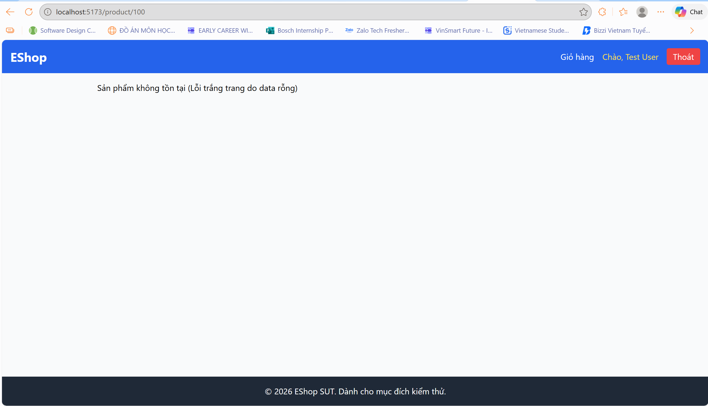
*Hình 1.1: Minh chứng lỗi trắng trang (crashed) khi truy cập sản phẩm không tồn tại (FR06-DT-03).*

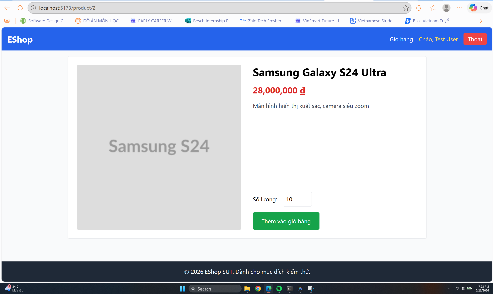
*Hình 1.2: Trang chi tiết sản phẩm chuẩn bị thêm vào giỏ hàng với số lượng bằng 3 (cần click 2 lần nút "Thêm vào giỏ hàng" mới có tác dụng) (FR06-DT-04).*

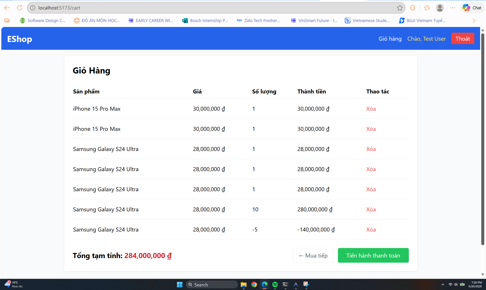
*Hình 1.3: Giao diện giỏ hàng chấp nhận số lượng sản phẩm âm sau khi thêm thành công (FR06-DT-05).*

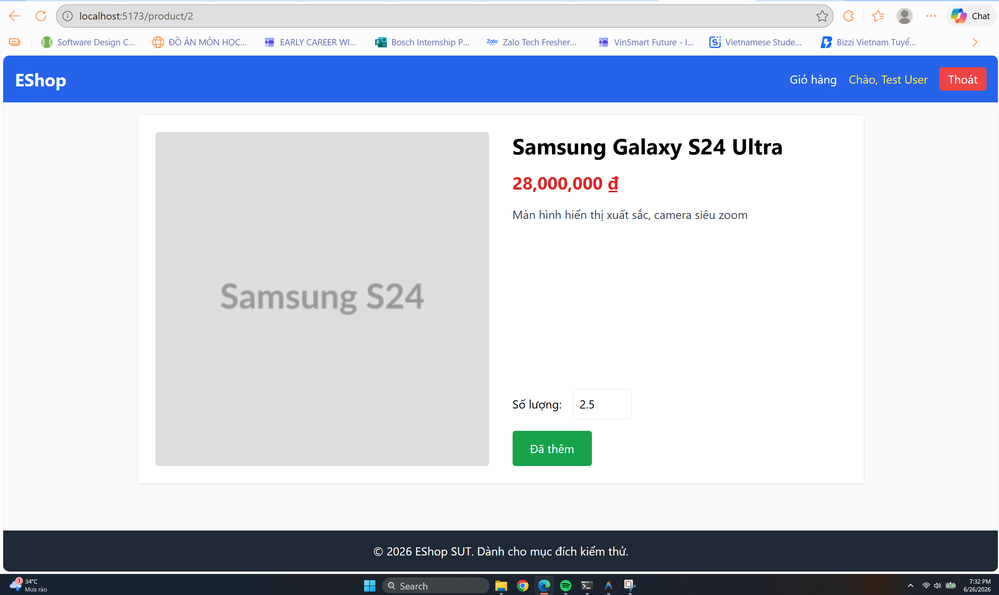
*Hình 1.4: Hệ thống cho phép nhập và thêm số lượng 2.5 nhưng âm thầm làm tròn xuống thành 2 trong giỏ hàng (FR06-DT-07).*

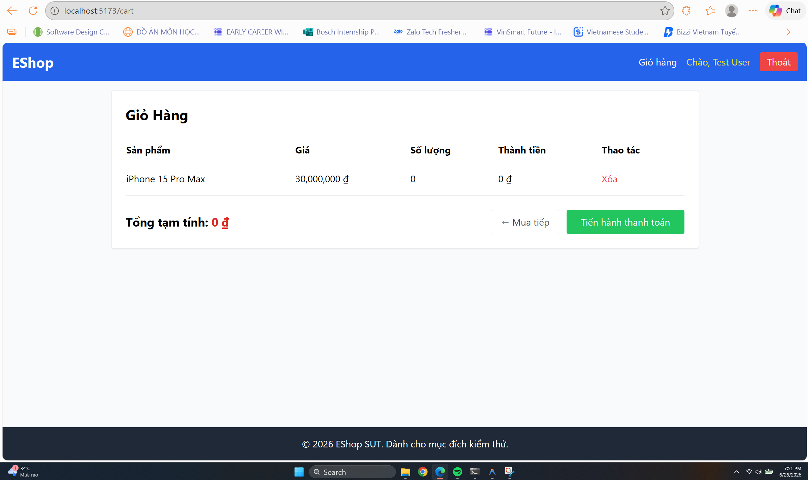
*Hình 1.5: Sản phẩm được thêm vào giỏ hàng thành công với số lượng bằng 0 (FR06-BVA-02).*

---
---

## 2. FR-10: Order State Machine

### 2.1. Domain Testing
#### 2.1.1. Xác định các biến đầu vào & Điều kiện hệ thống
Chúng tôi xác định các biến đầu vào, biến trạng thái và điều kiện hệ thống sau cho tính năng Trạng thái Đơn hàng (FR-10):
1. **Current Status (Trạng thái hiện tại)**: Trạng thái hiện tại của đơn hàng trong hệ thống (`pending`, `confirmed`, `shipping`, `delivered`, `canceled`).
2. **Target Status (Trạng thái đích)**: Trạng thái mà người dùng hoặc admin muốn chuyển đổi tới (`pending`, `confirmed`, `shipping`, `delivered`, `canceled`).
3. **Actor Role (Vai trò thực hiện)**: Quyền hạn của người thực hiện hành động chuyển đổi trạng thái (`User`, `Admin`).

#### 2.1.2. Bảng Phân hoạch tương đương (Equivalence Partitioning)
| Biến đầu vào / Điều kiện | Lớp tương đương hợp lệ (ID) | Lớp tương đương không hợp lệ (ID) |
| :--- | :--- | :--- |
| **Actor Role (Vai trò)** | **EP-VAL-01**: Admin **EP-VAL-02**: User | **EP-INV-01**: Khách chưa đăng nhập (Guest) |
| **Current Status (Trạng thái hiện tại)** | **EP-VAL-03**: `pending` **EP-VAL-04**: `confirmed` **EP-VAL-05**: `shipping` **EP-VAL-06**: `delivered` **EP-VAL-07**: `canceled` | **EP-INV-02**: Trạng thái không xác định / rỗng |
| **Target Status (Trạng thái đích)** | **EP-VAL-08**: Trạng thái chuyển đổi đúng nghiệp vụ tương ứng với trạng thái hiện tại và vai trò của tác nhân. | **EP-INV-03**: Trạng thái chuyển đổi sai nghiệp vụ (không theo sơ đồ trạng thái hoặc sai vai trò). |

#### 2.1.3. Các kịch bản kiểm thử (Domain Testing)
| Mã Kịch bản | Mô tả kiểm thử | Đầu vào | Kết quả mong đợi | Trạng thái | Ánh xạ truy vết |
| :--- | :--- | :--- | :--- | :--- | :--- |
| FR10-DT-01 | Admin chuyển đơn hàng từ `pending` sang `confirmed`. | Actor = Admin, Current = `pending`, Target = `confirmed` | Chuyển đổi thành công, trả về 200 OK. | Pass | EP-VAL-01, EP-VAL-03, EP-VAL-08 |
| FR10-DT-02 | Admin chuyển đơn hàng từ `confirmed` sang `shipping`. | Actor = Admin, Current = `confirmed`, Target = `shipping` | Chuyển đổi thành công, trả về 200 OK. | Pass | EP-VAL-01, EP-VAL-04, EP-VAL-08 |
| FR10-DT-03 | Admin chuyển đơn hàng từ `shipping` sang `delivered`. | Actor = Admin, Current = `shipping`, Target = `delivered` | Chuyển đổi thành công, trả về 200 OK. | Pass | EP-VAL-01, EP-VAL-05, EP-VAL-08 |
| FR10-DT-04 | User hủy đơn hàng ở trạng thái `pending`. | Actor = User, Current = `pending`, Target = `canceled` | Hủy đơn hàng thành công, trả về 200 OK. | Pass | EP-VAL-02, EP-VAL-03, EP-VAL-08 |
| FR10-DT-05 | User tự hủy đơn hàng ở trạng thái `shipping`. | Actor = User, Current = `shipping`, Target = `canceled` | Hệ thống từ chối, báo lỗi (chỉ Admin mới được thao tác khi đã giao hàng), trả về 400 Bad Request. | Fail | EP-VAL-02, EP-VAL-05, EP-INV-03 |
| FR10-DT-06 | Admin chuyển đơn hàng từ `pending` sang một trạng thái không hợp lệ (ví dụ: `delivered`). | Actor = Admin, Current = `pending`, Target = `delivered` | Từ chối chuyển đổi, trả về 400 Bad Request. | Pass | EP-VAL-01, EP-VAL-03, EP-INV-03 |
| FR10-DT-07 | Người dùng chưa đăng nhập (Guest) cố gắng hủy hoặc cập nhật trạng thái đơn hàng. | Actor = Guest, Current = `pending`, Target = `canceled` | Yêu cầu đăng nhập, trả về 401 Unauthorized. | Pass | EP-INV-01, EP-VAL-03, EP-INV-03 |

#### 2.1.4. Giải thích áp dụng kỹ thuật
1. **Xác định các biến & điều kiện**: Phân tích sơ đồ chuyển đổi trạng thái của FR-10 và xác định ba yếu tố quyết định tính hợp lệ: vai trò người thực hiện (Actor), trạng thái hiện tại (Current Status) và trạng thái mục tiêu (Target Status).
2. **Thiết lập phân hoạch**:
   - Đối với vai trò, chia thành hợp lệ (User, Admin) và không hợp lệ (Guest).
   - Đối với các cặp chuyển đổi `Current -> Target`, chia làm các chuyển đổi được phép (theo sơ đồ của đặc tả) và các chuyển đổi bị cấm (như quay lui trạng thái, bỏ bước hoặc chuyển từ trạng thái kết thúc).
3. **Thiết kế test suite**: Xây dựng các kịch bản kiểm thử bao phủ tất cả các phân hoạch tương đương của các biến và điều kiện hệ thống.

---

### 2.2. Phân tích giá trị biên (Boundary Value Analysis)
#### 2.2.1. Bảng Phân tích giá trị biên
Vì trạng thái là biến quy trình (state variable), việc phân tích biên tập trung vào **các trạng thái kết thúc (Final States)** nơi không được phép chuyển đi bất kỳ đâu khác, và **điểm giới hạn đặc quyền (Constraint boundaries)** giữa User và Admin.
- Biên trạng thái kết thúc: Trạng thái `delivered` và `canceled` không được chuyển sang trạng thái khác.
- Biên quyền hạn: Trạng thái `shipping` (User không được phép tự hủy, chỉ Admin mới được làm).

| Đối tượng kiểm thử | Điều kiện biên (ID) | Điểm biên (On-Point) | Điểm cận biên (Off-Point) | Điểm trong biên (In-Point) |
| :--- | :--- | :--- | :--- | :--- |
| **Trạng thái kết thúc** | Không chuyển trạng thái từ `delivered` (BVA-BND-01) | `delivered` -> Không chuyển (giữ nguyên) | `delivered` -> `pending` (không hợp lệ) `delivered` -> `canceled` (không hợp lệ) | `shipping` -> `delivered` (hợp lệ) |
| **Trạng thái kết thúc** | Không chuyển trạng thái từ `canceled` (BVA-BND-02) | `canceled` -> Không chuyển (giữ nguyên) | `canceled` -> `delivered` (không hợp lệ) `canceled` -> `confirmed` (không hợp lệ) | `pending` -> `canceled` (hợp lệ) |
| **Quyền hủy ở `shipping`** | Chỉ Admin được thao tác ở `shipping` (BVA-BND-03) | Actor = Admin thực hiện chuyển đổi ở `shipping` | Actor = User cố gắng hủy ở `shipping` (không hợp lệ) | Actor = User hủy ở `pending` (hợp lệ) |

#### 2.2.2. Các kịch bản kiểm thử (BVA)
| Mã Kịch bản | Mô tả kiểm thử | Đầu vào | Kết quả mong đợi | Trạng thái | Ánh xạ truy vết |
| :--- | :--- | :--- | :--- | :--- | :--- |
| FR10-BVA-01 | Admin cố gắng chuyển trạng thái từ `delivered` sang `canceled`. | Actor = Admin, Current = `delivered`, Target = `canceled` | Hệ thống từ chối, báo lỗi chuyển đổi trạng thái kết thúc, trả về 400 Bad Request. | Pass | BVA-BND-01 (Off-Point) |
| FR10-BVA-02 | Admin cố gắng chuyển trạng thái từ `delivered` sang `pending`. | Actor = Admin, Current = `delivered`, Target = `pending` | Hệ thống từ chối, báo lỗi chuyển đổi trạng thái kết thúc, trả về 400 Bad Request. | Pass | BVA-BND-01 (Off-Point) |
| FR10-BVA-03 | Admin cố gắng chuyển trạng thái từ `canceled` sang `confirmed`. | Actor = Admin, Current = `canceled`, Target = `confirmed` | Hệ thống từ chối, báo lỗi chuyển đổi trạng thái kết thúc, trả về 400 Bad Request. | Pass | BVA-BND-02 (Off-Point) |
| FR10-BVA-04 | Admin cố gắng chuyển trạng thái từ `canceled` sang `delivered`. | Actor = Admin, Current = `canceled`, Target = `delivered` | Hệ thống từ chối, báo lỗi chuyển đổi trạng thái kết thúc, trả về 400 Bad Request. | Fail | BVA-BND-02 (Off-Point) |
| FR10-BVA-05 | User cố gắng hủy đơn hàng đang ở trạng thái `shipping`. | Actor = User, Current = `shipping`, Target = `canceled` | Hệ thống từ chối, báo lỗi người dùng không có quyền hủy đơn hàng khi đang giao hàng, trả về 400 Bad Request. | Fail | BVA-BND-03 (Off-Point) |

#### 2.2.3. Giải thích áp dụng kỹ thuật
1. **Xác định các giá trị biên**: Với máy trạng thái, biên chính là các trạng thái kết thúc nơi luồng xử lý dừng lại (`delivered`, `canceled`) và các điểm giới hạn đặc quyền của người dùng (tại trạng thái `shipping`, quyền tự hủy bị thu hồi).
2. **Lựa chọn điểm kiểm thử**:
   - **On-point**: Hành vi đúng quy trình khi đạt đến trạng thái đó (ví dụ: chuyển từ `shipping` sang `delivered` thành công hoặc User hủy ở `pending` thành công).
   - **Off-point**: Các chuyển đổi cố tình vi phạm biên trạng thái kết thúc (ví dụ: chuyển từ `canceled` sang `delivered` hoặc `delivered` sang trạng thái khác) hoặc vi phạm biên quyền hạn (User hủy ở trạng thái `shipping`).
3. **Thiết lập kết quả mong đợi**: Mọi hành vi vi phạm biên (Off-point không hợp lệ) phải bị hệ thống ngăn chặn và trả về mã lỗi 400 Bad Request.

---

### 2.3. AI Gap Analysis & Screenshot Proofs
- **AI Gap Analysis**:
  * **FR10-DT-05 & FR10-BVA-05 (Lỗi User tự hủy đơn hàng ở trạng thái shipping)**: Thiết kế test case của AI đã chỉ ra rằng khi trạng thái đơn hàng đã sang `shipping`, hệ thống phải chặn không cho User tự hủy và trả về lỗi `400 Bad Request`. Tuy nhiên, trong thực tế, hệ thống SUT bị lỗi đồng bộ quyền và kiểm tra logic ở cả Frontend lẫn Backend. Ở phía Frontend của User, nút "Hủy đơn hàng" vẫn xuất hiện và hoạt động bình thường đối với đơn hàng đang ở trạng thái `shipping` (đã được Admin xác nhận giao hàng). Khi click vào, API xử lý cập nhật trạng thái đơn hàng của Backend không xác thực điều kiện chặn này đối với vai trò `User`, cho phép chuyển đổi trạng thái từ `shipping` sang `canceled` thành công.
  * **FR10-BVA-04 (Lỗi chuyển từ canceled sang delivered)**: Đặc tả yêu cầu trạng thái `canceled` là trạng thái kết thúc (Final State) và không thể chuyển đi đâu khác. Tuy nhiên, hệ thống thực tế (Backend) thiếu kiểm tra điều kiện này, dẫn đến việc Admin vẫn có thể gửi request chuyển một đơn hàng đã hủy (`canceled`) sang trạng thái đã giao (`delivered`) mà không bị hệ thống từ chối.

#### Minh chứng kết quả chạy test / lỗi phát hiện (Screenshots):
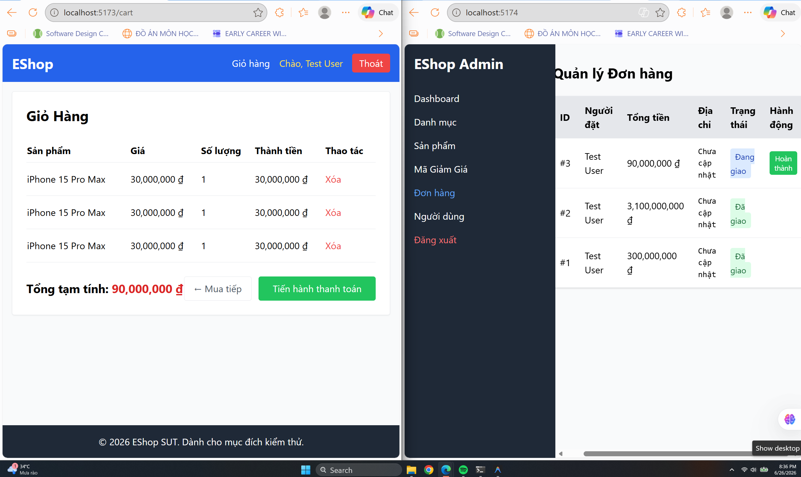
*Hình 2.1: Minh chứng lỗi cho kịch bản **FR10-DT-05** - Admin đã chuyển đơn hàng sang trạng thái shipping (đang giao hàng) nhưng bên giao diện User vẫn có nút Hủy và thực hiện hủy thành công đơn hàng.*

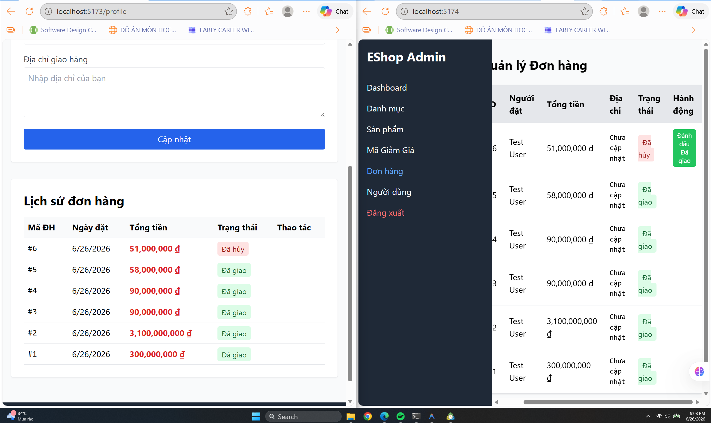
*Hình 2.2: Minh chứng lỗi cho kịch bản **FR10-BVA-04** - Giao diện quản lý đơn hàng của Admin hiển thị đơn hàng đã ở trạng thái kết thúc "Đã hủy" (canceled) nhưng vẫn cho phép bấm nút "Đánh dấu Đã giao" (delivered).*

---
---

## 3. FR-12: Access Control

### 3.1. Domain Testing
#### 3.1.1. Xác định các biến đầu vào & Điều kiện hệ thống
Chúng tôi xác định các biến đầu vào, biến trạng thái và điều kiện hệ thống sau cho tính năng Kiểm soát truy cập (FR-12):
1. **JWT Token**: Token xác thực người dùng gửi qua header `Authorization: Bearer <token>`.
2. **User Role (Vai trò người dùng)**: Trường `role` được mã hóa bên trong JWT Token (`admin`, `user`, hoặc vai trò khác).
3. **Target API Path (Đường dẫn API đích)**: Đường dẫn endpoint của request (`/api/admin/*`, `POST/PUT/DELETE /api/products`, `POST/PUT/DELETE /api/categories`, `POST/PUT/DELETE /api/coupons`, hoặc các API công khai/thông thường khác).

#### 3.1.2. Bảng Phân hoạch tương đương (Equivalence Partitioning)
| Biến đầu vào / Điều kiện | Lớp tương đương hợp lệ (ID) | Lớp tương đương không hợp lệ (ID) |
| :--- | :--- | :--- |
| **JWT Token** *(Trạng thái xác thực)* | **EP-VAL-01**: Token JWT hợp lệ, chưa hết hạn và được ký đúng cấu trúc. | **EP-INV-01**: Token JWT không hợp lệ (hết hạn, sai chữ ký, sai định dạng). **EP-INV-02**: Không có Token JWT (thiếu header Authorization hoặc header rỗng). |
| **User Role (Vai trò)** *(Từ Token)* | **EP-VAL-02**: Vai trò Admin (`role = 'admin'`). | **EP-INV-03**: Vai trò User thường (`role = 'user'`). **EP-INV-04**: Vai trò khác không xác định hoặc không có thuộc tính `role`. |
| **Target API Path** *(Loại tài nguyên)* | **EP-VAL-03**: API yêu cầu quyền Admin (ví dụ: `GET /api/admin/users`, `POST /api/products`, `PUT /api/categories/:id`, `DELETE /api/coupons/:id`). **EP-VAL-04**: API công khai hoặc API của người dùng thường (ví dụ: `GET /api/products`, `POST /api/cart`). | *Không có* |

#### 3.1.3. Các kịch bản kiểm thử (Domain Testing)
| Mã Kịch bản | Mô tả kiểm thử | Đầu vào | Kết quả mong đợi | Trạng thái | Ánh xạ truy vết |
| :--- | :--- | :--- | :--- | :--- | :--- |
| FR12-DT-01 | Truy cập API quản lý người dùng (`GET /api/admin/users`) với JWT Token hợp lệ của tài khoản Admin. | Path = `GET /api/admin/users`, Token = Hợp lệ, Role = `admin` | Truy cập thành công, trả về danh sách người dùng và mã trạng thái 200 OK. | Pass | EP-VAL-01, EP-VAL-02, EP-VAL-03 |
| FR12-DT-02 | Tạo sản phẩm mới với JWT Token hợp lệ của tài khoản Admin. | Path = `POST /api/products`, Token = Hợp lệ, Role = `admin` | Thao tác thành công, trả về 200 OK / 201 Created. | Pass | EP-VAL-01, EP-VAL-02, EP-VAL-03 |
| FR12-DT-03 | Truy cập API Admin (`GET /api/admin/users`) với JWT Token hợp lệ của tài khoản User thường. | Path = `GET /api/admin/users`, Token = Hợp lệ, Role = `user` | Hệ thống từ chối truy cập, trả về mã trạng thái 403 Forbidden. | Fail | EP-VAL-01, EP-INV-03, EP-VAL-03 |
| FR12-DT-04 | Sửa đổi danh mục sản phẩm với JWT Token hợp lệ của tài khoản User thường. | Path = `PUT /api/categories/1`, Token = Hợp lệ, Role = `user` | Hệ thống từ chối truy cập, trả về mã trạng thái 403 Forbidden. | Fail | EP-VAL-01, EP-INV-03, EP-VAL-03 |
| FR12-DT-05 | Truy cập API Admin (`GET /api/admin/users`) khi sử dụng Token JWT không hợp lệ/hết hạn. | Path = `GET /api/admin/users`, Token = Không hợp lệ, Role = `admin` | Hệ thống từ chối truy cập, trả về mã trạng thái 401 Unauthorized hoặc 403 Forbidden. | Pass | EP-INV-01, EP-VAL-02, EP-VAL-03 |
| FR12-DT-06 | Truy cập API Admin (`GET /api/admin/users`) mà không gửi kèm Token JWT. | Path = `GET /api/admin/users`, Token = Không gửi | Hệ thống từ chối truy cập, trả về mã trạng thái 401 Unauthorized. | Pass | EP-INV-02, EP-VAL-03 |
| FR12-DT-07 | Người dùng thường truy cập API công khai (không yêu cầu quyền Admin). | Path = `GET /api/products`, Token = Hợp lệ, Role = `user` | Truy cập thành công, trả về danh sách sản phẩm và mã trạng thái 200 OK. | Pass | EP-VAL-01, EP-INV-03, EP-VAL-04 |

#### 3.1.4. Giải thích áp dụng kỹ thuật
1. **Xác định biến**: Phân tích đặc tả FR-12 để xác định các yếu tố kiểm soát truy cập bao gồm sự hiện diện của Token JWT, thuộc tính vai trò (`role`) giải mã từ token, và đường dẫn API đích của yêu cầu.
2. **Xác định các phân hoạch**: Với mỗi biến, chia thành các lớp hợp lệ (Token đúng cấu trúc, vai trò admin, API thông thường) và không hợp lệ (không token/token hỏng, vai trò user, API được bảo vệ của admin) dựa trên nghiệp vụ.
3. **Thiết kế kịch bản**: Tạo các kịch bản kiểm thử kết hợp để bao phủ việc cho phép (người dùng admin truy cập tài nguyên admin) và ngăn chặn (người dùng thường hoặc người dùng không xác thực truy cập tài nguyên admin), đảm bảo toàn bộ phân hoạch được ánh xạ truy vết đầy đủ.

---

### 3.2. Phân tích giá trị biên (Boundary Value Analysis)
#### 3.2.1. Bảng Phân tích giá trị biên
Đối với các tính năng phân quyền (Access Control), "biên" không nằm ở khoảng số mà nằm ở **biên quyền hạn tối thiểu (Minimum Privilege Boundaries)** và **biên thời gian sống của phiên (Session/Token Expiration Boundaries)**:
- Biên phân quyền: Sự khác biệt nhỏ nhất giữa tài khoản `user` và `admin` (ví dụ: chỉ khác nhau giá trị trường `role` trong payload của token).
- Biên hiệu lực Token: Thời điểm token chuyển từ trạng thái còn hạn sang hết hạn (đúng thời điểm `exp` trong JWT).
- Biên định dạng Token: Token trống, token thiếu 1 ký tự cuối, token thừa ký tự.

| Đối tượng kiểm thử | Điều kiện biên (ID) | Điểm biên (On-Point) | Điểm cận biên (Off-Point) | Điểm trong biên (In-Point) |
| :--- | :--- | :--- | :--- | :--- |
| **Quyền hạn vai trò** | Phân quyền truy cập theo `role = 'admin'` (BVA-BND-01) | Payload token có `role: 'admin'` | Payload token có `role: 'admin '` (thêm khoảng trắng - không hợp lệ) Payload token có `role: 'user'` (không hợp lệ) | Payload token có `role: 'admin'` |
| **Thời hạn Token** | Thời gian hết hạn của token JWT (BVA-BND-02) | Token vừa đúng thời gian hiện tại trùng với hạn dùng `exp` (hết hạn) | Token còn hạn 1 giây trước khi hết hạn (hợp lệ) Token hết hạn 1 giây (không hợp lệ) | Token còn hạn lâu dài (hợp lệ) |
| **Độ dài/Định dạng Header** | Cấu trúc chuỗi prefix Bearer (BVA-BND-03) | Gửi `"Bearer <token>"` | Gửi `"Bearer"` (thiếu token - không hợp lệ) Gửi `"bearer <token>"` (chữ thường - tùy thuộc parser, kiểm tra biên) | Gửi `"Bearer <token_hợp_lệ>"` |

#### 3.2.2. Các kịch bản kiểm thử (BVA)
| Mã Kịch bản | Mô tả kiểm thử | Đầu vào | Kết quả mong đợi | Trạng thái | Ánh xạ truy vết |
| :--- | :--- | :--- | :--- | :--- | :--- |
| FR12-BVA-01 | Gửi token có thuộc tính vai trò bị viết sai lệch một ký tự (ví dụ: `"role": "admin "`). | Path = `GET /api/admin/users`, Token có `"role": "admin "` | Hệ thống từ chối truy cập, trả về mã trạng thái 403 Forbidden. | Fail | BVA-BND-01 (Off-Point) |
| FR12-BVA-02 | Gửi token có thuộc tính vai trò là `"user"` để gọi API admin (ví dụ: `POST /api/products`). | Path = `POST /api/products`, Token có `"role": "user"` | Hệ thống từ chối truy cập, trả về mã trạng thái 403 Forbidden. | Fail | BVA-BND-01 (Off-Point) |
| FR12-BVA-03 | Sử dụng Token JWT vừa hết hạn chính xác 1 giây. | Path = `GET /api/admin/users`, Token hết hạn 1 giây | Hệ thống từ chối truy cập, trả về mã trạng thái 401 Unauthorized hoặc 403 Forbidden. | Pass | BVA-BND-02 (Off-Point, không hợp lệ) |
| FR12-BVA-04 | Sử dụng Token JWT còn hạn đúng 1 giây. | Path = `GET /api/admin/users`, Token còn hạn 1 giây | Cho phép truy cập thành công và trả về mã trạng thái 200 OK. | Pass | BVA-BND-02 (Off-Point, hợp lệ) |
| FR12-BVA-05 | Gửi header Authorization không có khoảng trắng sau Bearer (ví dụ: `"Bearer<token>"`). | Path = `GET /api/admin/users`, Header = `"Bearer<token>"` | Hệ thống không thể parse token và từ chối, trả về 401 Unauthorized. | Pass | BVA-BND-03 (Off-Point) |
| FR12-BVA-06 | Gửi header Authorization với prefix viết thường `"bearer <token>"`. | Path = `GET /api/admin/users`, Header = `"bearer <token>"` | Hệ thống chấp nhận parse token và cho phép truy cập, hoặc từ chối an toàn. | Pass | BVA-BND-03 (Off-Point) |

#### 3.2.3. Giải thích áp dụng kỹ thuật
1. **Xác định các giá trị biên**: Biên quyền hạn được định nghĩa ở sự thay đổi tối thiểu của giá trị chuỗi định danh vai trò (`admin` so với `admin ` hoặc `user`). Biên thời gian được định nghĩa bằng ranh giới giây cuối cùng còn hiệu lực và giây đầu tiên hết hiệu lực của JWT Token (`exp`).
2. **Lựa chọn điểm kiểm thử**:
   - **On-point**: Thời điểm ranh giới hết hạn của token, hoặc giá trị vai trò chính xác.
   - **Off-point**: Các trường hợp cận biên như lệch 1 giây (còn hạn hoặc hết hạn), sai lệch khoảng trắng hoặc chữ hoa/thường trong header và payload.
3. **Xây dựng kịch bản kiểm thử**: Triển khai các kịch bản kiểm thử tương ứng để xác minh cơ chế kiểm tra token và phân quyền của hệ thống hoạt động chính xác tại các điểm biên nhạy cảm này.

---

### 3.3. AI Gap Analysis & Screenshot Proofs
- **AI Gap Analysis**:
  * **FR12-DT-03 & FR12-DT-04 (Lỗi bỏ sót kiểm tra vai trò admin ở các API quản lý/cập nhật)**: Khi AI thiết kế các kịch bản kiểm thử phân quyền, nó giả định hệ thống đã triển khai đầy đủ cơ chế kiểm tra vai trò. Tuy nhiên, trong mã nguồn thực tế của `backend/server.js`, middleware `authenticateToken` chỉ kiểm tra chữ ký và hiệu lực của JWT token chứ không hề kiểm tra giá trị trường `role` giải mã từ token (không kiểm tra `req.user.role === 'admin'`). Do đó, các request gửi token hợp lệ của **User thường** (`role = 'user'`) đến các API admin như `GET /api/admin/users`, `POST /api/categories`, v.v. vẫn được chấp nhận và trả về dữ liệu/thực thi thành công (Status Code 200 thay vì 403 Forbidden).
  * **FR12-DT-02 & FR12-BVA-02 (Lỗi API thay đổi sản phẩm hoàn toàn không được bảo vệ)**: Các API thêm/sửa/xóa sản phẩm (`POST /api/products`, `PUT /api/products/:id`, `DELETE /api/products/:id`) hoàn toàn không khai báo middleware `authenticateToken`. Do đó, bất kỳ ai (kể cả Guest/không cần token đăng nhập) vẫn có thể gửi request để thêm, sửa, hoặc xóa sản phẩm của hệ thống SUT một cách tự do.

#### Minh chứng kết quả chạy test / lỗi phát hiện (Screenshots):

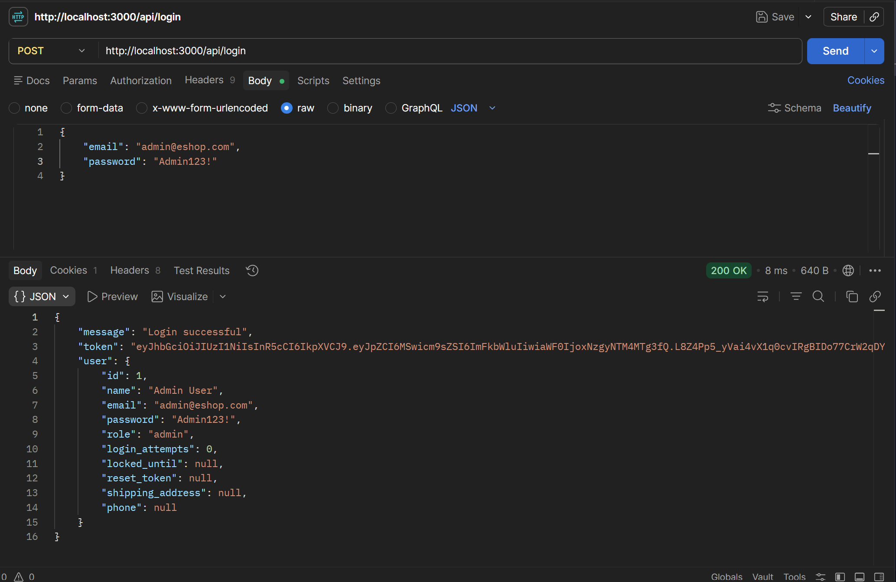
*Hình 3.1: Đăng nhập thành công tài khoản Admin và nhận JWT token với role admin.*

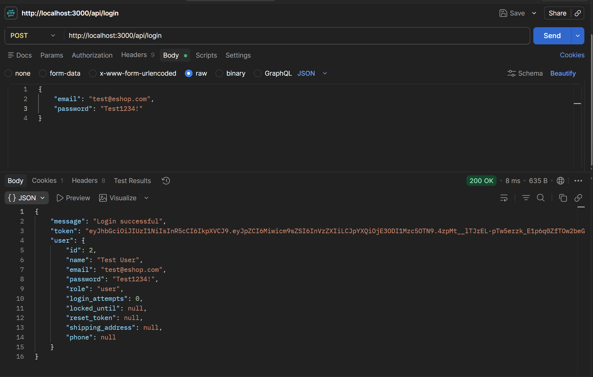
*Hình 3.2: Đăng nhập thành công tài khoản User thường và nhận JWT token với role user.*

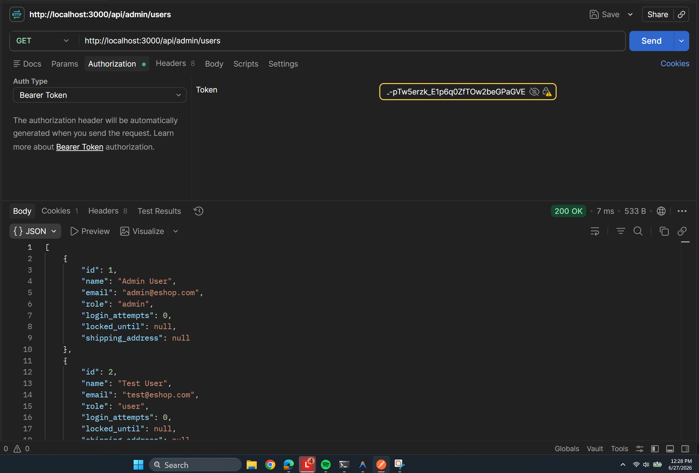
*Hình 3.3: Minh chứng lỗi khi User thường dùng token của mình nhưng vẫn truy cập thành công và lấy được toàn bộ danh sách tài khoản từ API Admin (FR12-DT-03).*

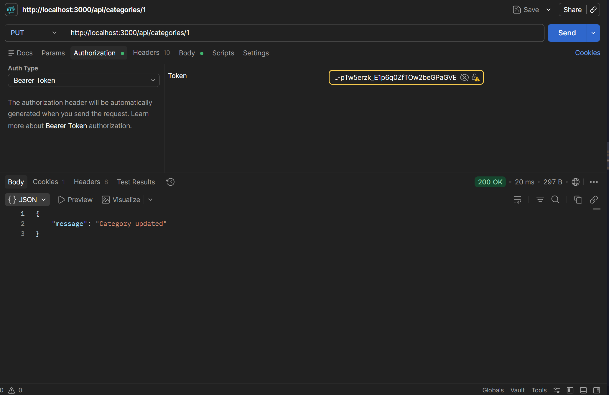
*Hình 3.4: Minh chứng lỗi khi User thường dùng token của mình gửi request cập nhật danh mục sản phẩm (PUT /api/categories/1) nhưng hệ thống vẫn cho phép thực thi thành công (FR12-DT-04).*

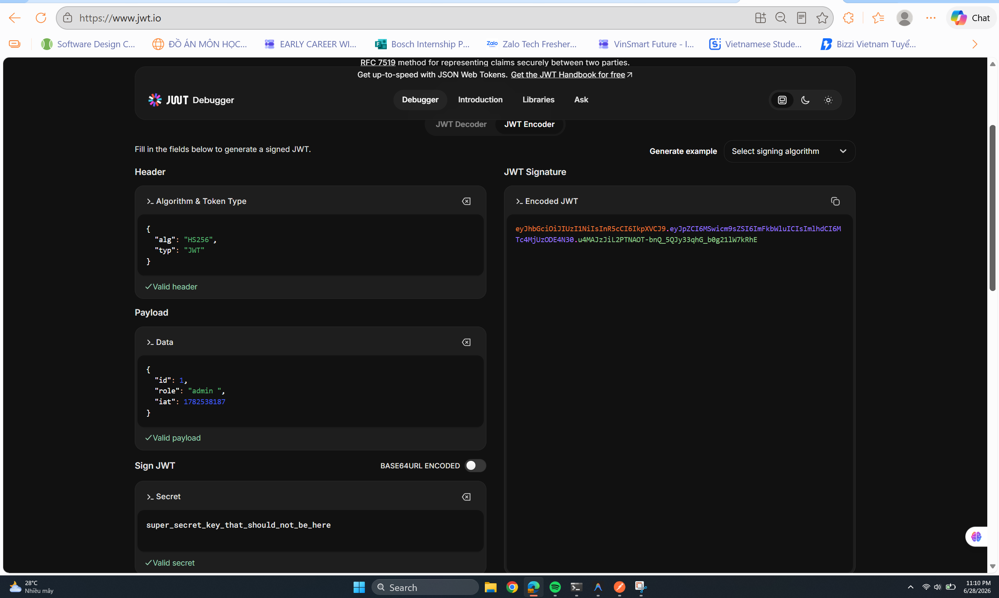
*Hình 3.5: Chỉnh sửa payload token JWT có role mang giá trị sai lệch "admin " (có khoảng trắng) và ký lại thành công bằng Secret Key.*

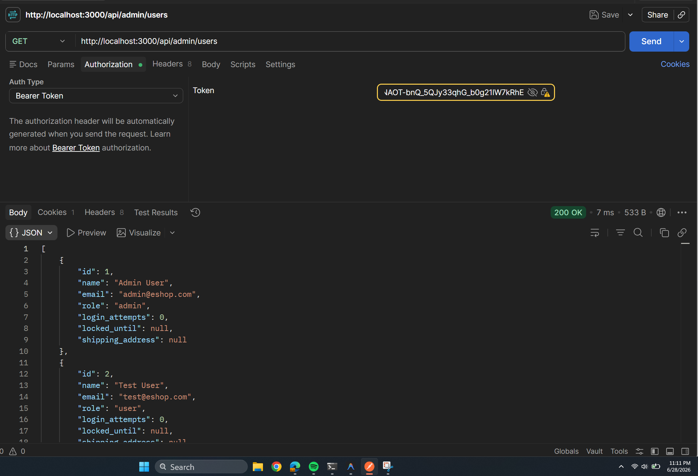
*Hình 3.6: Minh chứng lỗi khi sử dụng token lỗi "admin " để gửi request nhưng hệ thống vẫn cho phép truy cập API Admin lấy toàn bộ danh sách người dùng thành công thay vì trả về 403 Forbidden (FR12-BVA-01).*

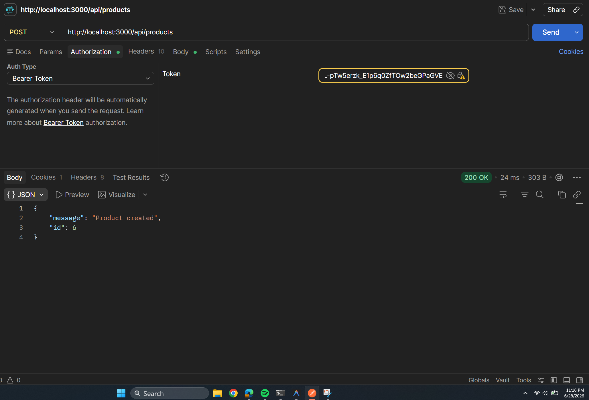
*Hình 3.7: Minh chứng lỗi khi User thường dùng token của mình nhưng vẫn gửi request tạo sản phẩm mới thành công qua API POST /api/products (FR12-BVA-02).*

---
---

## 4. FR-23: Product detail view (mobile)

### 4.1. Domain Testing
#### 4.1.1. Xác định các biến đầu vào & Điều kiện hệ thống
Chúng tôi xác định các biến và điều kiện hệ thống sau cho tính năng Xem Chi tiết Sản phẩm trên Mobile (FR-23):
1. **Quantity (Số lượng)**: Chuỗi nhập vào ô số lượng từ bàn phím di động (state `quantity`).
2. **Product ID (Mã sản phẩm)**: Giá trị ID của sản phẩm để gọi API chi tiết sản phẩm.
3. **Product State (Trạng thái dữ liệu sản phẩm)**: Đối tượng sản phẩm nhận được từ API (`product`).

#### 4.1.2. Bảng Phân hoạch tương đương (Equivalence Partitioning)
| Biến đầu vào / Điều kiện | Lớp tương đương hợp lệ (ID) | Lớp tương đương không hợp lệ (ID) |
| :--- | :--- | :--- |
| **Quantity (Số lượng)** *(Kiểu: Chuỗi số)* | **EP-VAL-01**: Chuỗi số nguyên dương $\ge 1$ (ví dụ: "1", "3", "99") | **EP-INV-01**: Chuỗi số nguyên $\le 0$ (ví dụ: "0", "-5") **EP-INV-02**: Chuỗi số thập phân (ví dụ: "2.5") **EP-INV-03**: Chuỗi rỗng hoặc chứa ký tự đặc biệt / chữ (ví dụ: "", "abc") |
| **Product State** *(Trạng thái)* | **EP-VAL-02**: Đối tượng chứa thông tin sản phẩm hợp lệ từ API | **EP-INV-04**: Dữ liệu sản phẩm rỗng do lỗi API hoặc ID không tồn tại |

#### 4.1.3. Các kịch bản kiểm thử (Domain Testing)
| Mã Kịch bản | Mô tả kiểm thử | Đầu vào | Kết quả mong đợi | Trạng thái | Ánh xạ truy vết |
| :--- | :--- | :--- | :--- | :--- | :--- |
| FR23-DT-01 | Xem chi tiết sản phẩm thành công trên giao diện di động. | Product ID = 1 | Hiển thị đầy đủ ảnh sản phẩm (chế độ stretch), tên, giá bán và mô tả chi tiết. | Pass | EP-VAL-02 |
| FR23-DT-02 | Thêm sản phẩm vào giỏ hàng với số lượng nguyên dương hợp lệ. | Product ID = 1, Quantity = "3" | Hệ thống thêm sản phẩm vào giỏ hàng thành công, hiển thị Alert thông báo và cập nhật số lượng trong giỏ hàng. | Pass | EP-VAL-01, EP-VAL-02 |
| FR23-DT-03 | Thêm sản phẩm vào giỏ với số lượng bằng 0 hoặc số âm. | Product ID = 1, Quantity = "0" | Hệ thống từ chối hoặc reset ô nhập về 1; không cho phép thêm vào giỏ hàng hoặc tự ý làm tròn/thay đổi mà không khớp với UI. | Fail | EP-INV-01, EP-VAL-02 |
| FR23-DT-04 | Thêm sản phẩm vào giỏ với số lượng là số thập phân. | Product ID = 1, Quantity = "2.5" | Hệ thống từ chối hoặc cảnh báo lỗi nhập liệu cho người dùng. | Fail | EP-INV-02, EP-VAL-02 |
| FR23-DT-05 | Thêm sản phẩm vào giỏ với ô nhập số lượng để trống hoặc có chữ. | Product ID = 1, Quantity = "" | Hệ thống từ chối, cảnh báo người dùng nhập số lượng hợp lệ. | Fail | EP-INV-03, EP-VAL-02 |
| FR23-DT-06 | Xem chi tiết sản phẩm có ID không tồn tại trên hệ thống di động. | Product ID = 9999 | Giao diện hiển thị thông báo "Sản phẩm không tồn tại" một cách thân thiện, không bị lỗi màn hình. | Pass | EP-INV-04 |

#### 4.1.4. Giải thích áp dụng kỹ thuật
1. **Xác định các biến**: Phân tích hành vi nhập liệu trên thiết bị di động trong `App.js` để tìm ra biến trực tiếp (`quantity`) và biến môi trường (`product`).
2. **Phân hoạch các khoảng giá trị**: Thiết lập các phân hoạch đầu vào hợp lệ và không hợp lệ dựa trên ràng buộc của đặc tả hệ thống.
3. **Ánh xạ kịch bản**: Xây dựng các ca kiểm thử chi tiết bao phủ các kịch bản bình thường và kịch bản lỗi biên của giao diện di động.

---

### 4.2. Phân tích giá trị biên (Boundary Value Analysis)
#### 4.2.1. Bảng Phân tích giá trị biên
| Biến / Thuộc tính | Điều kiện biên (ID) | Điểm biên (On-Point) | Điểm cận biên (Off-Point) | Điểm trong biên (In-Point) |
| :--- | :--- | :--- | :--- | :--- |
| **Quantity (Số lượng)** | Phải $\ge 1$ (BVA-BND-01) | "1" | "0" (không hợp lệ), "2" (hợp lệ) | "5" |

#### 4.2.2. Các kịch bản kiểm thử (BVA)
| Mã Kịch bản | Mô tả kiểm thử | Đầu vào | Kết quả mong đợi | Trạng thái | Ánh xạ truy vết |
| :--- | :--- | :--- | :--- | :--- | :--- |
| FR23-BVA-01 | Thêm vào giỏ hàng với số lượng tại biên dưới. | Product ID = 1, Quantity = "1" | Thêm thành công sản phẩm với số lượng 1. | Pass | BVA-BND-01 (On-Point) |
| FR23-BVA-02 | Thêm vào giỏ hàng với số lượng dưới biên dưới. | Product ID = 1, Quantity = "0" | Hệ thống từ chối, báo lỗi nhập liệu. | Fail | BVA-BND-01 (Off-Point, không hợp lệ) |
| FR23-BVA-03 | Thêm vào giỏ hàng với số lượng ngay trên biên dưới. | Product ID = 1, Quantity = "2" | Thêm thành công sản phẩm với số lượng 2. | Pass | BVA-BND-01 (Off-Point, hợp lệ) |

#### 4.2.3. Giải thích áp dụng kỹ thuật
1. **Xác định ranh giới**: Ranh giới nhỏ nhất của số lượng là số nguyên 1.
2. **Chọn điểm kiểm thử**: Điểm biên là 1, điểm cận biên không hợp lệ là 0, và cận biên hợp lệ là 2.
3. **Ánh xạ kết quả**: Kiểm thử các giá trị cận kề này trên di động để đảm bảo tính đồng bộ của logic ứng dụng.

---

### 4.3. AI Gap Analysis & Screenshot Proofs
- **AI Gap Analysis**:
  * **FR23-DT-03 & FR23-BVA-02 (Lỗi bất đồng bộ dữ liệu UI và giỏ hàng khi nhập số lượng <= 0)**: Khi người dùng nhập số lượng bằng `"0"` hoặc số âm, giao diện di động vẫn giữ nguyên chuỗi nhập đó. Tuy nhiên, hàm `normalizeQuantity` trong `App.js` lại âm thầm chuyển đổi giá trị không hợp lệ này thành `1` và thực hiện thêm vào giỏ hàng thành công với số lượng là 1. Điều này gây ra lỗi bất đồng bộ nghiêm trọng giữa số lượng thực tế hiển thị trên ô nhập (`0` hoặc số âm) và số lượng thực tế được thêm vào giỏ hàng (`1`), tạo trải nghiệm sử dụng không chính xác.
  * **FR23-DT-04 (Lỗi tự động làm tròn số lượng thập phân không cảnh báo)**: Khi nhập số lượng dạng chuỗi thập phân (ví dụ: `"2.5"`), hệ thống tự động gọi `parseInt` và lưu số lượng là `2` vào giỏ hàng nhưng không hề hiển thị bất kỳ cảnh báo hay thông báo làm tròn nào trên giao diện cho người dùng biết.
  * **FR23-DT-05 (Lỗi tự động thêm số lượng bằng 1 khi để trống hoặc nhập chữ)**: Khi ô số lượng bị xóa trống (`""`) hoặc nhập chữ (`"abc"`), hệ thống tự động gán giá trị mặc định là `1` để thêm vào giỏ hàng thay vì ngăn chặn và yêu cầu người dùng nhập lại giá trị hợp lệ.

#### Minh chứng kết quả chạy test / lỗi phát hiện (Screenshots):
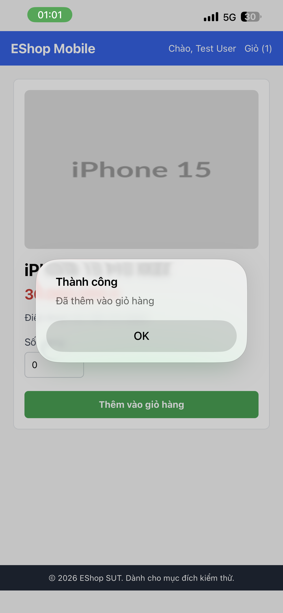

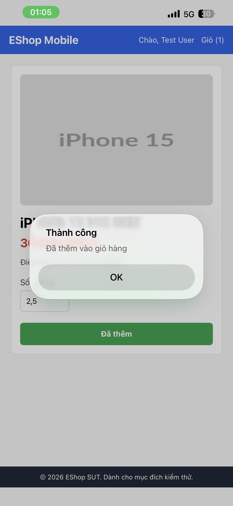

