# HW03 Verified Defect Report

| Field | Value |
|---|---|
| Student | Lê Tuấn Lộc (23127404) |
| System under test | EShop |
| Evidence environments | Google Chrome 151.0.7922.72 on Windows 11; Expo Go/iPhone captures at 1284×2778 |
| Desktop execution | 2 August 2026; two clean runs per listed desktop defect |
| Mobile execution | Student-supplied authentic captures; exact device, iOS, Expo version, SUT location, date, and independent rerun count not supplied |
| Verified defects | 19 runtime-observed defects: 15 desktop and 4 Mobile |
| Pending Mobile evidence compliance | BUG-020 through BUG-023 screenshots require the PDF identity overlay |
| GitHub Issue status | 19/19 public Issue URLs and GitHub-hosted evidence attachments verified through the GitHub API on 3 August 2026 |

## Evidence policy

The 15 listed desktop defects were reproduced in two independent Google Chrome runs and have genuine screenshots. BUG-020 through BUG-023 are visible in authentic Mobile captures and are counted as runtime-observed defects; independent Mobile reruns are not claimed. Those captures do not yet show the PDF-required identity overlay, so compliant recaptures remain pending. Defect-ID gaps are intentional because retired or deduplicated candidates were not renumbered. The former unexecuted missing-product candidate was retired when CHK-GUI-044 was redesigned as the valid default-quantity happy path.

## Execution contexts

| Context | Environment | SUT location | Reproducibility rule |
|---|---|---|---|
| Desktop Customer/Admin/API-supported checks | Google Chrome 151.0.7922.72 / Windows 11 | `http://127.0.0.1:5173` plus the locally running EShop Admin/API services | `2/2 clean runs` for every listed desktop defect |
| Mobile FR-23 checks | Expo Go / iPhone capture / 1284×2778 | Not supplied | Observed in the supplied capture set; independent rerun count not supplied |

Severity uses one project-wide scale: `Critical`, `High`, `Medium`, and `Low`. Critical indicates security or financial-integrity risk; High materially impairs a core journey or state rule; Medium causes incorrect behavior or material friction with a workaround; Low is a limited visual or feedback issue.

## Verified defect summary

| Bug ID | Related check | Severity | Title | Evidence |
|---|---|---|---|---|
| BUG-001 | CHK-GUI-002 | High | Product Detail requires a second click to add an item | `evidence_images/bug_001_first_click_cart_empty.png` |
| BUG-002 | CHK-GUI-003 | High | Negative product quantity produces a negative cart subtotal | `evidence_images/bug_002_negative_quantity.png` |
| BUG-003 | CHK-GUI-004 | Medium | Decimal quantity is silently truncated | `evidence_images/bug_003_decimal_quantity_truncated.png` |
| BUG-006 | CHK-GUI-005 | Critical | Checkout total is client-editable and trusted | `evidence_images/bug_006_editable_checkout_total.png` |
| BUG-007 | CHK-GUI-009 | High | Cart remains populated after checkout | `evidence_images/bug_007_cart_retained_after_checkout.png` |
| BUG-010 | CHK-GUI-016 | High | Customer can cancel an order in shipping state | `evidence_images/bug_010_shipping_order_canceled.png` |
| BUG-011 | CHK-GUI-017 | High | Canceled order can transition to delivered | `evidence_images/bug_011_canceled_order_delivered.png` |
| BUG-012 | CHK-GUI-024 | Medium | Valid Vietnamese phone number is rejected | `evidence_images/bug_012_valid_phone_rejected.png` |
| BUG-013 | CHK-GUI-032 | Critical | Stored shipping-address HTML is executed in Admin | `evidence_images/bug_013_stored_html_injection.png` |
| BUG-014 | CHK-GUI-031 | High | Admin dashboard doubles delivered revenue | `evidence_images/bug_014_admin_revenue_doubled.png` |
| BUG-015 | CHK-GUI-018 | Critical | Percentage coupon calculation produces invalid negative savings | `evidence_images/bug_015_percent_coupon_calculation.png` |
| BUG-016 | CHK-GUI-026 | Medium | Order History provides no order-details view | `evidence_images/bug_016_order_history_has_no_details.png` |
| BUG-017 | CHK-GUI-036 | High | Editing one product changes every visible product name | `evidence_images/bug_017_admin_product_edit_corrupts_list.png` |
| BUG-018 | CHK-GUI-037 | Low | Admin data loading has no progress feedback | `evidence_images/bug_018_admin_missing_loading_indicator.png` |
| BUG-019 | CHK-GUI-035 | Low | Admin order transition has no explicit success feedback | `evidence_images/bug_019_admin_status_no_success_feedback.png` |
| BUG-020 | CHK-GUI-038 | Low | Mobile Product Detail stretches the product image | `../cross_platform/mobile_real_device/mobile_01_product_detail.png` |
| BUG-021 | CHK-GUI-039 | Low | Mobile Product Detail omits the category | `../cross_platform/mobile_real_device/mobile_01_product_detail.png` |
| BUG-022 | CHK-GUI-012, CHK-GUI-041 | High | Invalid Mobile quantity is silently normalized to one | `../cross_platform/mobile_real_device/mobile_03_invalid_quantity_before.png`; `../cross_platform/mobile_real_device/mobile_04_invalid_quantity_after.png` |
| BUG-023 | CHK-GUI-042 | Low | Mobile Product Detail has no dedicated back control | `../cross_platform/mobile_real_device/mobile_01_product_detail.png` |

## Detailed defect records

### GitHub Issue copy instructions

All 19 public Issues and their GitHub-hosted evidence attachments were verified through the GitHub API on 3 August 2026. Keep the Issue body synchronized with the normalized fields below. Issue #118 currently has a missing digit in its student-ID title prefix; correct the prefix to `23127404` before submission. For BUG-020–BUG-023, add the actual iPhone model, iOS version, Expo version, SUT location, execution date, and rerun count when available. Preserve the local evidence filename in this report for submission traceability.

### BUG-001 — Product Detail requires a second click to add an item

**Severity:** High — a core add-to-cart action fails silently on the first attempt.  
**Environment:** Google Chrome 151.0.7922.72 / Windows 11 / local Customer Web.  
**Reproducibility:** 2/2 clean runs.  
**Related check:** CHK-GUI-002
**Precondition:** Product 1 is available and the cart is empty.
**Test data:** Product ID `1`; quantity `1`.

**Steps to reproduce:**

1. Open `/product/1`.
2. Select **Thêm vào giỏ hàng** once.
3. Open **Giỏ hàng**.

**Expected:** The cart contains one unit after the first click.
**Actual:** The cart remains empty; a second click is required.
**Likely cause:** `handleAddToCart` consumes the first click by updating `clickCount` and returns before `addToCart`.
**Evidence file:** `evidence_images/bug_001_first_click_cart_empty.png`

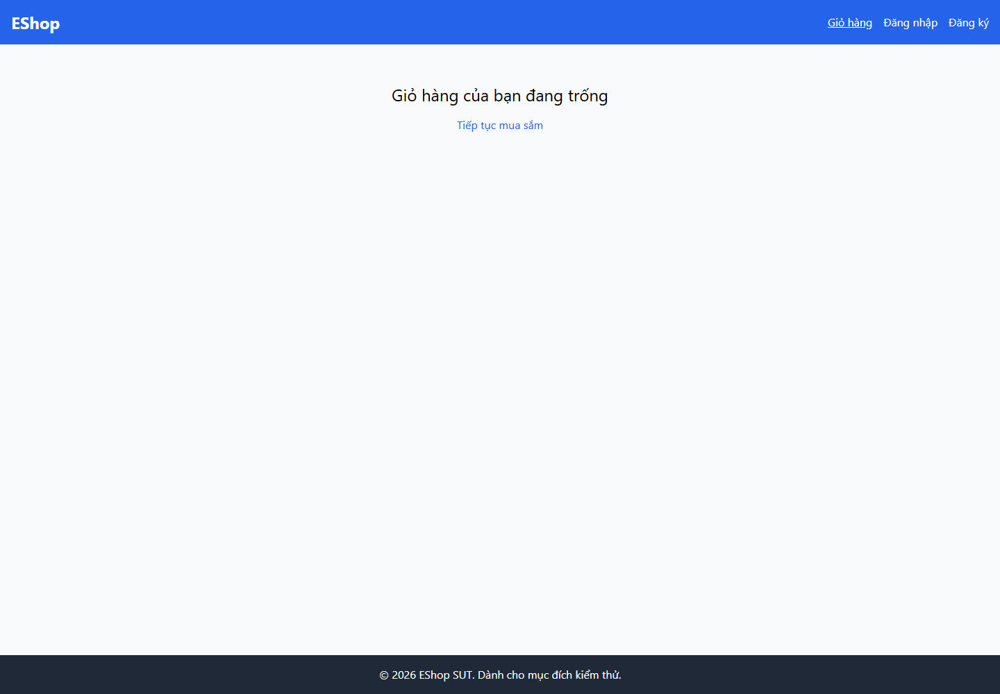
**GitHub Issue:** https://github.com/KidCute1412/eshop-sut/issues/116

### BUG-002 — Negative quantity produces a negative cart subtotal

**Severity:** High — invalid quantity corrupts the cart subtotal and purchase data.  
**Environment:** Google Chrome 151.0.7922.72 / Windows 11 / local Customer Web.  
**Reproducibility:** 2/2 clean runs.  
**Related check:** CHK-GUI-003
**Precondition:** Product Detail is loaded and the cart is empty.  
**Test data:** Quantity `-5`.  
**Steps:** Enter `-5` on Product Detail, add the item, and open the cart.
**Expected:** Quantity is constrained to a positive integer with validation feedback.
**Actual:** Quantity `-5` is accepted and the cart shows a negative subtotal.
**Likely cause:** No `min` constraint or range validation is applied.
**Evidence file:** `evidence_images/bug_002_negative_quantity.png`

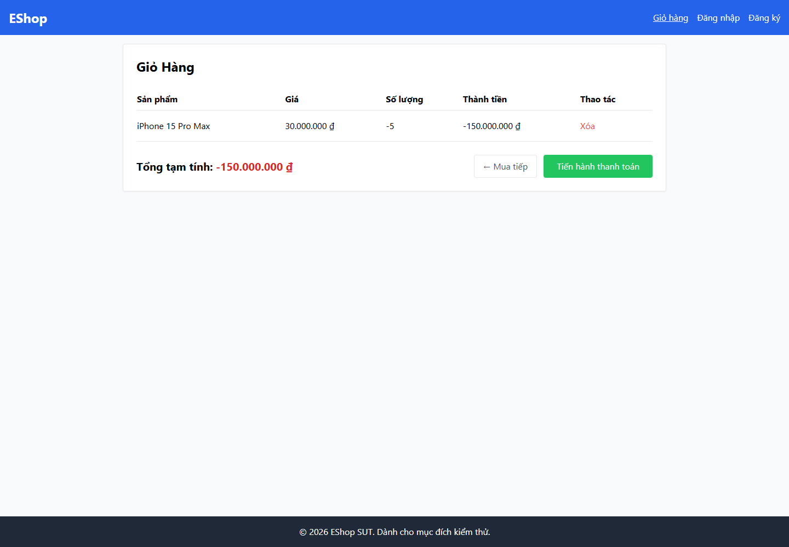
**GitHub Issue:** https://github.com/KidCute1412/eshop-sut/issues/117

### BUG-003 — Decimal quantity is silently truncated

**Severity:** Medium — the application changes user input without warning, but the user can correct the quantity.  
**Environment:** Google Chrome 151.0.7922.72 / Windows 11 / local Customer Web.  
**Reproducibility:** 2/2 clean runs.  
**Related check:** CHK-GUI-004
**Precondition:** Product Detail is loaded and the cart is empty.  
**Test data:** Quantity `2.5`.  
**Steps:** Enter `2.5` on Product Detail, add the item, and open the cart.
**Expected:** The decimal is rejected or the user is asked for an integer.
**Actual:** The cart silently stores quantity `2`.
**Likely cause:** `parseInt(quantity)` truncates without validation.
**Evidence file:** `evidence_images/bug_003_decimal_quantity_truncated.png`

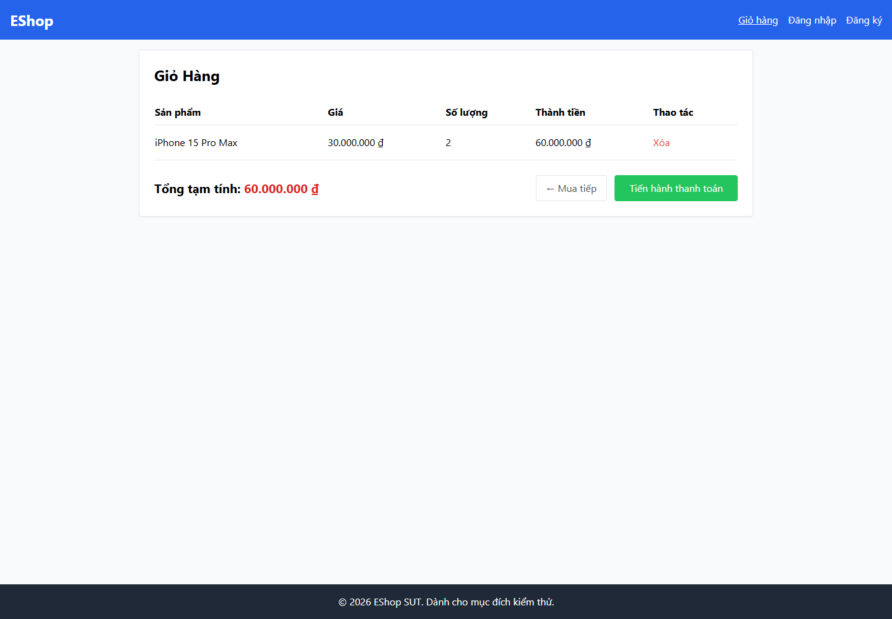
**GitHub Issue:** https://github.com/KidCute1412/eshop-sut/issues/118

### BUG-006 — Checkout total is client-editable and trusted

**Severity:** Critical
**Severity rationale:** A client-controlled payment total creates direct financial-integrity risk.  
**Environment:** Google Chrome 151.0.7922.72 / Windows 11 / local Customer Web and API.  
**Reproducibility:** 2/2 clean runs.  
**Related check:** CHK-GUI-005
**Precondition:** An authenticated customer has at least one cart item and can open Checkout.  
**Test data:** iPhone 15 Pro Max; displayed total `30,000,000 ₫`; manually edited total.  
**Steps:** Add a product, authenticate, open Checkout, and edit **Tổng tiền thanh toán**.
**Expected:** The authoritative total is read-only and calculated server-side.
**Actual:** The input is editable and its value is submitted as `total_amount`.
**Likely cause:** Checkout binds an editable input to `editableTotal`; the API stores the supplied total.
**Evidence file:** `evidence_images/bug_006_editable_checkout_total.png`

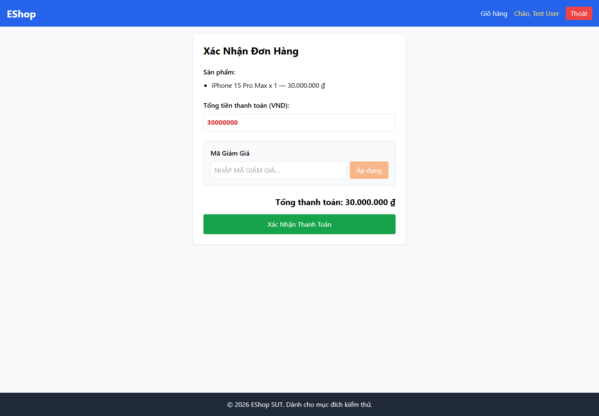
**GitHub Issue:** https://github.com/KidCute1412/eshop-sut/issues/119

### BUG-007 — Cart remains populated after checkout

**Severity:** High — stale purchased items can cause accidental duplicate checkout.  
**Environment:** Google Chrome 151.0.7922.72 / Windows 11 / local Customer Web.  
**Reproducibility:** 2/2 clean runs.  
**Related check:** CHK-GUI-009
**Precondition:** An authenticated customer has completed a successful checkout.  
**Test data:** One iPhone 15 Pro Max in the cart.  
**Steps:** Complete checkout, return home, and open the cart.
**Expected:** The purchased cart is cleared.
**Actual:** The purchased item remains present.
**Likely cause:** The success path never calls `clearCart()`.
**Evidence file:** `evidence_images/bug_007_cart_retained_after_checkout.png`

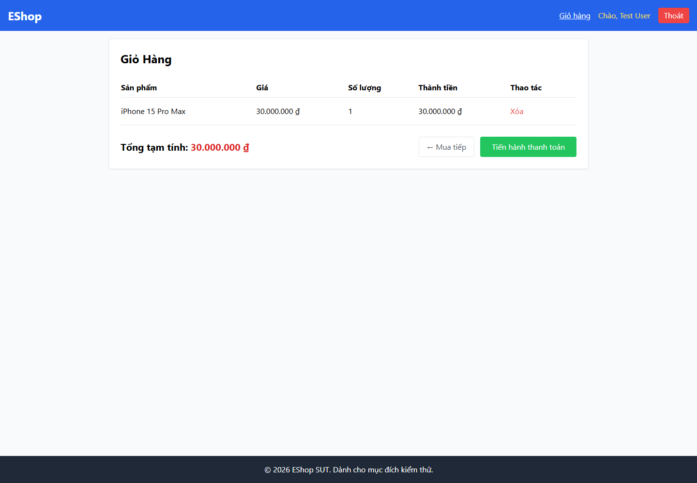
**GitHub Issue:** https://github.com/KidCute1412/eshop-sut/issues/120

### BUG-010 — Customer can cancel an order in shipping state

**Severity:** High — the defect violates a core order-state rule after fulfillment has begun.  
**Environment:** Google Chrome 151.0.7922.72 / Windows 11 / local Customer Web and API.  
**Reproducibility:** 2/2 clean runs.  
**Related check:** CHK-GUI-016
**Precondition:** The authenticated customer owns an order in `shipping` state.  
**Test data:** Owned order with status `shipping`.  
**Steps:** Move an owned order to `shipping`, then call the customer cancellation action.
**Expected:** The API rejects cancellation.
**Actual:** The API succeeds and changes the order to `canceled`.
**Likely cause:** The endpoint rejects only `delivered` and `canceled`, rather than allowing only `pending` and `confirmed`.
**Evidence file:** `evidence_images/bug_010_shipping_order_canceled.png`

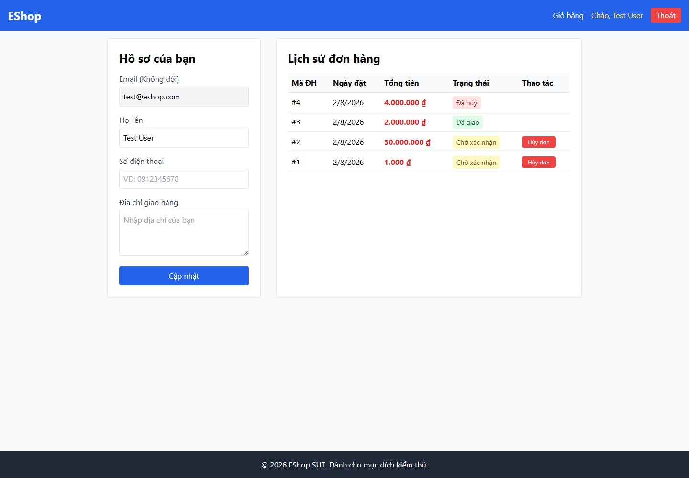
**GitHub Issue:** https://github.com/KidCute1412/eshop-sut/issues/121

### BUG-011 — Canceled order can transition to delivered

**Severity:** High — a terminal canceled order can become delivered and corrupt lifecycle history.  
**Environment:** Google Chrome 151.0.7922.72 / Windows 11 / local Admin and API.  
**Reproducibility:** 2/2 clean runs.  
**Related check:** CHK-GUI-017
**Precondition:** An order is in `canceled` state and an administrator is authenticated.  
**Test data:** Canceled test order.  
**Steps:** Cancel an order, then select **Đánh dấu Đã giao** in Admin.
**Expected:** `canceled` is terminal.
**Actual:** The UI offers the action and the API accepts `canceled → delivered`.
**Likely cause:** The Admin UI and state validation explicitly permit the transition.
**Evidence file:** `evidence_images/bug_011_canceled_order_delivered.png`

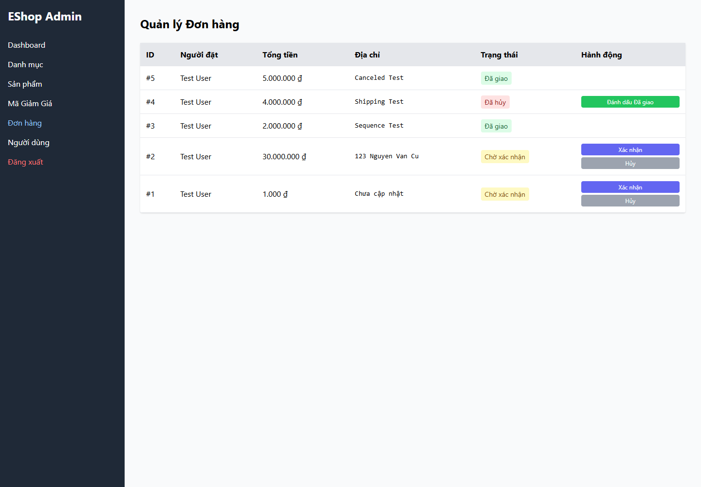
**GitHub Issue:** https://github.com/KidCute1412/eshop-sut/issues/122

### BUG-012 — Valid Vietnamese phone number is rejected

**Severity:** Medium — valid profile data is blocked, but it does not prevent the full purchasing flow.  
**Environment:** Google Chrome 151.0.7922.72 / Windows 11 / local Customer Web.  
**Reproducibility:** 2/2 clean runs.  
**Related check:** CHK-GUI-024
**Precondition:** An authenticated customer is editing the Profile phone field.  
**Test data:** `0912345678`.  
**Steps:** Enter `0912345678` in Profile and submit.
**Expected:** The valid ten-digit number is accepted.
**Actual:** An alert reports that it is invalid.
**Likely cause:** The regex starts with `[1-9]` and excludes the required leading zero.
**Evidence file:** `evidence_images/bug_012_valid_phone_rejected.png`

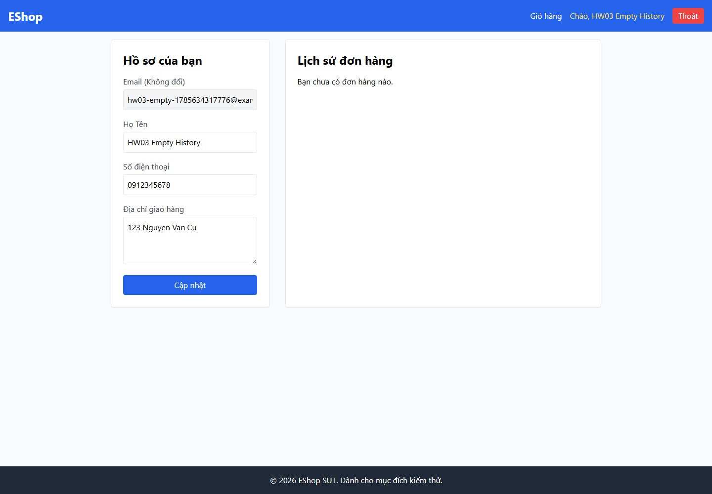
**GitHub Issue:** https://github.com/KidCute1412/eshop-sut/issues/123

### BUG-013 — Stored shipping-address HTML is executed in Admin

**Severity:** Critical
**Severity rationale:** Stored untrusted markup reaches the Admin origin and creates a script-capable stored-injection risk.  
**Environment:** Google Chrome 151.0.7922.72 / Windows 11 / local Customer/Admin/API.  
**Reproducibility:** 2/2 clean runs.  
**Related check:** CHK-GUI-032
**Precondition:** An order contains a shipping address controlled by the customer; an administrator opens Admin Orders.  
**Test data:** `` represented by the visible `HW03 HTML EXECUTED` test marker.  
**Steps:** Store HTML in an order's shipping address and open Admin Orders.
**Expected:** The address is rendered as escaped text.
**Actual:** The markup is interpreted and styled content appears; script-capable payloads can execute in the Admin origin.
**Likely cause:** `dangerouslySetInnerHTML` renders untrusted address content.
**Evidence file:** `evidence_images/bug_013_stored_html_injection.png`

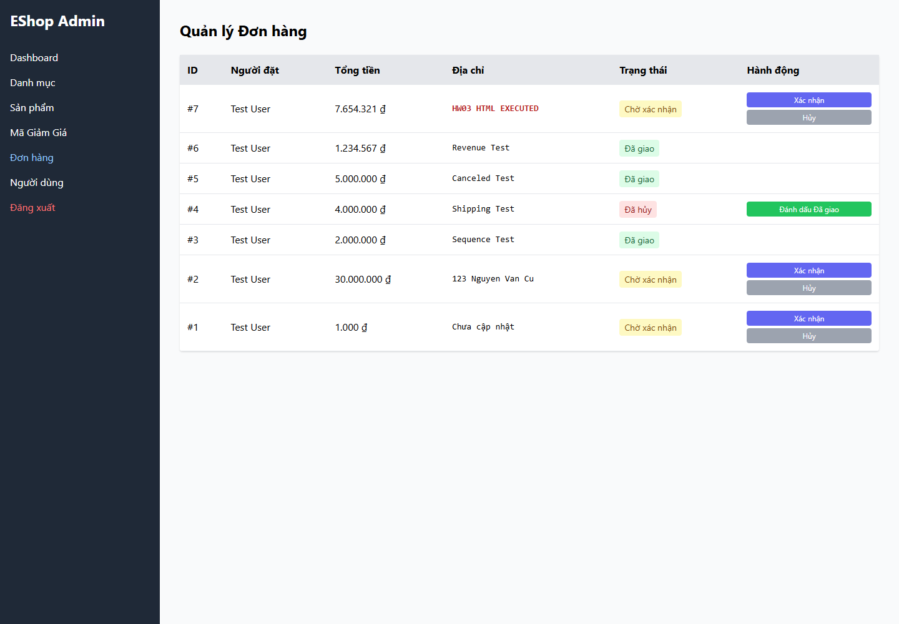
**GitHub Issue:** https://github.com/KidCute1412/eshop-sut/issues/124

### BUG-014 — Admin dashboard doubles delivered revenue

**Severity:** High — the primary Admin revenue metric is materially incorrect.  
**Environment:** Google Chrome 151.0.7922.72 / Windows 11 / local Admin and API.  
**Reproducibility:** 2/2 clean runs.  
**Related check:** CHK-GUI-031
**Precondition:** Delivered orders with known totals exist.  
**Test data:** Delivered totals summing to `8,234,567 ₫`.  
**Steps:** Create delivered orders with known totals and open Dashboard.
**Expected:** Revenue equals `8,234,567 ₫`.
**Actual:** Dashboard displays `16,469,134 ₫`.
**Likely cause:** The reducer adds `o.total_amount * 2`.
**Evidence file:** `evidence_images/bug_014_admin_revenue_doubled.png`

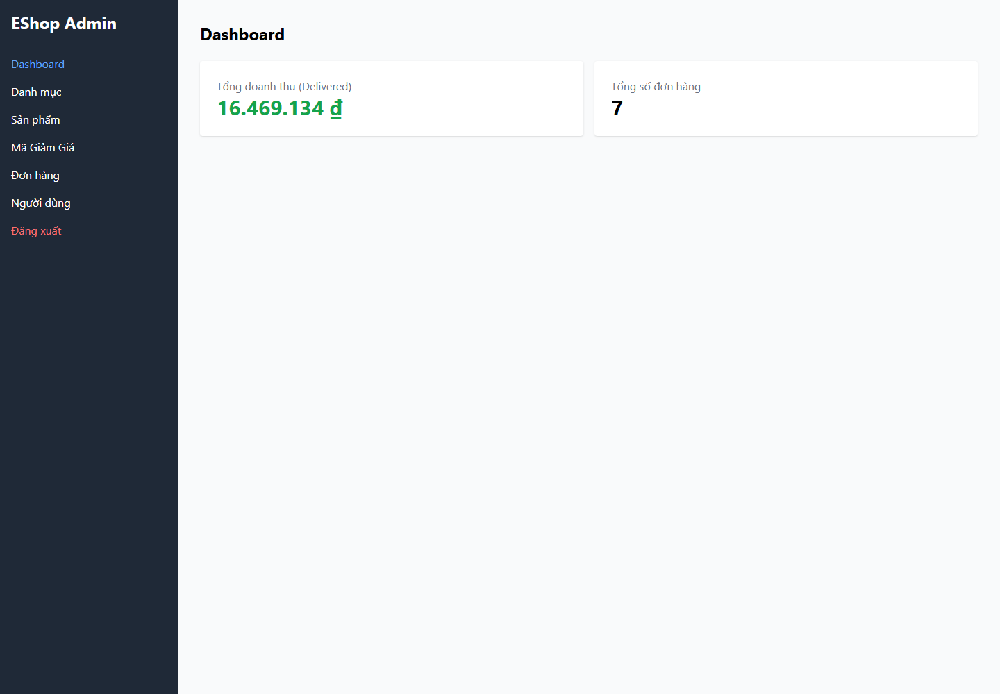
**GitHub Issue:** https://github.com/KidCute1412/eshop-sut/issues/125

### BUG-015 — Percentage coupon calculation produces invalid negative savings

**Severity:** Critical
**Severity rationale:** The discount calculation reverses savings and can produce a severely inflated payment total.  
**Environment:** Google Chrome 151.0.7922.72 / Windows 11 / local Customer Web and API.  
**Reproducibility:** 2/2 clean runs.  
**Related check:** CHK-GUI-018
**Precondition:** The authenticated customer has a `30,000,000 ₫` product at Checkout and `SAVE10` is active.  
**Test data:** Coupon `SAVE10` with a 10% discount; total `30,000,000 ₫`.  
**Steps:** Add a `30,000,000 ₫` product and apply `SAVE10` at Checkout.
**Expected:** Savings `3,000,000 ₫`; final total `27,000,000 ₫`.
**Actual:** Savings `-270,000,000 ₫`; final total `300,000,000 ₫`.
**Likely cause:** The formula uses `total_amount * (1 - discount_value)` instead of `total_amount * discount_value / 100`.
**Evidence file:** `evidence_images/bug_015_percent_coupon_calculation.png`

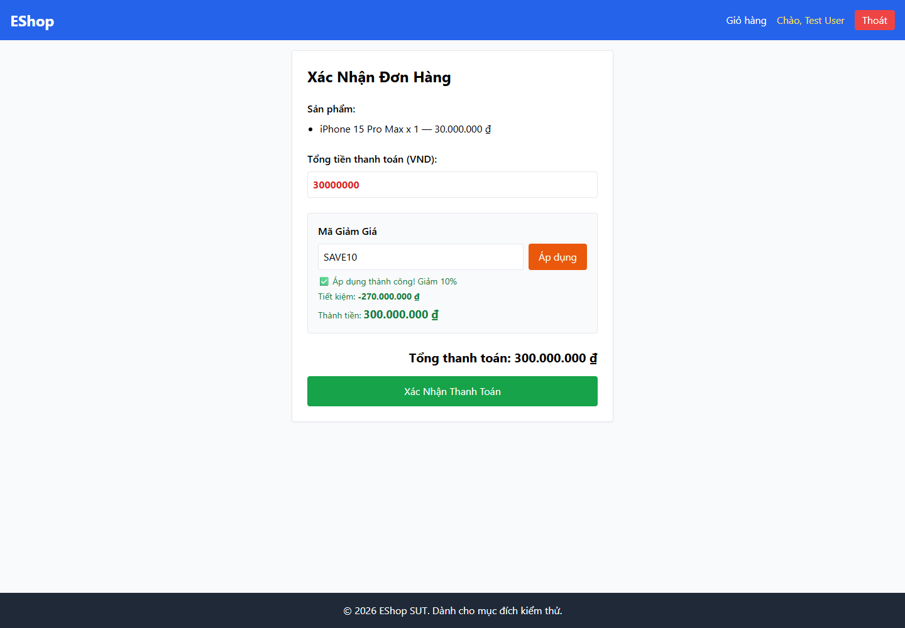
**GitHub Issue:** https://github.com/KidCute1412/eshop-sut/issues/126

### BUG-016 — Order History provides no order-details view

**Severity:** Medium — customers cannot inspect item-level order contents, but summary history remains available.  
**Environment:** Google Chrome 151.0.7922.72 / Windows 11 / local Customer Web.  
**Reproducibility:** 2/2 clean runs.  
**Related check:** CHK-GUI-026
**Precondition:** An authenticated customer has at least one order in Order History.  
**Test data:** Existing customer order.  
**Steps:** Open Profile for a customer with orders.
**Expected:** Each order can be expanded or opened to inspect its items.
**Actual:** Only summary columns are available; there is no details control.
**Evidence file:** `evidence_images/bug_016_order_history_has_no_details.png`

**GitHub Issue:** https://github.com/KidCute1412/eshop-sut/issues/127

### BUG-017 — Editing one product changes every visible product name

**Severity:** High — editing one record corrupts every visible product name in client state.  
**Environment:** Google Chrome 151.0.7922.72 / Windows 11 / local Admin.  
**Reproducibility:** 2/2 clean runs.  
**Related check:** CHK-GUI-036
**Precondition:** An administrator is authenticated and multiple products are visible.  
**Test data:** Edit one selected product name.  
**Steps:** In Admin Products, edit one name and save.
**Expected:** Only the selected row changes.
**Actual:** Every visible product row shows the edited name until refresh.
**Likely cause:** The success handler maps the new name onto every product in client state.
**Evidence file:** `evidence_images/bug_017_admin_product_edit_corrupts_list.png`

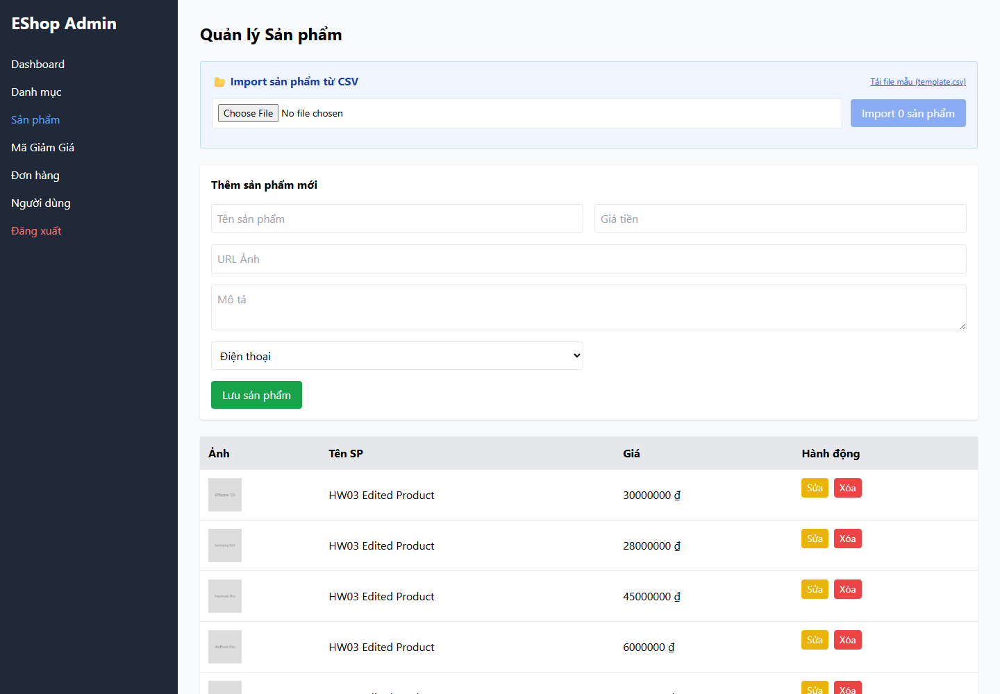
**GitHub Issue:** https://github.com/KidCute1412/eshop-sut/issues/128

### BUG-018 — Admin data loading has no progress feedback

**Severity:** Low — the missing transient feedback causes uncertainty but does not corrupt data.  
**Environment:** Google Chrome 151.0.7922.72 / Windows 11 / local Admin.  
**Reproducibility:** 2/2 clean runs with deliberately delayed Admin API responses.  
**Related check:** CHK-GUI-037
**Precondition:** An authenticated administrator opens an Admin view while API responses are delayed.  
**Test data:** Delayed Admin GET responses.  
**Steps:** Delay Admin API responses and authenticate.
**Expected:** A spinner, skeleton, loading message, or disabled state is shown.
**Actual:** No loading feedback appears while requests are pending.
**Evidence file:** `evidence_images/bug_018_admin_missing_loading_indicator.png`

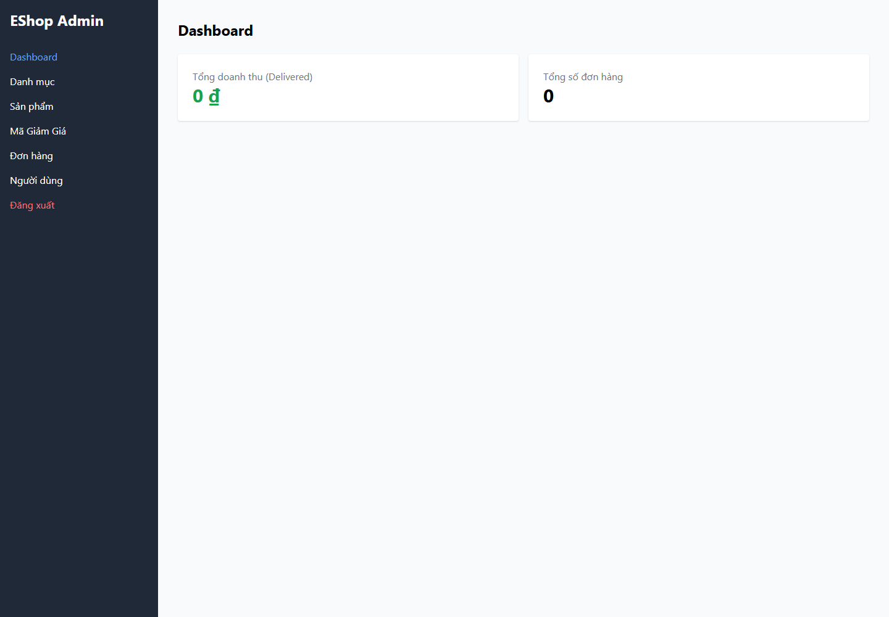
**GitHub Issue:** https://github.com/KidCute1412/eshop-sut/issues/129

### BUG-019 — Admin order transition has no explicit success feedback

**Severity:** Low — the state change succeeds, but confirmation is limited to the badge update.  
**Environment:** Google Chrome 151.0.7922.72 / Windows 11 / local Admin.  
**Reproducibility:** 2/2 clean runs.  
**Related check:** CHK-GUI-035
**Precondition:** An authenticated administrator can confirm a pending order.  
**Test data:** Pending test order.  
**Steps:** Confirm a pending order in Admin.
**Expected:** A success toast or confirmation message appears.
**Actual:** Only the badge changes; no explicit success message is presented.
**Evidence file:** `evidence_images/bug_019_admin_status_no_success_feedback.png`

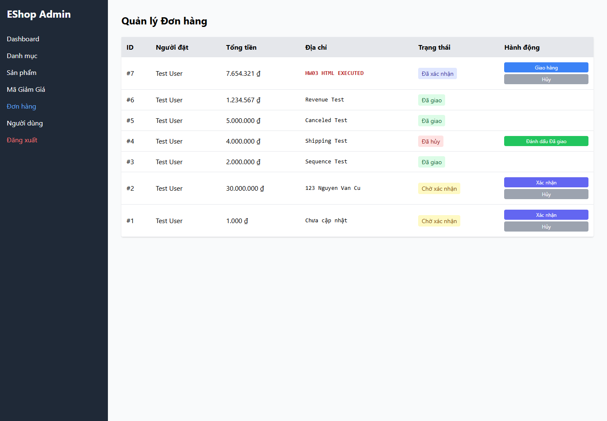
**GitHub Issue:** https://github.com/KidCute1412/eshop-sut/issues/130

## Mobile runtime-observed defects

The following records are supported by authentic Mobile captures. Each capture still needs the required identity overlay before final submission. The exact iPhone model, iOS version, Expo Go version, SUT location, execution date, and independent rerun count were not supplied; those fields remain explicit rather than inferred from screen dimensions or status-bar appearance.

### BUG-020 — Mobile Product Detail stretches the product image

**Severity:** Low — the distortion reduces visual quality but does not block product selection.  
**Environment:** Expo Go / iPhone capture / 1284×2778; exact device, iOS, Expo version, SUT location, and date not supplied.  
**Reproducibility:** Observed in the supplied Product Detail capture; independent rerun count not supplied.  
**Related check:** CHK-GUI-038  
**Precondition:** FR-23 Mobile Product Detail is open for the iPhone 15 Pro Max.  
**Test data:** Product `iPhone 15 Pro Max`.  
**Steps to reproduce:**

1. Open the Mobile product grid in Expo Go.
2. Select the iPhone 15 Pro Max.
3. Inspect the product image proportions on Product Detail.

**Expected:** Product media preserves its aspect ratio.  
**Actual:** The captured product media is stretched to fill the fixed frame instead of being proportionally contained.  
**Likely cause:** `frontend-mobile/App.js:553–559` uses `resizeMode="stretch"`.  
**Evidence file:** `../cross_platform/mobile_real_device/mobile_01_product_detail.png`; compliant overlay recapture pending.  

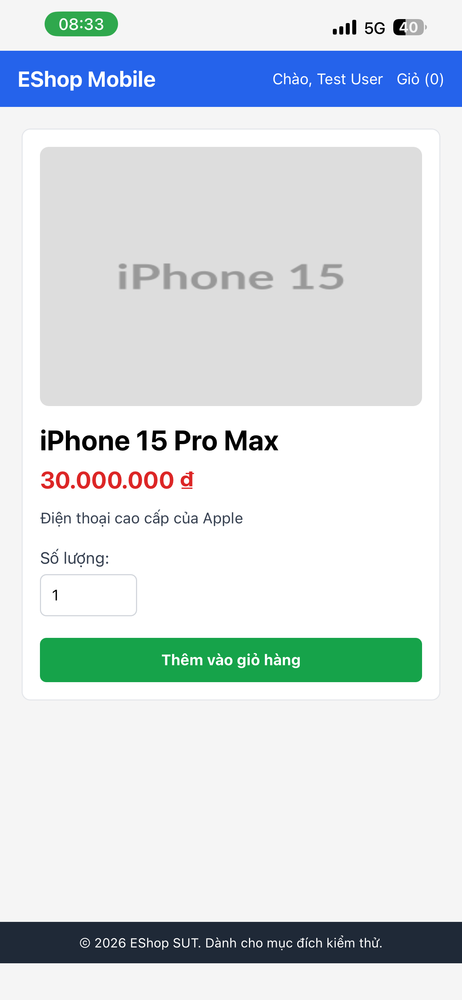
**GitHub Issue:** https://github.com/KidCute1412/eshop-sut/issues/131

### BUG-021 — Mobile Product Detail omits the product category

**Severity:** Low — product context is incomplete, but name, price, description, quantity, and CTA remain usable.  
**Environment:** Expo Go / iPhone capture / 1284×2778; exact device, iOS, Expo version, SUT location, and date not supplied.  
**Reproducibility:** Observed in the supplied Product Detail capture; independent rerun count not supplied.  
**Related check:** CHK-GUI-039  
**Precondition:** FR-23 Mobile Product Detail is open for a product with a known category.  
**Test data:** Product `iPhone 15 Pro Max`; expected category from product data.  
**Steps to reproduce:**

1. Open the Mobile product grid in Expo Go.
2. Select the iPhone 15 Pro Max.
3. Inspect all visible product identity fields.

**Expected:** The category is visible with the product identity.  
**Actual:** The complete captured detail card shows name, price, description, quantity, and CTA, but no category label or value.  
**Likely cause:** `frontend-mobile/App.js:560–562` renders the other product fields without a category field.  
**Evidence file:** `../cross_platform/mobile_real_device/mobile_01_product_detail.png`; compliant overlay recapture pending.  

**GitHub Issue:** https://github.com/KidCute1412/eshop-sut/issues/132

### BUG-022 — Invalid Mobile quantity is silently normalized to one

**Severity:** High — invalid input creates an unintended cart item while displaying misleading success feedback.  
**Environment:** Expo Go / iPhone capture / 1284×2778; exact device, iOS, Expo version, SUT location, and date not supplied.  
**Reproducibility:** Observed in one supplied before/after capture sequence; independent rerun count not supplied.  
**Related checks:** CHK-GUI-012, CHK-GUI-041  
**Precondition:** FR-23 Mobile Product Detail is open and the cart header initially shows one item.  
**Test data:** Visible quantity `0`; no unshown invalid-input variant is claimed by this image pair.  
**Steps to reproduce:**

1. Open the iPhone 15 Pro Max Product Detail screen.
2. Enter quantity `0`.
3. Select **Thêm vào giỏ hàng**.
4. Observe the response and cart state.

**Expected:** Quantity `0` is rejected with corrective feedback and no product is added.  
**Actual:** The before capture shows quantity `0`; the after capture shows a success alert, **Đã thêm**, and a cart result instead of validation.  
**Likely cause:** `frontend-mobile/App.js:129–135` normalizes invalid values to `1`.  
**Evidence files:** `../cross_platform/mobile_real_device/mobile_03_invalid_quantity_before.png` and `../cross_platform/mobile_real_device/mobile_04_invalid_quantity_after.png`; compliant overlay recaptures pending.  

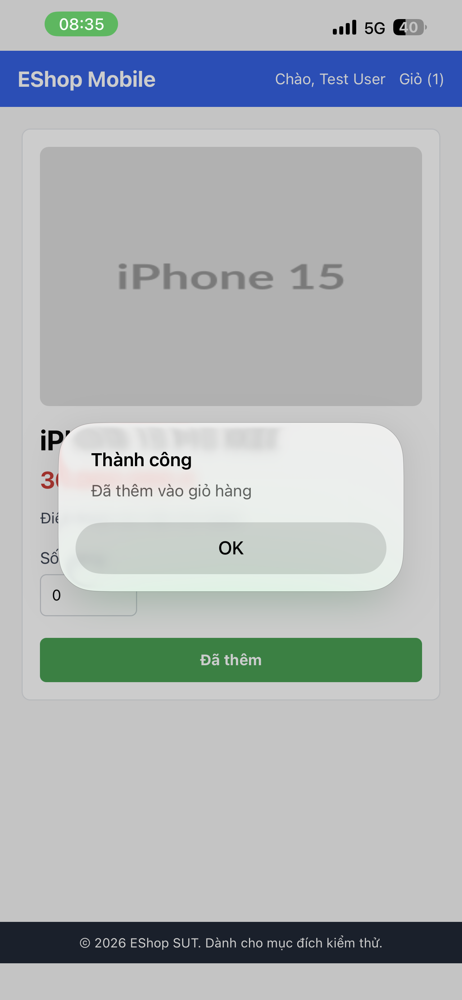
**GitHub Issue:** https://github.com/KidCute1412/eshop-sut/issues/133

### BUG-023 — Mobile Product Detail has no dedicated back control

**Severity:** Low — navigation remains possible through the shared brand, but the detail screen lacks an explicit contextual return control.  
**Environment:** Expo Go / iPhone capture / 1284×2778; exact device, iOS, Expo version, SUT location, and date not supplied.  
**Reproducibility:** Observed in the supplied full Product Detail capture; independent rerun count not supplied.  
**Related check:** CHK-GUI-042  
**Precondition:** The user navigated from the Mobile product grid to FR-23 Product Detail.  
**Test data:** Product `iPhone 15 Pro Max`.  
**Steps to reproduce:**

1. Open the Mobile product grid in Expo Go.
2. Select the iPhone 15 Pro Max.
3. Inspect the Product Detail header and available navigation controls.

**Expected:** A visible back control returns to the product grid.  
**Actual:** The full captured detail screen shows the shared **EShop Mobile** brand but no dedicated back control.  
**Likely cause:** The `frontend-mobile/App.js:536–585` detail renderer does not add a contextual back control.  
**Evidence file:** `../cross_platform/mobile_real_device/mobile_01_product_detail.png`; compliant overlay recapture pending.  

**GitHub Issue:** https://github.com/KidCute1412/eshop-sut/issues/134

