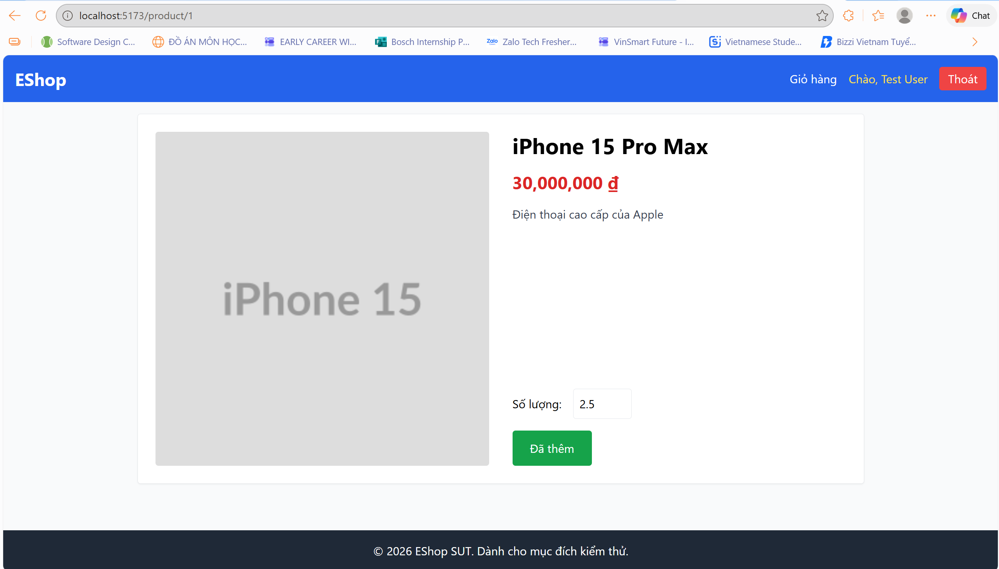
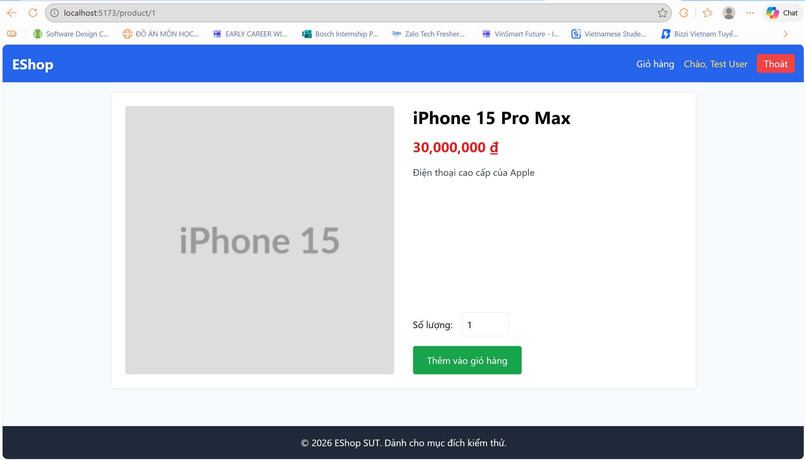
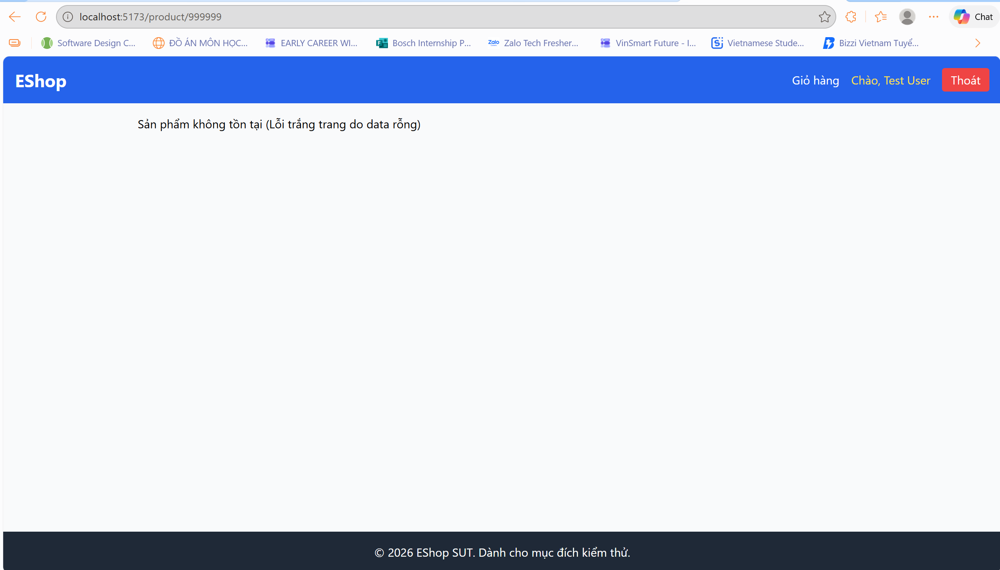

# BÁO CÁO KIỂM THỬ GIAO DIỆN NGƯỜI DÙNG (GUI TEST REPORT)

| Thuộc tính | Thông tin |
|---|---|
| Mã báo cáo | GUI-FR06-23127404 |
| Người thực hiện | Lê Tuấn Lộc (MSSV: 23127404) |
| Đối tượng kiểm thử | Trang chi tiết sản phẩm — FR-06 |
| Hệ thống kiểm thử | EShop SUT — Frontend Web và Backend API |
| Phiên bản mã nguồn được rà soát | 20/07/2026 |

---

## 1. Phạm vi và phương pháp

Báo cáo kiểm thử các luồng cốt lõi của trang `/product/:id`: hiển thị thông tin, bố cục đáp ứng, nhập số lượng, thêm vào giỏ hàng và xử lý ID không tồn tại. Kết quả Pass/Fail được đối chiếu với `ProductDetail`, `CartContext`, API `GET /api/products/:id` và dữ liệu SQLite. Ảnh minh chứng chỉ được yêu cầu cho các lỗi trong phần Bug Report.

| Hạng mục | Giá trị |
|---|---|
| Dữ liệu hợp lệ | `/product/1` — iPhone 15 Pro Max, `30,000,000 ₫`, category_id `1` |
| Dữ liệu không tồn tại | `/product/999999` — API trả HTTP 200 với body `{}` |
| Viewport kiểm tra | Desktop ≥ 768 px; Mobile 390 × 844 px |
| Quy ước | Pass: đáp ứng tiêu chí; Fail: không đáp ứng và có Bug ID liên kết |

---

## 2. GUI Test Checklist

Số lượng hợp lệ là số nguyên dương. Các dữ liệu biên/không hợp lệ được lựa chọn là `0`, số âm và số thập phân.

| Test ID | Hạng mục | Mô tả kiểm thử | Tiền điều kiện / dữ liệu | Kết quả mong đợi | Kết quả thực tế đã xác minh | Kết quả | Bug ID |
|---|---|---|---|---|---|:---:|---|
| GUI-01 | Nội dung | Mở chi tiết sản phẩm hợp lệ và kiểm tra thông tin chính. | Mở `/product/1`. | Ảnh, tên, giá có định dạng `₫` và mô tả được hiển thị. | API trả bản ghi ID 1; component render `imageUrl`, `name`, `description` và giá `30,000,000 ₫`. | Pass | — |
| GUI-02 | Ngữ nghĩa | Kiểm tra tiêu đề chính và alt text của ảnh. | `/product/1`. | Có một `h1` mang tên sản phẩm; ảnh có alt text mô tả. | `ProductDetail` có một `h1` với `product.name` và `alt={product.name}`. | Pass | — |
| GUI-03 | Bố cục | Kiểm tra bố cục desktop và mobile. | Desktop ≥ 768 px; mobile 390 × 844 px. | Desktop hiển thị hai cột; mobile xếp dọc và vẫn có nút thêm giỏ. | Dùng `flex`, `md:flex-row`, `md:w-1/2`; mặc định là `flex-col`; nút không bị ẩn/vô hiệu hóa. | Pass | — |
| GUI-04 | Biểu mẫu | Kiểm tra giá trị mặc định và dữ liệu hợp lệ. | Tải `/product/1`, nhập `3`. | Ô số lượng mặc định là `1` và nhận số nguyên dương `3`. | `quantity` khởi tạo là `1`; input `type="number"` lưu và render giá trị `3`. | Pass | — |
| GUI-05 | Điều hướng | Điều hướng về trang chủ qua logo EShop. | Tại `/product/1`, nhấn logo. | Người dùng được chuyển về trang chủ. | Header khai báo `Link to="/"` cho logo EShop. | Pass | — |
| GUI-06 | Nội dung | Kiểm tra hiển thị danh mục sản phẩm. | `/product/1`, category_id `1`. | Tên danh mục được trình bày trong thông tin chi tiết. | API trả `category_id`, nhưng component không lấy hoặc render tên danh mục. | Fail | BUG-004 |
| GUI-07 | Biểu mẫu | Kiểm tra giá trị không hợp lệ: `0` và số âm. | Nhập `0` hoặc `-5`, nhấn nút hai lần. | Hệ thống từ chối đầu vào và hiển thị thông báo lỗi. | Không có `min` hay validation; `parseInt` chuyển giá trị và `CartContext` lưu trực tiếp. | Fail | BUG-002 |
| GUI-08 | Biểu mẫu | Kiểm tra số lượng thập phân. | Nhập `2.5`, nhấn nút hai lần. | Hệ thống từ chối số thập phân và thông báo rõ ràng. | `parseInt('2.5')` âm thầm chuyển thành `2`; không có cảnh báo. | Fail | BUG-003 |
| GUI-09 | Tương tác | Nhấn nút Thêm vào giỏ hàng lần đầu. | `/product/1`, quantity `1`, giỏ trống. | Sản phẩm được thêm ngay tại lần nhấn đầu tiên. | `clickCount` ban đầu là 0; hàm chỉ đổi state rồi `return`, không gọi `addToCart`. | Fail | BUG-001 |
| GUI-10 | Trạng thái lỗi | Mở chi tiết sản phẩm không tồn tại. | Mở `/product/999999`. | Hiển thị error state thân thiện, có hướng dẫn quay lại. | Backend trả `{}`; frontend hiển thị chuỗi lỗi kỹ thuật, không có CTA để quay lại hoặc thử lại. | Fail | BUG-005 |
| GUI-11 | Nội dung | Kiểm tra định dạng giá khi API trả giá trị dạng chuỗi. | Mở `/product/2`. | Giá vẫn hiển thị đúng định dạng tiền tệ. | Backend chuyển `price` của ID chẵn thành chuỗi; `Number(product.price).toLocaleString()` vẫn hiển thị `28,000,000 ₫`. | Pass | — |
| GUI-12 | Tương tác | Kiểm tra phản hồi sau khi thêm sản phẩm thành công. | Sau lần nhấn đầu, nhấn nút lần thứ hai. | Giao diện xác nhận thao tác đã hoàn tất. | `addToCart` được gọi; nhãn nút đổi thành `Đã thêm` trong 2 giây. | Pass | — |
| GUI-13 | Trạng thái | Kiểm tra trạng thái trong khi dữ liệu đang tải. | Trì hoãn phản hồi API khi mở `/product/1`. | Có chỉ báo tải dữ liệu rõ ràng. | Khi `product` chưa có dữ liệu, component render chuỗi `Đang tải...`. | Pass | — |
| GUI-14 | Điều hướng | Điều hướng đến trang giỏ hàng. | Tại `/product/1`, nhấn `Giỏ hàng` trên Header. | Người dùng được chuyển đến `/cart`. | Header khai báo `Link to="/cart"`. | Pass | — |
| GUI-15 | Tương tác | Kiểm tra hiệu ứng hover của nút thêm giỏ. | Di chuột qua nút `Thêm vào giỏ hàng`. | Nút có thay đổi trực quan khi hover. | Nút khai báo class Tailwind `hover:bg-green-700`, đổi sang sắc xanh đậm hơn khi hover. | Pass | — |

### 2.1. Tổng hợp kết quả

| Chỉ số | Số lượng |
|---|---:|
| Tổng số test case | 15 |
| Pass | 10 |
| Fail | 5 |
| Tỷ lệ Pass | 66.67% |
| Số lỗi duy nhất | 5 |

---

## 3. Bug Report

| Bug ID | Tiêu đề | Severity | Priority | Test case liên quan | Các bước tái hiện và kết quả thực tế | Kết quả mong đợi | Evidence |
|---|---|:---:|:---:|---|---|---|---|
| BUG-001 | Lần nhấn đầu tiên vào nút “Thêm vào giỏ hàng” không thực hiện thao tác | High | P1 | GUI-09 | 1. Mở `/product/1`. 2. Giữ quantity là `1`. 3. Nhấn nút một lần. **Actual:** Chỉ `clickCount` đổi sang 1; giỏ không thay đổi. Lần nhấn thứ hai mới gọi `addToCart`. | Một lần nhấn hợp lệ phải thêm sản phẩm ngay lập tức và chỉ một lần. | [Hình BUG-001](#bug-001-evidence) |
| BUG-002 | Hệ thống chấp nhận số lượng bằng 0 và số âm | High | P1 | GUI-07 | 1. Nhập `0` hoặc `-5`. 2. Nhấn nút hai lần. **Actual:** Không có validation; `parseInt` chuyển giá trị và `CartContext` lưu trực tiếp. | Chỉ chấp nhận số nguyên dương từ 1 trở lên; phải chặn đầu vào không hợp lệ và thông báo lỗi. | [Hình BUG-002](#bug-002-evidence) |
| BUG-003 | Số lượng thập phân bị cắt phần lẻ mà không thông báo | Medium | P2 | GUI-08 | 1. Nhập `2.5`. 2. Nhấn nút hai lần. **Actual:** `parseInt('2.5')` thành `2`; người dùng không nhận được cảnh báo. | Từ chối số thập phân và giải thích yêu cầu số nguyên dương. | [Hình BUG-003](#bug-003-evidence) |
| BUG-004 | Trang chi tiết không hiển thị danh mục sản phẩm | Medium | P2 | GUI-06 | 1. Mở `/product/1` có `category_id = 1`. **Actual:** Component chỉ hiển thị ảnh, tên, giá, mô tả và số lượng; không render danh mục. | Hiển thị tên danh mục trong khu vực thông tin chi tiết sản phẩm. | [Hình BUG-004](#bug-004-evidence) |
| BUG-005 | Không có trạng thái lỗi thân thiện khi Product ID không tồn tại | Medium | P2 | GUI-10 | 1. Mở `/product/999999`. **Actual:** Backend trả `{}` và frontend hiển thị chuỗi “Sản phẩm không tồn tại (Lỗi trắng trang do data rỗng)”; không có nút quay lại hoặc thử lại. | Hiển thị thông báo không tìm thấy sản phẩm thân thiện, kèm điều khiển quay về danh sách sản phẩm. | [Hình BUG-005](#bug-005-evidence) |

---

## 4. Ảnh minh chứng

### BUG-001 Evidence

### BUG-002 Evidence

### BUG-003 Evidence

### BUG-004 Evidence

### BUG-005 Evidence

---

## 5. Kết luận

Trang chi tiết sản phẩm hiển thị đúng dữ liệu hợp lệ và có bố cục đáp ứng cơ bản. Tuy nhiên, việc kiểm tra số lượng, thao tác thêm vào giỏ hàng, hiển thị danh mục và xử lý Product ID không tồn tại cần được ưu tiên cải thiện. BUG-001 và BUG-002 cần được xử lý trước do ảnh hưởng trực tiếp đến luồng mua hàng và tính đúng đắn của dữ liệu giỏ hàng.
