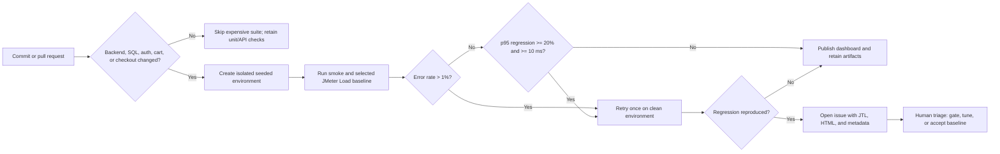

# Continuous Performance Testing Proposal

## Objective

Run the smallest meaningful performance check for every relevant change, compare it with a stable baseline, and escalate only reproducible regressions. The workflow uses the same API contract and test-data shape as the submitted JMeter evidence.

## Baseline and decision rules

1. Maintain three successful baseline runs for the affected endpoint group in the same isolated environment. Use the median p95 and error rate as the comparison baseline.
2. Execute a smoke run before a performance run. Reject the run as invalid if test data, assertions, seed state, or token extraction fail.
3. Flag a candidate regression only when both conditions hold: p95 is at least 20% and at least 10 ms worse than baseline, or error rate exceeds 1%.
4. Retry one time with a clean database and the same tool version. Create an issue only when the condition reproduces; otherwise retain it as environmental noise.
5. Retain JMX, CSV schema (without production secrets), JTL, HTML dashboard, command/commit metadata, and monitor evidence for 30 days or until the next accepted baseline.

## Trade-offs and human controls

Running the full Stress and Endurance suite on every commit is expensive and increases queue time, so the pipeline filters first by backend route, authentication, database, cart, checkout, and dependency changes. A local or shared runner has noise from CPU, memory, cache warming, and competing processes; the repeated-baseline and one-retry rule reduce false alerts without hiding repeated regressions. Isolated seeded data avoids cart/order cross-test contamination, but costs setup time. The short Load gate detects regressions quickly; scheduled nightly Stress/Endurance runs detect gradual degradation. A human owns baseline updates and release blocking because a statistical threshold cannot decide whether a customer-visible latency change is acceptable.
