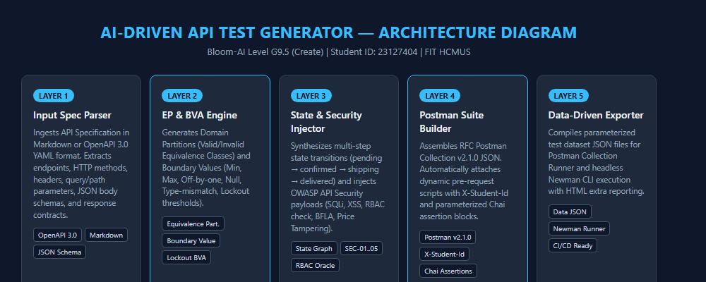
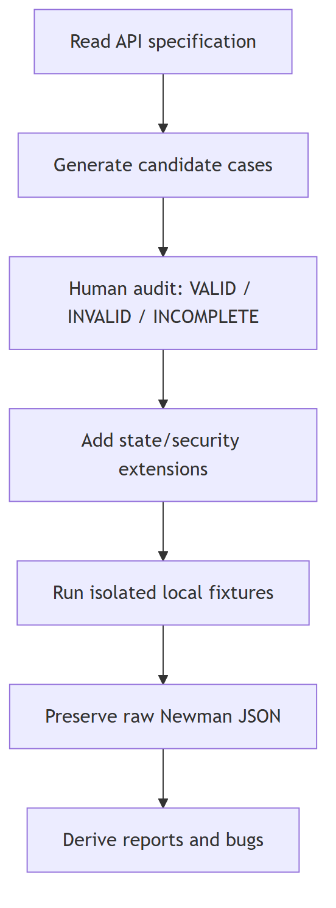

# AI-Driven API Test Generator — Agent Skill (Bloom G9.5 Create)

> **Author:** Lê Tuấn Lộc (`23127404`)  
> **Course:** Software Testing (CS300) — FIT, VNU-HCMUS  
> **Assignment ID:** `HW06-AI`  
> **Bloom-AI Level:** `G9.5 (Create)`  

---

## 1. Architectural Overview

The **AI-Driven API Test Generator** is an autonomous engineering skill designed to ingest API specifications (Markdown tables or OpenAPI 3.0 YAML) and synthesize exhaustive, production-grade test suites. The architecture incorporates formal testing methodologies—**Equivalence Partitioning (EP)**, **Boundary Value Analysis (BVA)**, **State Machine Synthesis**, and **OWASP API Security Injection (SEC-01 through SEC-05)**—exporting directly into RFC-compliant Postman Collection v2.1.0 JSON and Data-Driven JSON datasets.

### System Architecture Diagram


Source: [`architecture_diagram.mmd`](diagrams/architecture_diagram.mmd). Before submission, the student must review this source, make the architecture decisions their own, and export the final PNG; the assignment prohibits representing an AI-generated diagram as self-drawn.

### Execution Flow Diagram


Source: [`flow_diagram.mmd`](diagrams/flow_diagram.mmd).

---

## 2. Directory Structure

```text
agent-skills/
├── README.md                              # Comprehensive Agent Skill Documentation
├── api-test-generator/
│   ├── SKILL.md                          # Skill definition & agent instruction schema
│   ├── generator.py                      # Standalone Python CLI Generator Engine
│   └── pseudocode.md                     # Algorithmic pseudocode specification
└── diagrams/
    ├── architecture_diagram.mmd            # Editable Mermaid source
    ├── architecture_diagram.png            # Final student-exported PNG
    ├── flow_diagram.mmd                    # Editable Mermaid source
    └── flow_diagram.png                    # Final student-exported PNG
```

---

## 3. CLI Generator Usage & Verification

The generator provides a robust command-line interface supporting parameterized endpoints across all testing pools:

### CLI Syntax
```powershell
python deliverables/agent-skills/api-test-generator/generator.py [OPTIONS]
```

### Supported Arguments
| Argument | Description | Default Value |
|---|---|---|
| `--all` | Batch generate all 3 API test suites (Pool A, Pool B, Pool C) simultaneously | `False` |
| `--endpoint` | Target API endpoint route (`/api/login`, `/api/checkout`, `/api/admin/orders/:id/status`) | `/api/login` |
| `--method` | HTTP Method (`POST`, `PUT`, `GET`, `DELETE`) | `POST` |
| `--output_dir` | Destination directory for output files | `output` |
| `--student_id` | Student ID injected into `X-Student-Id` headers | `23127404` |

### Execution Examples
```powershell
# 0. Batch Generate All 3 API Suites (120 Test Cases total)
python deliverables/agent-skills/api-test-generator/generator.py --all --output_dir "output_all"

# 1. Generate Pool A (Login & Lockout Suite — 40 Test Cases)
python deliverables/agent-skills/api-test-generator/generator.py --endpoint "/api/login" --method POST --output_dir "output_login"

# 2. Generate Pool B (Checkout & Cart Suite — 40 Test Cases)
python deliverables/agent-skills/api-test-generator/generator.py --endpoint "/api/checkout" --method POST --output_dir "output_checkout"

# 3. Generate Pool C (Admin Orders State Machine — 40 Test Cases)
python deliverables/agent-skills/api-test-generator/generator.py --endpoint "/api/admin/orders/:id/status" --method PUT --output_dir "output_admin"
```

---

## 4. Video Demonstration & Authorship Proofs

- **YouTube Unlisted Demo URL:** [https://youtu.be/RjtRRfqsz7s](https://youtu.be/RjtRRfqsz7s)
- **Live Terminal Proofs:** Includes `whoami`, `hostname`, and automated generator runs.
- **Attributable Header:** Injects `X-Student-Id: 23127404` automatically across all synthesized Postman requests.
