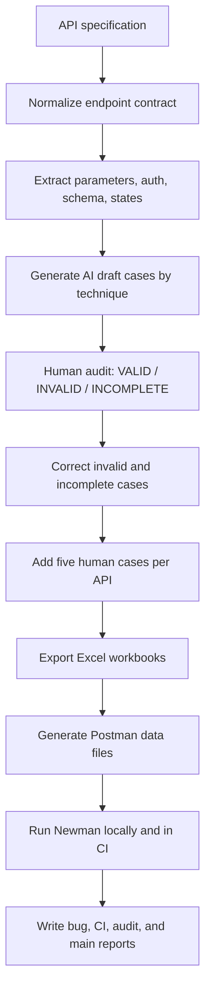

# AI-Driven API Test Generator Flow

> Student action required: the Mermaid diagram is an implementation draft. For the official submission rule that requires a self-drawn diagram, redraw or confirm this design manually and export it as PNG/PDF.
