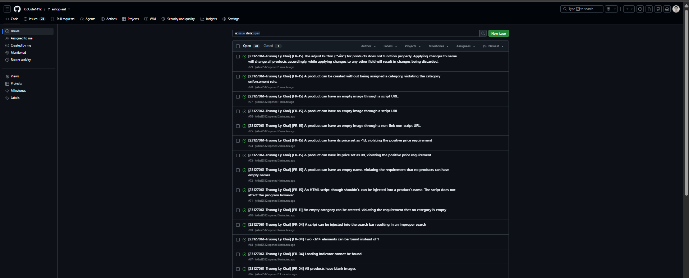

# Bug report

|ID|Test Case Origin|Reporter|Submit Date|Summary|Screenshot|OS Name|Browser|Severity|
|:-:|:-:|:-|:-|:-|:-|:-|:-|:-|
|#B01|TC01|Trương Lý Khải|27/06/2026|Each product on the main page does not have a proper image to display, only a blank placeholder with text is shown|B01-TC01.png|Microsoft Windows 11 Home Single Language|Chrome|Moderate|
|#B02|TC03|Trương Lý Khải|27/06/2026|The loading state, as well as the loading indicator cannot be found when using a search query.|B02-TC03.png|Microsoft Windows 11 Home Single Language|Chrome|Moderate|
|#B03|TC07|Trương Lý Khải|27/06/2026There exists 2 h1 elements when the requirements specify only one.|B04-TC04.png|Microsoft Windows 11 Home Single Language|B03-TC07.png|Microsoft Windows 11 Home Single Language|Chrome|Moderate|
|#B04|TC04|Trương Lý Khải|28/06/2026|A script can be injected into the search bar resulting in an improper search|B04-TC04.png|Microsoft Windows 11 Home Single Language|Chrome|Moderate|
|#B05|TC18|Trương Lý Khải|28/06/2026|An empty category can be created, violating the requirement that no category is empty|B05-TC18.png|Microsoft Windows 11 Home Single Language|Chrome|High|
|#B06|TC23|Trương Lý Khải|29/06/2026|An HTML script, though shouldn't, can be injected into a product's name. The script does not affect the program however.|B06-TC23.png|Microsoft Windows 11 Home Single Language|Chrome|Moderate|
|#B07|TC22-2|Trương Lý Khải|29/06/2026|A product can have an empty name, violating the requirement that no products can have empty names.|B07-TC22.png|Microsoft Windows 11 Home Single Language|Chrome|High|
|#B08|TC27-1|Trương Lý Khải|29/06/2026|A product can have its price set as 0đ, violating the positive price requirement|B08-TC27.png|Microsoft Windows 11 Home Single Language|Chrome|High|
|#B09|TC27-2|Trương Lý Khải|29/06/2026|A product can have its price set as -1đ, violating the positive price requirement|B09-TC27.png|Microsoft Windows 11 Home Single Language|Chrome|High|
|#B10|TC24|Trương Lý Khải|29/06/2026|A product can have an empty image through a non-link non-script URL.|B10-TC24.png|Microsoft Windows 11 Home Single Language|Chrome|Moderate|
|#B11|TC25|Trương Lý Khải|29/06/2026|A product can have an empty image through a script URL.|B11-TC25.png|Microsoft Windows 11 Home Single Language|Chrome|Moderate|
|#B12|TC28|Trương Lý Khải|29/06/2026|A product can be created without being assigned a category, violating the category enforcement rule.|B12-TC28.png|Microsoft Windows 11 Home Single Language|Chrome|Moderate|
|#B13|TC31|Trương Lý Khải|28/06/2026|The adjust button ("Sửa") for products does not function properly. Applying changes to name will change all products accordingly, while applying changes to any other field will result in changes being discarded.|B13-TC31.png|Microsoft Windows 11 Home Single Language|Chrome|High|

# Bug Analysis Summary

| Severity | Count | Percentage |
| :--- | :---: | :---: |
| Severe | 0 | 0.00% |
| High | 5 | 38.46% |
| Moderate | 8 | 61.54% |
| Low | 0 | 0.00% |
| **Total** | **13** | **100.00%** |

# Github Issues Screenshot
