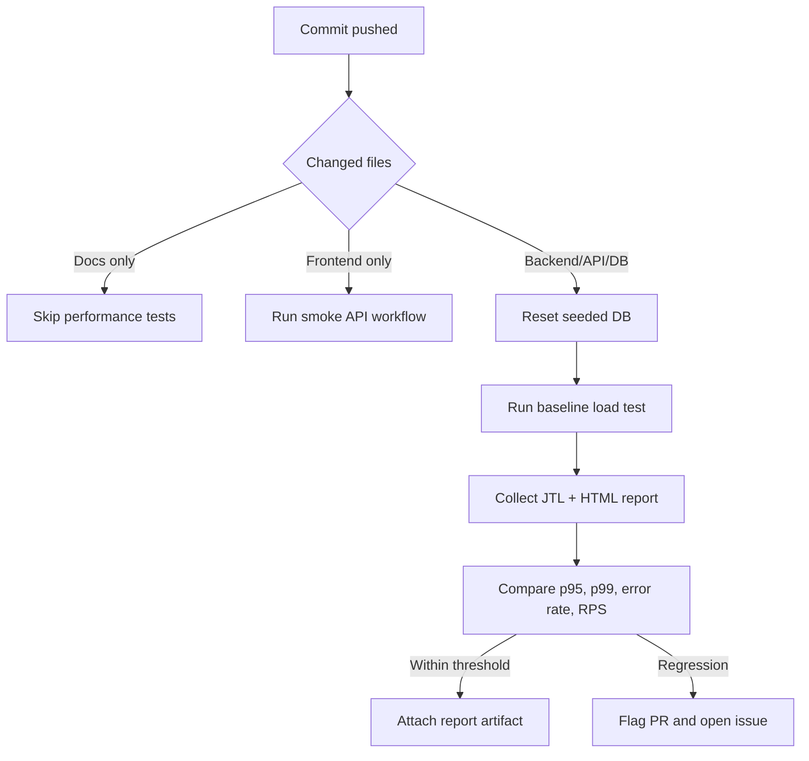

# Continuous Performance Testing Proposal

## Model

## Trigger Policy

Run the full performance suite when a commit touches:

- `backend/server.js`
- `backend/database.js`
- API route definitions
- SQL schema or seed data
- checkout/cart/order logic

For frontend-only changes, run a short smoke performance workflow because frontend changes should not normally affect backend p95, but they may change request shape.

## Regression Gate

Use a stored baseline from the latest accepted main-branch run:

- Fail if p95 latency increases by more than 20%.
- Fail if error rate exceeds 1% during load test.
- Warn if throughput drops by more than 15%.
- Require manual review for stress/spike results because local hardware noise can produce false alarms.

## Trade-Offs

Continuous performance testing is valuable because backend regressions are caught near the commit that introduced them. The cost is execution time and infrastructure noise. A full load/stress/spike run on every commit is expensive and can produce false alarms on shared or overheated hardware. The proposed model reduces cost by classifying changed files and running the full suite only when backend/API/database code changes. It also stores raw `.jtl` and HTML report artifacts so a reviewer can distinguish a true regression from a noisy runner.

## Data Reset Strategy

Because checkout creates orders and cart state is in memory, every CI run should start from a known seeded database. The reset must be explicit and logged. For local runs, the student should document whether the backend startup re-seeded the database.

