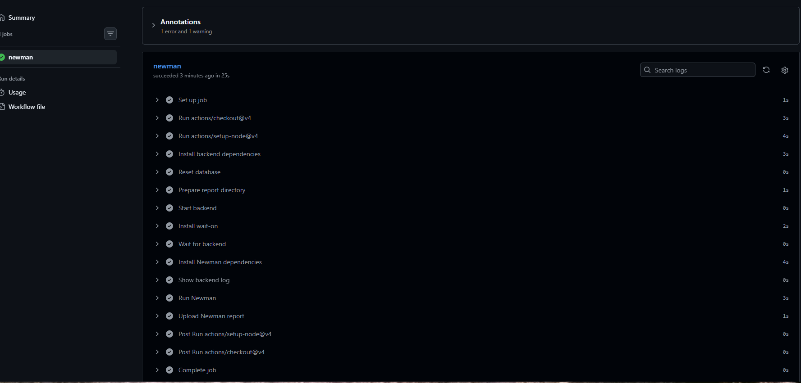

# HW06 - API Testing Main Report

- Student: Nguyen Thanh Tien, Student ID 23127539
- SUT: EShop API (`https://github.com/KidCute1412/eshop-sut`)
- Tool: Postman + Newman
- Scope: three selected backend APIs from Pool A, Pool B, and Pool C: FR01 Account Registration,
  FR07 Shopping Cart, and FR17 Coupon Management CRUD.

## Submission Scope

| API | Pool | Selected Endpoint(s) | Main Artifacts |
| --- | --- | --- | --- |
| FR01 | A | `POST /api/register` | [test-cases.md](FR01/test-cases.md), [api-mapping.md](FR01/api-mapping.md), [ai-audit.md](FR01/ai-audit.md), [ai-gap-analysis.md](FR01/ai-gap-analysis.md), [evidence/](FR01/evidence/) |
| FR07 | B | `GET /api/cart`, `POST /api/cart` | [test-cases.md](FR07/test-cases.md), [api-mapping.md](FR07/api-mapping.md), [ai-audit.md](FR07/ai-audit.md), [ai-gap-analysis.md](FR07/ai-gap-analysis.md), [evidence/](FR07/evidence/) |
| FR17 | C | `GET /api/coupons`, `POST /api/admin/coupons`, `DELETE /api/admin/coupons/:id` | [test-cases.md](FR17/test-cases.md), [api-mapping.md](FR17/api-mapping.md), [ai-audit.md](FR17/ai-audit.md), [ai-gap-analysis.md](FR17/ai-gap-analysis.md), [evidence/](FR17/evidence/) |
| CI/CD | - | GitHub Actions Newman run | [ci-cd-report.md](ci-cd-report.md), [.github/workflows/github-actions-api-tests.yml](../../.github/workflows/github-actions-api-tests.yml), [ci-screenshot.png](ci-screenshot.png) |

## Method Summary

1. Read the HW06 assignment, `README.md`, `api_specification.md`, and `setup_guide.md` as the
   source of truth for expected API behavior.
2. Select one API-backed feature from each required pool: FR01 from Pool A, FR07 from Pool B, and
   FR17 from Pool C.
3. Use AI to generate the initial candidate API test cases, but preserve the prompt and raw output
   separately in each feature's `ai-audit.md`.
4. Review and prune the AI output manually, keeping final IDs stable instead of renumbering removed
   cases. This is why some sequences intentionally jump, for example `FR07-API-003` to
   `FR07-API-005`.
5. Execute the cases using Postman/Newman against the real backend and attach per-case screenshot
   evidence in each FR's `evidence/` folder.
6. Integrate the Newman collection into GitHub Actions and keep CI evidence separately from local
   evidence.

## Test Environment

- Backend: Node.js + Express + SQLite
- Base URL for local and CI execution: `http://127.0.0.1:3000`
- Backend startup: `cd backend`, `npm install`, `node database.js`, `node server.js`
- Default user: `test@eshop.com / Test1234!`
- Default admin: `admin@eshop.com / Admin123!`
- Student ID used in execution evidence: `23127539`

## API 1 - FR01 Account Registration

- Endpoint under test: `POST /api/register`.
- Final reviewed suite: **39 test cases**.
- Execution result recorded in the final table: **13 Passed / 26 Failed**.
- Coverage includes required fields, valid registration, email format partitions, duplicate email,
  password boundaries, password complexity, null values, role injection, SQL injection-looking
  inputs, XSS-like name input, response schema, and sensitive-data leakage.
- AI-generation process: [FR01/ai-audit.md](FR01/ai-audit.md) contains the detailed prompt and raw
  35-row AI output before human filtering.
- Human critique and gap-filling: [FR01/ai-gap-analysis.md](FR01/ai-gap-analysis.md) records the
  additional human-designed cases and the reason AI missed them.
- Execution evidence: [FR01/evidence/](FR01/evidence/) contains screenshot evidence linked directly
  from the Evidence column in [FR01/test-cases.md](FR01/test-cases.md).

## API 2 - FR07 Shopping Cart

- Endpoints under test: `GET /api/cart`, `POST /api/cart`.
- Final reviewed suite: **38 test cases**.
- Execution result recorded in the final table: **14 Passed / 24 Failed**.
- Coverage includes authentication, missing/malformed/valid token behavior, cart response schema,
  add-to-cart success paths, quantity boundaries, product id/name/price partitions, duplicate-add
  state behavior, repeated GET stability, product data tampering, identity-field injection, and SQL
  injection-looking product name.
- AI-generation process: [FR07/ai-audit.md](FR07/ai-audit.md) contains the detailed prompt and raw
  35-row AI output before human filtering. It intentionally still preserves rows that were removed
  from the final table.
- Human critique and gap-filling: [FR07/ai-gap-analysis.md](FR07/ai-gap-analysis.md) records the
  human-added coverage for malformed body shape, large quantity, and product data tampering.
- Execution evidence: [FR07/evidence/](FR07/evidence/) contains screenshot evidence linked directly
  from the Evidence column in [FR07/test-cases.md](FR07/test-cases.md).

## API 3 - FR17 Coupon Management CRUD

- Endpoints under test: `GET /api/coupons`, `POST /api/admin/coupons`,
  `DELETE /api/admin/coupons/:id`.
- Final reviewed suite: **40 test cases**.
- Execution result recorded in the final table: **13 Passed / 27 Failed**.
- Coverage includes admin/user/no-token authorization, coupon list schema, coupon creation,
  coupon deletion, required fields, duplicate code, type enum, discount boundaries, date validation,
  minimum order amount, maximum uses per user, SQL injection-looking coupon code, and script-like
  coupon code.
- AI-generation process: [FR17/ai-audit.md](FR17/ai-audit.md) contains the detailed prompt and raw
  39-row AI output before human filtering. It intentionally preserves AI candidates that were later
  removed from the final suite.
- Human critique and gap-filling: [FR17/ai-gap-analysis.md](FR17/ai-gap-analysis.md) records the
  remaining human-added malformed body cases.
- Execution evidence: [FR17/evidence/](FR17/evidence/) contains screenshot evidence linked directly
  from the Evidence column in [FR17/test-cases.md](FR17/test-cases.md).

## Postman / Newman Execution

- Postman collection: [postman/HW06_FR01_FR07_FR17.postman_collection.json](postman/HW06_FR01_FR07_FR17.postman_collection.json)
- Postman environment: [postman/HW06_local.postman_environment.json](postman/HW06_local.postman_environment.json)
- Newman CLI output: [newman/newman-output.txt](newman/newman-output.txt)
- Newman HTML report: [newman/report.html](newman/report.html)
- Collection features used: folders by feature, collection/environment variables, token extraction,
  collection-level `X-Student-Id`, pre-request logging, schema/status assertions, and grouped test
  scripts.

## CI/CD Integration

- Workflow used by GitHub Actions: [.github/workflows/github-actions-api-tests.yml](../../.github/workflows/github-actions-api-tests.yml)
- CI report: [ci-cd-report.md](ci-cd-report.md)
- CI screenshot evidence: [ci-screenshot.png](ci-screenshot.png)



The CI job starts the backend, waits for `http://127.0.0.1:3000/api/products`, clears proxy
variables for Newman, overrides `baseUrl` to `http://127.0.0.1:3000`, then runs the Postman
collection with `studentId=23127539`. Real workflow links and final pass/fail notes should be
filled into [ci-cd-report.md](ci-cd-report.md) after the latest pushed workflow run completes.

## AI-Driven API Test Generator

- Create-level generator folder:
  [create-level-generator/](create-level-generator/).
- Design document:
  [create-level-generator/generator-design.md](create-level-generator/generator-design.md).
- Pseudocode:
  [create-level-generator/generator-pseudocode.py](create-level-generator/generator-pseudocode.py).
- Prompt templates:
  [create-level-generator/prompt-templates.md](create-level-generator/prompt-templates.md).
- Self-drawn diagram checklist:
  [create-level-generator/self-drawn-diagram-instructions.md](create-level-generator/self-drawn-diagram-instructions.md).
- Diagram blueprint for manual redraw:
  [create-level-generator/diagram.mmd](create-level-generator/diagram.mmd).
- Submission checklist:
  [create-level-generator/submission-checklist.md](create-level-generator/submission-checklist.md).

The design describes an AI-driven API test generator that reads the API specification,
requirements, setup guide, assignment constraints, selected feature IDs, and student execution
configuration. It extracts endpoint contracts, maps them to `FR-*` and `SEC-*` rules, generates
domain/boundary/security/state/schema candidate cases with AI assistance, validates the candidates,
requires human audit, and emits Markdown test cases, AI audit logs, Postman/Newman artifacts, CI
workflow scaffolding, and execution evidence links.

Required manual item: draw the final diagram yourself and export it as
`reports/HW6/create-level-generator/generator-diagram.png`. The folder includes the exact nodes,
edges, and feedback loops to draw, but the submitted image should be manually created to satisfy the
"self-drawn" requirement.

## Agent Skill

- Skill location: `.agents/skills/api-testing/`
- Contents: `SKILL.md`, references for assignment/API/test design/Postman-Newman workflow, reusable
  report templates, and validation/helper scripts.
- The skill enforces the main HW06 integrity rules: do not fabricate execution results, preserve
  raw AI outputs, map expected behavior to source-of-truth documents, and separate AI-generated
  candidates from human-reviewed final test cases.

## AI Audit Report

Prompt-and-raw-output logs:

- FR01: [FR01/ai-audit.md](FR01/ai-audit.md)
- FR07: [FR07/ai-audit.md](FR07/ai-audit.md)
- FR17: [FR17/ai-audit.md](FR17/ai-audit.md)

## AI Critique

See [ai-critique.md](ai-critique.md).

## Git Commit Log

TODO - export real git history with:

```powershell
git log --stat > reports/HW6/git-commit-log.txt
```

## Self-Assessment

| No. | Criteria | Grade | Self-Assessed Grade |
| ---: | --- | ---: | ---: |
| 1 | API 1 - FR01 full pipeline | 30 | 30 |
| 2 | API 2 - FR07 full pipeline | 30 | 30 |
| 3 | API 3 - FR17 full pipeline | 30 | 30 |
| 4 | Agent Skills / AI-driven API test generator | 10 | 10 |
| **Total** | | **100** | **100** |

## Github Link

- [HW06 Github Repository](https://github.com/KidCute1412/eshop-sut)
